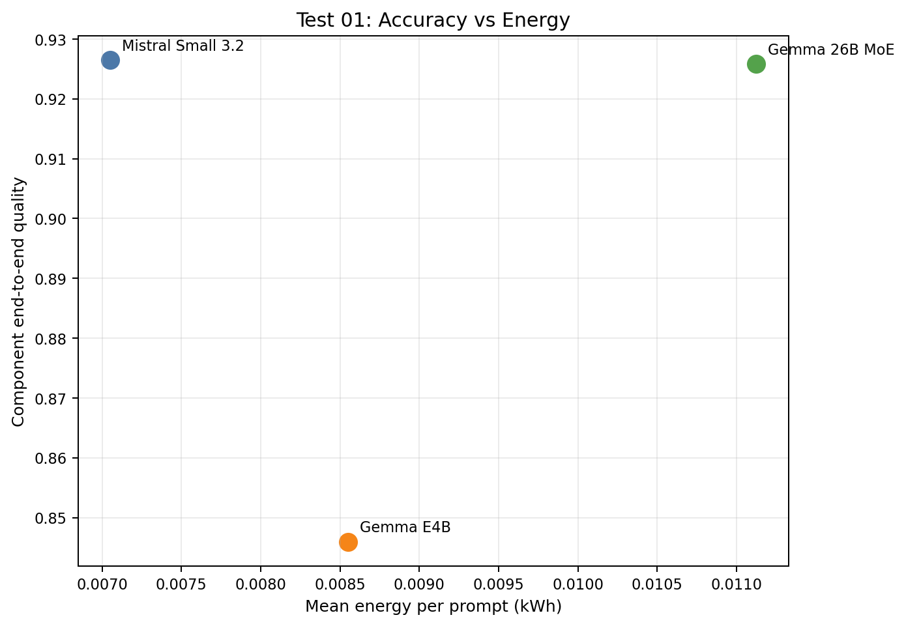
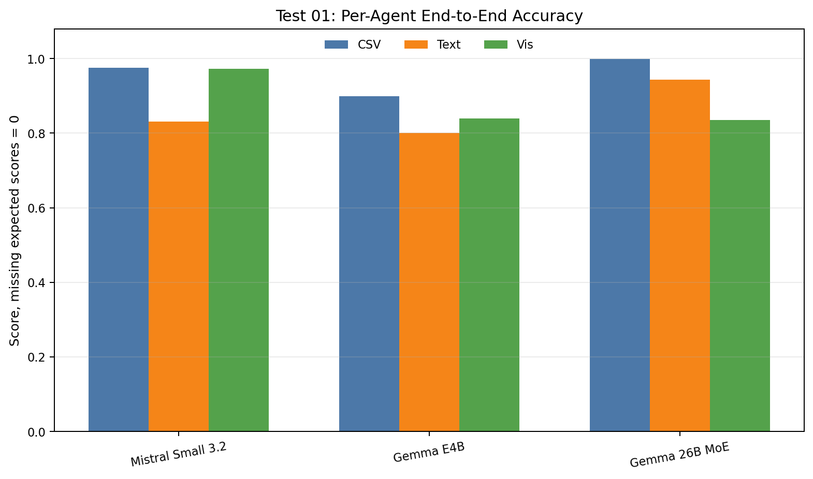
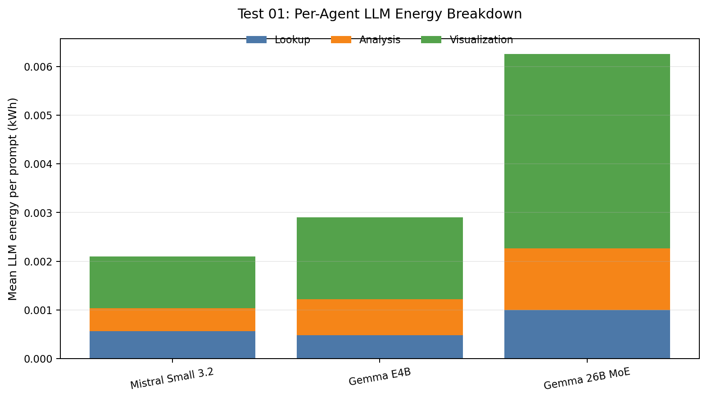
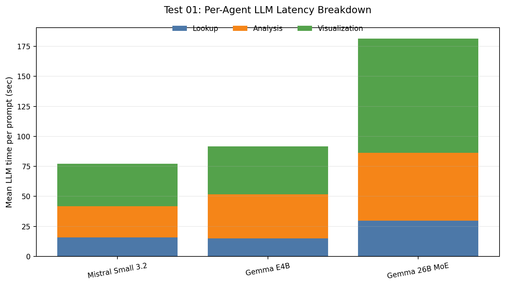
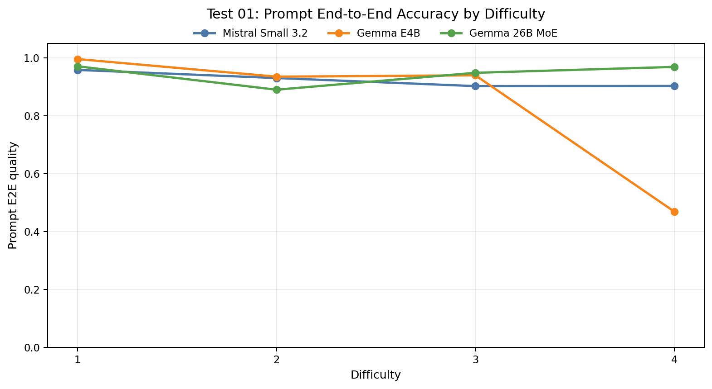
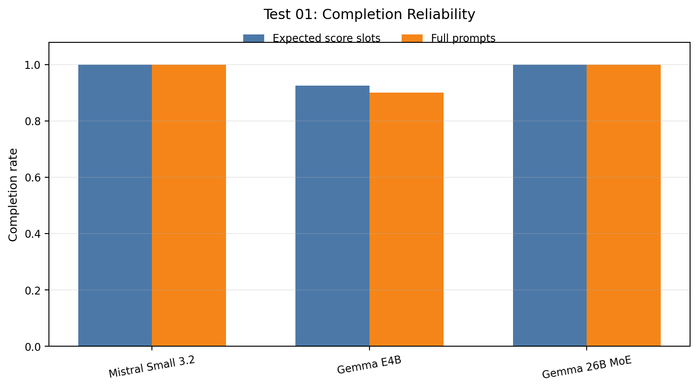

# Test 01 Report: Baseline Model Comparison

## Data Source

Results analyzed from:

```text
/home/oss/Downloads/01_model_baseline_comparison/
```

Run structure found:

```text
gemma4_e4b/rep
gemma4_26b/rep
mistral_small32_24b/rep
```

Each model has one baseline config over the full 20-prompt benchmark. The original Test 01 plan asks for three repeats, so this report should be treated as a first-pass baseline analysis rather than the final statistical result.

## Executive Findings

The three models are very close under the official `quality_mean` from `thesis_summary.csv`:

```text
mistral-small3.2:24b   0.9265
gemma4:26b             0.9259
gemma4:e4b             0.9222
```

However, the models have different failure modes:

- `gemma4:26b` is the strongest SQL/data model, with `csv_iou=0.9987`, but it is slowest and weakest on visualization.
- `mistral-small3.2:24b` gives the best energy/latency tradeoff and nearly the same quality as the best model.
- `gemma4:e4b` is strong when it completes the pipeline, especially on visualization, but two SQL failures on difficulty-4 prompts reduce its end-to-end reliability.

When missing expected downstream scores are counted as `0.0`, the component-balanced end-to-end scores are:

```text
mistral-small3.2:24b   0.9265
gemma4:26b             0.9259
gemma4:e4b             0.8460
```

Main thesis signal: model size and thinking behavior alone do not determine the best agent. The best baseline tradeoff here is the larger non-thinking Mistral Small model, while the larger Gemma thinking MoE improves SQL/text reliability but pays heavily in latency and energy.

## Metric Caveat

`thesis_summary.csv` computes `quality_mean` as the average of metric means:

```text
mean(csv_iou_mean, text_score_mean, vis_score_mean)
```

This is useful for continuity, but it can mask missing downstream outputs. For example, `gemma4:e4b` failed SQL on two prompts, which also prevented text/visualization scoring for those prompts. Its official `quality_mean` remains high because missing text/visualization scores are excluded from those metric means.

For this report, three quality views are used:

```text
official_quality              quality_mean from thesis_summary.csv
component_e2e_quality         mean(csv, text, vis), missing expected scores count as 0
prompt_e2e_quality            mean per prompt over expected components, missing expected scores count as 0
```

`component_e2e_quality` is the cleanest main accuracy metric for this report because it keeps the same component-balanced structure as `quality_mean`, but treats failed downstream outputs as part of the model result. `official_quality` remains useful for continuity with the runner output.

## Aggregate Results

| Model | Role | Official quality | Component E2E quality | Prompt E2E quality | csv E2E | text E2E | vis E2E | Mean sec | Mean kWh | Component E2E quality/kWh |
|---|---|---:|---:|---:|---:|---:|---:|---:|---:|---:|
| `mistral-small3.2:24b` | larger non-thinking | 0.9265 | 0.9265 | 0.9206 | 0.9758 | 0.8313 | 0.9724 | 112.5 | 0.00705 | 131.4 |
| `gemma4:26b` | larger thinking MoE | 0.9259 | 0.9259 | 0.9423 | 0.9987 | 0.9438 | 0.8352 | 228.3 | 0.01113 | 83.2 |
| `gemma4:e4b` | small thinking | 0.9222 | 0.8460 | 0.8556 | 0.8987 | 0.8000 | 0.8393 | 135.3 | 0.00855 | 98.9 |

Interpretation:

- By official quality, all three are effectively tied.
- By component end-to-end quality, `mistral-small3.2:24b` and `gemma4:26b` remain tied, while `gemma4:e4b` drops because missing expected text/visual scores are counted as failures.
- By prompt end-to-end quality, `gemma4:26b` is best because it completes all prompts and has near-perfect SQL.
- By efficiency, `mistral-small3.2:24b` is clearly best: it is fastest, lowest-energy, and has the highest end-to-end quality per kWh.

## Figures

The plots below use the corrected end-to-end interpretation. In particular, the main quality-energy plot uses `component_e2e_quality`, not the optimistic official `quality_mean`.













## Completeness And Reliability

| Model | Rows | csv scores | text scores | vis scores | Timeouts | Notes |
|---|---:|---:|---:|---:|---:|---|
| `gemma4:e4b` | 20 | 20 | 18 | 12 | 0 | Two SQL failures prevented downstream text/vis outputs. |
| `gemma4:26b` | 20 | 20 | 20 | 14 | 0 | Completed all expected text scores and all visualization prompts. |
| `mistral-small3.2:24b` | 20 | 20 | 20 | 14 | 0 | Completed all expected text scores and all visualization prompts. |

The full benchmark has 14 prompts with visualization ground truth. `gemma4:e4b` only has 12 visualization scores because it failed before visualization on two visualization prompts.

## Accuracy By Difficulty

Prompt-level quality by difficulty:

| Difficulty | `gemma4:e4b` | `gemma4:26b` | `mistral-small3.2:24b` |
|---:|---:|---:|---:|
| 1 | 0.9958 | 0.9708 | 0.9583 |
| 2 | 0.9350 | 0.8900 | 0.9303 |
| 3 | 0.9397 | 0.9484 | 0.9024 |
| 4 | 0.4688 | 0.9688 | 0.9029 |

The most important pattern is difficulty 4:

- `gemma4:26b` remains highly reliable.
- `mistral-small3.2:24b` remains usable.
- `gemma4:e4b` collapses because two hard SQL failures occur on monthly comparison prompts.

This supports the need for the later step-isolated tests: the small thinking model is not uniformly weak, but its lookup step is fragile on harder aggregation prompts.

## Cost And Energy

Relative to `mistral-small3.2:24b`, using prompt end-to-end quality:

| Model | Relative prompt quality | Relative time | Relative energy |
|---|---:|---:|---:|
| `mistral-small3.2:24b` | 1.000 | 1.000 | 1.000 |
| `gemma4:e4b` | 0.929 | 1.202 | 1.213 |
| `gemma4:26b` | 1.024 | 2.028 | 1.578 |

`gemma4:26b` improves prompt end-to-end quality by about 2.4% over Mistral, but takes about 2.0x the time and 1.6x the energy. This is not a favorable baseline Pareto tradeoff unless the thesis prioritizes deterministic SQL correctness over energy and latency.

`gemma4:e4b` is slower and more energy-intensive than Mistral while also less reliable at prompt level in this run.

## Step-Level Cost

Mean per-step LLM time:

| Model | Lookup sec | Analysis sec | Visualization sec | Dominant step |
|---|---:|---:|---:|---|
| `gemma4:e4b` | 15.1 | 36.5 | 40.0 | visualization |
| `gemma4:26b` | 29.6 | 56.8 | 95.0 | visualization |
| `mistral-small3.2:24b` | 16.0 | 25.8 | 35.3 | visualization |

Mean per-step LLM energy:

| Model | Lookup kWh | Analysis kWh | Visualization kWh | Visualization share |
|---|---:|---:|---:|---:|
| `gemma4:e4b` | 0.000482 | 0.000739 | 0.001683 | 57.9% |
| `gemma4:26b` | 0.000997 | 0.001267 | 0.003996 | 63.8% |
| `mistral-small3.2:24b` | 0.000560 | 0.000474 | 0.001066 | 50.7% |

Visualization is the dominant cost center for all three models. This matters for the later parameter tests: visualization tuning can affect energy more than lookup tuning, especially for `gemma4:26b`.

## Error Analysis

### `gemma4:e4b`

Main failures:

```text
case 4   Compare average monthly revenue between store regions for 2022 and 2023
case 17  Compare average monthly revenue between store types for 2022 and 2023
```

Both failed with `csv_iou=0.0` because the generated SQL returned no data or errored. The generated queries used nested monthly aggregation but referenced incorrect aliases/date fields in the outer query. This suggests a lookup-agent issue rather than a general model failure.

Other issues:

```text
case 14  top brands by realized average selling price
```

The table similarity remained high (`csv_iou=0.973`), but the analysis swapped or misreported the average selling price and total unit values, leading to `text_score=0.5`.

Takeaway: `gemma4:e4b` needs lookup robustness work, especially for nested time aggregation. CoT or Best-of-N on SQL generation is a good candidate for Test 04.

### `gemma4:26b`

Main failures:

```text
case 10  monthly revenue for product class 22975 as a line chart
case 16  grouped bar chart for Organic vs Non-Organic revenue by region
```

`case 10` had perfect SQL and text, but `vis_score=0.0` because no chart code was produced.

`case 16` had high table similarity (`csv_iou=0.974`) and good text (`text_score=0.875`), but weak visualization (`vis_score=0.592`) because the chart treated the organic flag as a numeric y-axis rather than a grouping variable.

Takeaway: the larger Gemma model is reliable for SQL/text, but its visualization step is the main weakness and cost center.

### `mistral-small3.2:24b`

Main failure:

```text
case 18  promo revenue share by product category
```

The model returned a semantically useful table with extra columns and a percentage-form column name, but it did not match the expected compact `promo_revenue_share` schema. This reduced `csv_iou` to `0.546` and `vis_score` to `0.664`, even though the text score was high (`0.875`).

Other weaker text cases:

```text
case 7   top stores by units sold
case 8   top sales days
case 16  Organic vs Non-Organic regional revenue
```

These had good or perfect table outputs but partial textual coverage. The issue is analysis completeness rather than SQL failure.

Takeaway: Mistral Small is strong as a full-pipeline baseline, but analysis wording/coverage and strict output schema adherence are the likely tuning targets.

## Thesis Implications

1. The larger non-thinking model is the best baseline Pareto point in this run.

`mistral-small3.2:24b` is essentially tied for official quality while being clearly faster and lower-energy. This is strong evidence that a larger non-thinking model can be more efficient than thinking models for this agentic data-analysis workload.

2. The larger thinking MoE improves deterministic data correctness but not overall Pareto efficiency.

`gemma4:26b` has the best SQL/data performance and best self-judged text score, but it pays a large latency and energy cost and has weak visualization reliability.

3. The small thinking model is not uniformly bad, but it is brittle.

`gemma4:e4b` performs very well on many prompts and has the best visualization mean among completed visualization cases, but two hard SQL failures dominate its prompt-level reliability. This supports testing SQL-specific Best-of-N and CoT rather than globally increasing model size.

4. Visualization is the biggest energy lever.

Across all models, visualization consumes the largest share of per-step LLM energy. Later experiments should pay close attention to whether visualization parameter changes improve quality enough to justify their cost.

## Recommendations For The Next Tests

- Keep `mistral-small3.2:24b` as the main non-thinking Pareto baseline.
- For `gemma4:e4b`, prioritize lookup-step sensitivity, max-token laddering, and SQL CoT/Best-of-N.
- For `gemma4:26b`, prioritize visualization-step sensitivity because SQL/text are already strong.
- In final thesis tables, report deterministic `csv_iou` separately from self-judged text/visual scores.
- Add a prompt-level quality or completion-adjusted quality metric to avoid hiding failures where SQL errors prevent text/visualization evaluation.
- Run the planned additional repeats before making final statistical claims.
