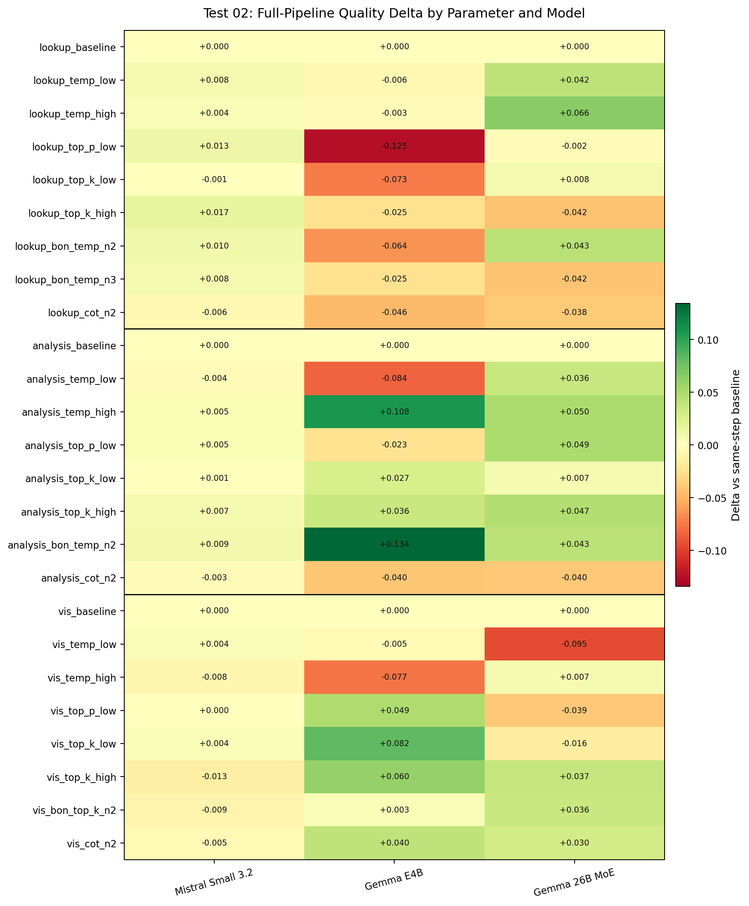
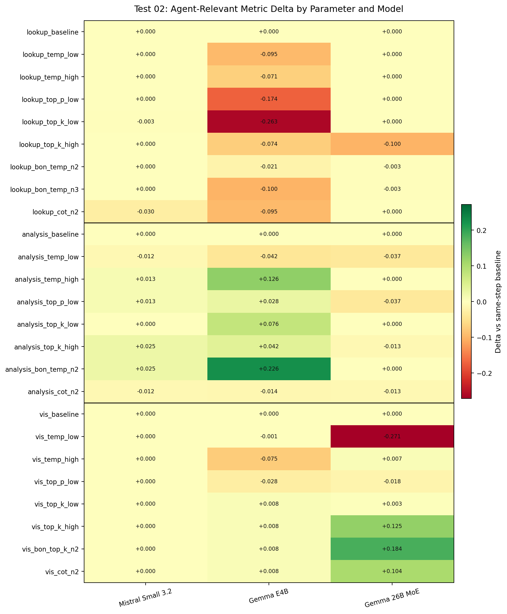
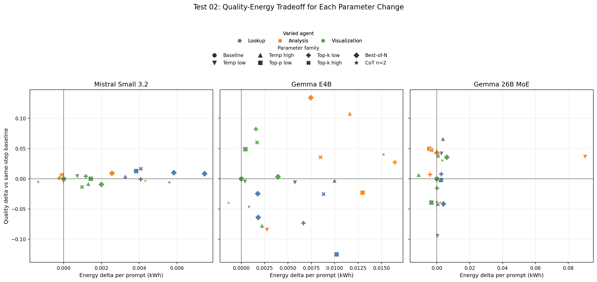
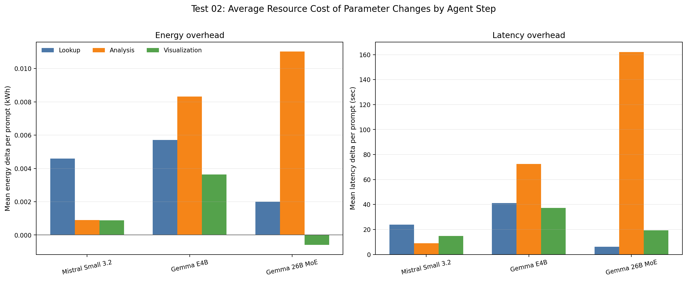

# Test 02 Report: Agent-Step Parameter Sensitivity

## Data Source

Results analyzed from:

```text
/home/oss/Downloads/02_agent_step_parameter_sensitivity/
```

Run structure found:

```text
gemma4_e4b/rep
gemma4_26b/rep
mistral_small32_24b/rep
```

Each completed model has:

```text
25 configs x 10 prompts = 250 benchmark rows
```

Coverage limitation:

```text
nemotron-3-nano:4b was planned but no result folder was present in this directory.
```

Repeat limitation:

```text
Only one repeat per completed model was present.
```

This report should therefore be read as a strong exploratory analysis, not yet as the final statistical claim.

## Method Notes

The experiment follows the bulk-runner logic: one agent step is varied while the other two are configured at baseline.

However, the fixed steps are still re-run for each config. Therefore, a change in `quality_mean` can include downstream stochastic variation, not only the direct effect of the varied agent. For interpretation, this report uses two views:

```text
quality_mean        full-pipeline thesis metric
step metric         csv_iou for lookup, text_score for analysis, vis_score for visualization
```

The step metric is more appropriate for identifying which parameter affects the varied agent. The full-pipeline metric is more appropriate for judging whether that parameter improves the final user-visible output.

## Executive Findings

The most important result is that parameter sensitivity is model-dependent and agent-dependent.

- `mistral-small3.2:24b` is very stable. Most parameter changes move quality by less than `0.02`, and visualization is already saturated at `vis_score=1.0`.
- `gemma4:e4b` is highly sensitive. Lookup changes generally hurt SQL quality, while analysis and visualization can improve substantially with the right setting.
- `gemma4:26b` is robust on SQL/text, but visualization remains the main weakness and the main place where tuning helps.

Practical thesis signal:

```text
static sampling changes are usually more attractive than compute-expansion methods
```

Best-of-N and CoT often increase time and energy substantially. They should be used only where the quality gain is large enough to justify the extra calls.

## Overall Resource Use

Across all 25 configs and 250 prompt runs per model:

| Model | Total sec | Total kWh | Total GPU kWh | Mean quality over configs | Mean sec / prompt | Mean kWh / prompt |
|---|---:|---:|---:|---:|---:|---:|
| `mistral-small3.2:24b` | 35,332.8 | 3.0936 | 2.5975 | 0.9430 | 141.3 | 0.0124 |
| `gemma4:e4b` | 51,689.9 | 4.2885 | 3.5679 | 0.8900 | 206.8 | 0.0172 |
| `gemma4:26b` | 71,211.6 | 5.9507 | 4.9629 | 0.9143 | 284.8 | 0.0238 |

This reinforces the Test 01 result: Mistral Small is the most efficient baseline and remains efficient across the sensitivity grid.

## Sensitivity Range

For each model and step, the table reports the best and worst full-pipeline quality delta relative to that step's baseline.

| Model | Varied step | Baseline quality | Best delta | Worst delta | Range | Best config | Worst config |
|---|---|---:|---:|---:|---:|---|---|
| `gemma4:e4b` | lookup | 0.9371 | -0.0029 | -0.1251 | 0.1222 | `lookup_temperature_high` | `lookup_top_p_low` |
| `gemma4:e4b` | analysis | 0.8454 | +0.1343 | -0.0844 | 0.2187 | `analysis_bon_temperature_n2` | `analysis_temperature_low` |
| `gemma4:e4b` | visualization | 0.8889 | +0.0819 | -0.0774 | 0.1593 | `visualization_top_k_low` | `visualization_temperature_high` |
| `gemma4:26b` | lookup | 0.8993 | +0.0661 | -0.0423 | 0.1084 | `lookup_temperature_high` | `lookup_top_k_high` |
| `gemma4:26b` | analysis | 0.9124 | +0.0500 | -0.0395 | 0.0895 | `analysis_temperature_high` | `analysis_cot_n2` |
| `gemma4:26b` | visualization | 0.9095 | +0.0375 | -0.0946 | 0.1321 | `visualization_top_k_high` | `visualization_temperature_low` |
| `mistral-small3.2:24b` | lookup | 0.9375 | +0.0167 | -0.0057 | 0.0224 | `lookup_top_k_high` | `lookup_cot_n2` |
| `mistral-small3.2:24b` | analysis | 0.9408 | +0.0092 | -0.0042 | 0.0134 | `analysis_bon_temperature_n2` | `analysis_temperature_low` |
| `mistral-small3.2:24b` | visualization | 0.9458 | +0.0042 | -0.0134 | 0.0176 | `visualization_temperature_low` | `visualization_top_k_high` |

The strongest single effect is `gemma4:e4b` analysis Best-of-N, followed by `gemma4:e4b` visualization `top_k_low`. Mistral's sensitivity range is much smaller, which means its baseline is already close to its local optimum for this subset.

## Figures

The figures below summarize the same sensitivity result from four angles: full-pipeline quality movement, direct agent-metric movement, quality-energy tradeoff, and resource overhead.



This heatmap is the quickest way to explain the experiment. Rows are parameter changes, columns are models, and each cell is the full-pipeline `quality_mean` delta against the baseline for the same varied agent step.



This companion heatmap isolates the metric most directly tied to the varied agent: `csv_iou` for lookup, `text_score` for analysis, and `vis_score` for visualization. It helps separate direct agent behavior from downstream pipeline noise.



This plot shows whether each parameter change buys accuracy or only increases cost. Points above the horizontal zero line improve quality; points to the right consume more energy than the same-step baseline.



This resource plot highlights the cost side of the thesis question: which agent-step parameter changes tend to add latency and energy, and whether those costs are concentrated in a specific model.

## Step-Relevant Metric Findings

### Lookup Agent

Primary metric:

```text
csv_iou
```

| Model | Baseline csv_iou | Best non-baseline csv_iou | Worst csv_iou | Interpretation |
|---|---:|---:|---:|---|
| `gemma4:e4b` | 0.9711 | 0.9503 | 0.7084 | No lookup setting beat baseline; lookup is fragile. |
| `gemma4:26b` | 0.9974 | 0.9974 | 0.8974 | Very robust except `top_k_high`. |
| `mistral-small3.2:24b` | 1.0000 | 1.0000 | 0.9703 | Essentially saturated; CoT slightly hurts. |

`gemma4:e4b`:

- Every lookup change reduced `csv_iou` versus baseline.
- `top_p_low` and `top_k_low` are especially harmful.
- Best-of-N and CoT did not solve lookup fragility in this run.

This matters because Test 01 showed `gemma4:e4b` failing hard on difficult SQL prompts. Test 02 suggests the solution is not simply changing lookup sampling on this 10-case subset. The lookup step may need targeted prompt/schema improvements, a different feedback loop, or a focused hard-case test.

`gemma4:26b`:

- SQL is almost saturated at baseline.
- `lookup_temperature_high` improves full-pipeline quality without hurting `csv_iou`.
- `lookup_top_k_high` causes the main SQL degradation.

`mistral-small3.2:24b`:

- SQL is saturated under most settings.
- `lookup_top_k_high` gives the best full-pipeline quality, mainly through better downstream text score, not SQL.
- `lookup_cot_n2` is not attractive: lower quality, higher time, higher energy.

### Analysis Agent

Primary metric:

```text
text_score
```

| Model | Baseline text_score | Best text_score | Best config | Interpretation |
|---|---:|---:|---|---|
| `gemma4:e4b` | 0.7361 | 0.9625 | `analysis_bon_temperature_n2` | Very large gain, but extra cost. |
| `gemma4:26b` | 0.9625 | 0.9625 | baseline / high temp / top_k_low / BoN | Already saturated. |
| `mistral-small3.2:24b` | 0.8250 | 0.8500 | `analysis_top_k_high` or `analysis_bon_temperature_n2` | Small gain only. |

`gemma4:e4b`:

- Analysis is the clearest tuning opportunity.
- `analysis_bon_temperature_n2` raises `text_score` by `+0.2264` and full quality by `+0.1343`.
- `analysis_temperature_high` also helps strongly, with `text_score +0.1264` and quality `+0.1079`.
- `analysis_temperature_low` hurts both quality and text score.
- `analysis_cot_n2` does not help.

This suggests that the small thinking model benefits from candidate diversity in the analysis step, but not from a simple CoT refinement loop.

`gemma4:26b`:

- Text score is already high at baseline.
- Most apparent quality gains are driven by downstream visualization variation rather than the analysis text score itself.
- `analysis_temperature_low` is a major runtime/energy outlier: mean elapsed time `1210.8s` and mean energy `0.1095 kWh`.

This outlier should not be used as a recommended setting. It is thesis-relevant because it shows that a parameter can create a huge energy/latency penalty without a proportional accuracy gain.

`mistral-small3.2:24b`:

- Analysis changes are small.
- `analysis_top_k_high` gives the same text-score gain as Best-of-N (`+0.025`) with much lower cost.
- CoT is negative and expensive.

### Visualization Agent

Primary metric:

```text
vis_score
```

| Model | Baseline vis_score | Best vis_score | Best config | Interpretation |
|---|---:|---:|---|---|
| `gemma4:e4b` | 0.9917 | 1.0000 | `top_k_low`, `top_k_high`, BoN, CoT | Already high; top-k improves full pipeline. |
| `gemma4:26b` | 0.7810 | 0.9654 | `visualization_bon_top_k_n2` | Biggest visualization repair, but costly. |
| `mistral-small3.2:24b` | 1.0000 | 1.0000 | many configs | Visualization saturated. |

`gemma4:e4b`:

- `visualization_top_k_low` is the best static visualization config: quality `+0.0819`, energy only `+0.0016 kWh`.
- `visualization_top_k_high` is also good: quality `+0.0602`.
- `visualization_cot_n2` improves quality but costs much more time and energy.
- `visualization_temperature_high` is harmful.

`gemma4:26b`:

- Visualization is the main bottleneck.
- `visualization_bon_top_k_n2` gives the largest `vis_score` gain: `+0.1843`.
- `visualization_top_k_high` is the better cost-aware choice: `vis_score +0.1250`, quality `+0.0375`, with much smaller overhead than BoN or CoT.
- `visualization_temperature_low` is strongly harmful: `vis_score -0.2714`.

`mistral-small3.2:24b`:

- Visualization is already perfect on this subset.
- Parameter changes only affect downstream text/SQL noise, not visualization quality.
- Best-of-N and CoT should not be used for visualization here.

## Compute Expansion: Best-of-N And CoT

Best-of-N and CoT should be judged by whether their accuracy gain offsets extra calls.

### Best-of-N

Useful cases:

```text
gemma4:e4b analysis_bon_temperature_n2:
  quality +0.1343
  text_score +0.2264
  energy +0.0074 kWh
  time +93.8 sec

gemma4:26b visualization_bon_top_k_n2:
  vis_score +0.1843
  quality +0.0355
  energy +0.0060 kWh
  time +58.9 sec
```

Weak or negative cases:

```text
gemma4:e4b lookup Best-of-N:
  did not beat lookup baseline

mistral Best-of-N:
  small gains only, usually not worth the extra cost
```

### CoT

CoT is mostly unattractive in this run.

Negative examples:

```text
gemma4:e4b lookup_cot_n2:
  quality -0.0462

gemma4:26b analysis_cot_n2:
  quality -0.0395

mistral lookup_cot_n2:
  quality -0.0057 and csv_iou -0.0297
```

Potentially useful but costly:

```text
gemma4:e4b visualization_cot_n2:
  quality +0.0403
  energy +0.0152 kWh
  time +128.1 sec

gemma4:26b visualization_cot_n2:
  vis_score +0.1036
  quality +0.0304
  energy +0.0033 kWh
  time +97.3 sec
```

Thesis interpretation: CoT is not a general-purpose improvement. It may help visualization for Gemma models, but static `top_k` changes are cheaper and often competitive.

## Energy And Latency Insights

The strongest energy lesson is that parameter choices can create large cost differences even when quality changes are modest.

Notable cases:

```text
gemma4:26b analysis_temperature_low:
  quality +0.0363
  elapsed +989.7 sec vs analysis baseline
  energy +0.0901 kWh vs analysis baseline
```

This is a major outlier. It should be treated as a warning example: lower temperature does not necessarily mean cheaper generation.

Cost-effective static changes:

```text
gemma4:e4b visualization_top_k_low:
  quality +0.0819
  energy +0.0016 kWh

gemma4:26b visualization_top_k_high:
  quality +0.0375
  energy +0.0007 kWh

mistral analysis_top_k_high:
  text_score +0.0250
  energy roughly unchanged
```

Expensive changes that are not clearly justified:

```text
mistral lookup_bon_temperature_n3:
  quality +0.0083
  energy +0.0075 kWh
  time +53.6 sec

mistral visualization_bon_top_k_n2:
  quality -0.0092
  energy +0.0020 kWh
  time +42.3 sec
```

## Model-Specific Recommendations

### `gemma4:e4b`

Recommended candidates:

```text
lookup:         keep baseline
analysis:       analysis_bon_temperature_n2, or analysis_temperature_high if avoiding Best-of-N
visualization:  visualization_top_k_low
```

Avoid:

```text
lookup_top_p_low
lookup_top_k_low
analysis_temperature_low
visualization_temperature_high
```

Thesis story:

`gemma4:e4b` is the most sensitive model. It can improve substantially when the correct agent is tuned, especially analysis and visualization, but lookup remains fragile.

### `gemma4:26b`

Recommended candidates:

```text
lookup:         lookup_temperature_high, but baseline is already strong for csv_iou
analysis:       analysis_temperature_high or analysis_top_p_low
visualization:  visualization_top_k_high as cost-aware choice
```

Avoid:

```text
lookup_top_k_high
analysis_temperature_low
analysis_cot_n2
visualization_temperature_low
```

Thesis story:

`gemma4:26b` has strong SQL/text reliability but needs visualization tuning. It also demonstrates that larger thinking models can incur extreme latency under some sampling settings.

### `mistral-small3.2:24b`

Recommended candidates:

```text
lookup:         baseline or lookup_top_k_high
analysis:       analysis_top_k_high
visualization:  baseline
```

Avoid:

```text
lookup_cot_n2
visualization_bon_top_k_n2
unnecessary CoT/Best-of-N generally
```

Thesis story:

Mistral Small is robust and efficient. It does not need heavy parameter tuning on this subset. Its best improvements are small static sampling changes, not extra computation.

## Best Candidates For Final Confirmation

These are candidates to carry forward, not final winners:

| Model | Step | Quality-first candidate | Efficiency-first candidate |
|---|---|---|---|
| `gemma4:e4b` | lookup | baseline | baseline |
| `gemma4:e4b` | analysis | `analysis_bon_temperature_n2` | `analysis_temperature_high` |
| `gemma4:e4b` | visualization | `visualization_top_k_low` | `visualization_top_k_low` |
| `gemma4:26b` | lookup | `lookup_temperature_high` | baseline or `lookup_temperature_high` |
| `gemma4:26b` | analysis | `analysis_temperature_high` | `analysis_top_p_low` |
| `gemma4:26b` | visualization | `visualization_bon_top_k_n2` | `visualization_top_k_high` |
| `mistral-small3.2:24b` | lookup | `lookup_top_k_high` | baseline |
| `mistral-small3.2:24b` | analysis | `analysis_top_k_high` | `analysis_top_k_high` |
| `mistral-small3.2:24b` | visualization | baseline | baseline |

## Implications For The Thesis

1. Agent-level tuning is necessary.

The same parameter has different effects depending on the agent. For example, visualization `top_k` is useful for Gemma models, while Mistral visualization is already saturated.

2. Thinking models are more parameter-sensitive.

Both Gemma models show larger sensitivity ranges than Mistral. This supports a thesis discussion where reasoning models may require more careful agent-specific configuration.

3. Bigger thinking does not automatically mean better Pareto efficiency.

`gemma4:26b` can improve quality, especially visualization, but its energy and latency are much higher. Some settings create severe cost outliers.

4. Best-of-N should be targeted, not global.

Best-of-N is promising for `gemma4:e4b` analysis and `gemma4:26b` visualization, but weak or wasteful elsewhere.

5. CoT is not generally beneficial.

CoT often hurts or costs too much. The only plausible use from this test is visualization refinement for Gemma models, and even there static `top_k` tuning is usually a better first choice.

6. Mistral Small remains the strongest baseline control.

It is stable, low-energy, and robust. The small sensitivity range itself is a result: the model appears less dependent on careful parameter tuning.

## Next Steps

- Run the missing `nemotron-3-nano:4b` Test 02 if it is still part of the thesis comparison.
- Run at least one additional repeat for Test 02 before final statistical claims.
- In Test 03, pay special attention to whether token budget affects `gemma4:e4b` lookup failures and Gemma visualization reliability.
- In Test 04, keep the focused design: Best-of-N for `gemma4:e4b` analysis/lookup, CoT only for lookup and visualization.
- For final Pareto confirmation, include both quality-first and efficiency-first candidates; they are not always the same.
