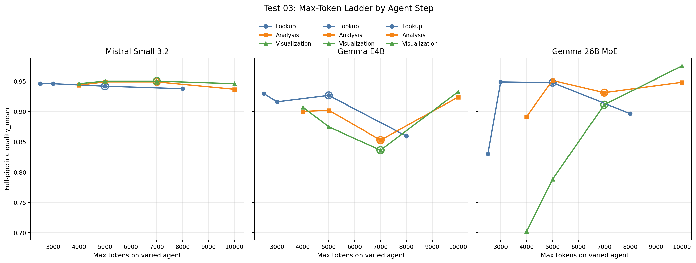
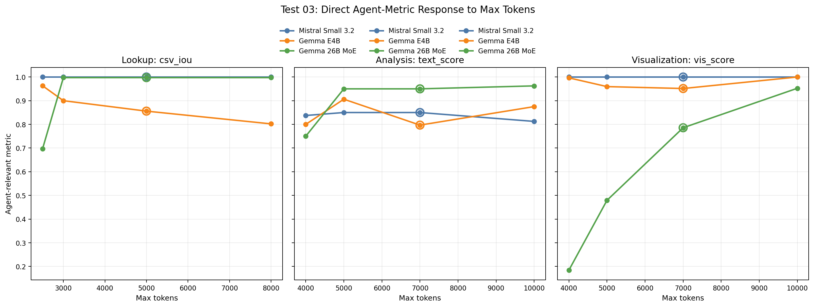
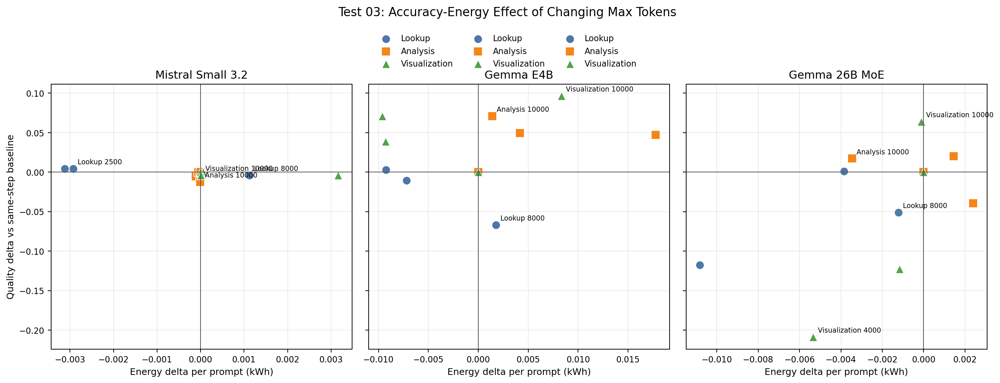
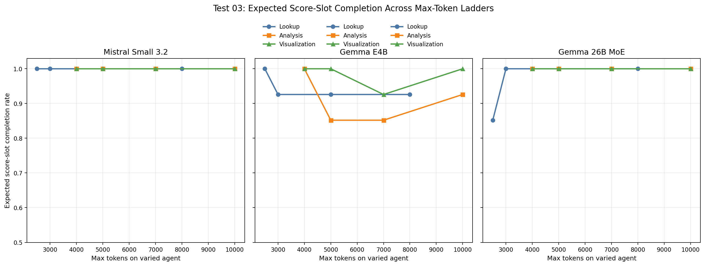
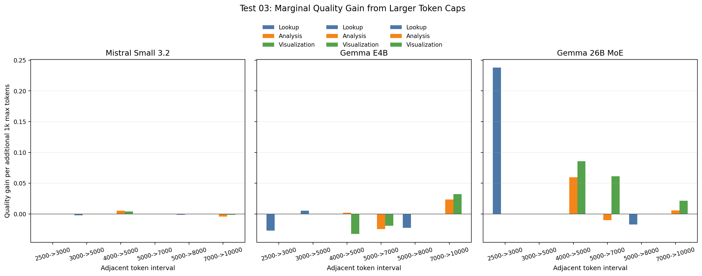

# Test 03 Report: Max Tokens Agent Ladder

## Data Source

Results analyzed from:

```text
/home/oss/Downloads/03_max_tokens_agent_ladder/
```

Completed result folders:

```text
gemma4_e4b/rep
gemma4_26b/rep
mistral_small32_24b/rep
```

Each completed model contains:

```text
12 configs x 10 prompts = 120 benchmark rows
```

Coverage limitation:

```text
nemotron-3-nano:4b was planned in the experiment document, but no result folder was present in this directory.
```

Repeat limitation:

```text
Only one repeat per completed model was present.
```

The results are therefore strong exploratory evidence, but the final thesis claim should avoid presenting small differences as statistically stable.

## Method Notes

This experiment varies only one agent's `max_tokens` at a time:

```text
lookup_sales_data      2500, 3000, 5000 baseline, 8000
analyzing_data         4000, 5000, 7000 baseline, 10000
create_visualization   4000, 5000, 7000 baseline, 10000
```

The other two agents are kept at generous token caps so the varied step is the intended bottleneck.

Interpretation uses two views:

```text
step metric      csv_iou for lookup, text_score for analysis, vis_score for visualization
quality_mean     full-pipeline thesis metric
```

The step metric is the cleaner signal for the varied agent. `quality_mean` is still useful because it tells whether the setting improves the final user-visible result.

## Executive Findings

The main finding is that `max_tokens` sensitivity is strongly model-dependent and agent-dependent.

- `mistral-small3.2:24b` is almost insensitive to token caps in this range. SQL and visualization are saturated, and analysis changes are small.
- `gemma4:26b` has one clear token bottleneck: visualization. Increasing visualization from `4000` to `10000` raises `vis_score` from `0.1846` to `0.9524` and full quality from `0.7023` to `0.9749`.
- `gemma4:e4b` benefits from a higher cap mainly in analysis and visualization, but the relationship is not monotonic in every step.
- Higher caps do not automatically mean higher energy. They are upper bounds, not fixed generation lengths. The clearest example is `gemma4:26b` visualization: `7000` to `10000` improves quality by `+0.0639` while total measured energy is essentially unchanged.

Practical thesis signal:

```text
Use generous max_tokens for steps that can fail structurally, especially visualization.
Do not use max_tokens as the primary energy-saving lever unless a lower cap is proven safe for that model and step.
```

## Overall Resource Use

Across all 12 configs and 120 prompt runs per completed model:

| Model | Total sec | Total kWh | Total GPU kWh | Mean sec / prompt | Mean kWh / prompt |
|---|---:|---:|---:|---:|---:|
| `mistral-small3.2:24b` | 15,830.3 | 1.3748 | 1.1522 | 131.9 | 0.0115 |
| `gemma4:e4b` | 24,880.9 | 2.1258 | 1.7789 | 207.3 | 0.0177 |
| `gemma4:26b` | 27,166.7 | 2.3353 | 1.9572 | 226.4 | 0.0195 |

This is consistent with the previous experiments: Mistral Small is the fastest and most energy-efficient model among the completed Test 03 runs. Gemma 26B is slower than Gemma E4B, but not by a very large margin in this specific test.

## Sensitivity Ranges

The table reports the range between the best and worst token cap inside each agent ladder.

| Model | Varied step | Step metric range | Quality range | Most sensitive finding |
|---|---|---:|---:|---|
| `gemma4:e4b` | lookup | 0.1607 | 0.0699 | Higher lookup caps did not help in this run. |
| `gemma4:e4b` | analysis | 0.1093 | 0.0709 | `10000` gives the best full quality. |
| `gemma4:e4b` | visualization | 0.0486 | 0.0963 | `10000` gives the best full quality and perfect `vis_score`. |
| `gemma4:26b` | lookup | 0.3000 | 0.1189 | `2500` is too low; `3000+` saturates SQL. |
| `gemma4:26b` | analysis | 0.2125 | 0.0595 | `4000` is too low; `5000+` is strong. |
| `gemma4:26b` | visualization | 0.7679 | 0.2726 | Visualization is the dominant token bottleneck. |
| `mistral-small3.2:24b` | lookup | 0.0000 | 0.0083 | SQL is saturated at all tested caps. |
| `mistral-small3.2:24b` | analysis | 0.0375 | 0.0122 | Small text-score movement only. |
| `mistral-small3.2:24b` | visualization | 0.0000 | 0.0042 | Visualization is saturated at all tested caps. |

The strongest effect in the whole test is `gemma4:26b` visualization. That is thesis-relevant because it shows that a large thinking MoE can still have a very specific agent-step bottleneck.

## Figures

The figures below focus on the main Test 03 question: whether larger `max_tokens` values improve accuracy, whether the effect depends on the agent step, and whether the additional budget is expensive.



This is the main Test 03 plot. Each panel is a model, and each line varies `max_tokens` for one agent while the other agents remain fixed at generous caps. It shows that `max_tokens` is not a global model setting: the same model can be insensitive in lookup but highly sensitive in visualization.



This companion plot isolates the direct metric for the varied agent: `csv_iou` for lookup, `text_score` for analysis, and `vis_score` for visualization. It makes the strongest result very clear: `gemma4:26b` visualization improves sharply as the cap rises.



This plot shows the quality and energy delta relative to the baseline for the same agent step. It supports the thesis point that larger token caps are upper bounds, not guaranteed extra computation: some higher caps improve quality with little or no measured energy increase.



This reliability plot counts expected score-slot completion only. It shows why too-low caps are risky: even if average energy falls, missing expected scores can reduce the usable end-to-end result.



This plot shows the marginal quality gain between adjacent token levels. It is useful for selecting practical caps: choose generous values where low caps create structural failures, but avoid increasing caps where the curve is already flat or negative.

## Gemma E4B Findings

| Step | Token cap behavior | Best full-quality cap | Best step-metric cap | Interpretation |
|---|---|---:|---:|---|
| lookup | `csv_iou` falls from `0.9628` at `2500` to `0.8021` at `8000`. | `2500` | `2500` | Lookup was not token-limited in this range; extra room may allow longer, less stable SQL. |
| analysis | `text_score` is highest at `5000`, but full quality is highest at `10000`. | `10000` | `5000` | Analysis benefits from avoiding the `7000` baseline setting; `10000` is the safest thesis setting. |
| visualization | `vis_score` is already high, but full quality is best at `10000`. | `10000` | `10000` | Higher cap can help, but it also increases runtime and energy for E4B. |

Important numbers:

| Step | Baseline cap | Baseline quality | Best quality | Best cap | Quality gain | Energy change vs baseline |
|---|---:|---:|---:|---:|---:|---:|
| lookup | 5000 | 0.9264 | 0.9293 | 2500 | +0.0029 | -0.0093 kWh |
| analysis | 7000 | 0.8528 | 0.9236 | 10000 | +0.0709 | +0.0014 kWh |
| visualization | 7000 | 0.8361 | 0.9324 | 10000 | +0.0963 | +0.0083 kWh |

For Gemma E4B, the ad hoc max-token story is mixed:

```text
analysis:      higher cap improves quality at very small marginal energy
visualization: higher cap improves quality but with visible runtime/energy cost
lookup:        lower cap is better in this run
```

This suggests that a single global max-token setting is not ideal for an agent pipeline. The value should be set per agent.

## Gemma 26B MoE Findings

| Step | Token cap behavior | Best full-quality cap | Best step-metric cap | Interpretation |
|---|---|---:|---:|---|
| lookup | `2500` is unsafe; `3000`, `5000`, and `8000` all reach `csv_iou=0.9974`. | `3000` | `3000+` | SQL needs a minimum cap, but does not need a very high cap. |
| analysis | `4000` hurts text; `5000+` is stable and strong. | `5000` | `10000` | Analysis has a minimum usable cap around `5000`. |
| visualization | Strong monotonic improvement in `vis_score`: `0.1846`, `0.4793`, `0.7857`, `0.9524`. | `10000` | `10000` | Visualization needs the generous cap. This is the clearest result of Test 03. |

Important numbers:

| Step | Baseline cap | Baseline quality | Best quality | Best cap | Quality gain | Energy change vs baseline |
|---|---:|---:|---:|---:|---:|---:|
| lookup | 5000 | 0.9476 | 0.9487 | 3000 | +0.0012 | -0.0038 kWh |
| analysis | 7000 | 0.9310 | 0.9511 | 5000 | +0.0202 | +0.0014 kWh |
| visualization | 7000 | 0.9110 | 0.9749 | 10000 | +0.0639 | -0.0001 kWh |

The visualization ladder is the strongest support for the thesis claim that larger `max_tokens` can improve usability at low marginal cost. Compared with the `7000` baseline, `10000` gives a large accuracy gain with effectively no extra measured total energy.

Compared with `4000`, the full improvement is even clearer:

```text
vis_score:      0.1846 -> 0.9524
quality_mean:   0.7023 -> 0.9749
total energy:   0.0155 -> 0.0208 kWh per prompt
```

That is a large quality recovery for a modest energy increase.

## Mistral Small 3.2 Findings

| Step | Token cap behavior | Best full-quality cap | Best step-metric cap | Interpretation |
|---|---|---:|---:|---|
| lookup | `csv_iou=1.0000` for all caps. | `2500` or `3000` | any | Lookup is not token-limited. |
| analysis | `text_score` varies only from `0.8125` to `0.8500`. | `5000` or `7000` | `5000` or `7000` | Small effect; `10000` is not useful here. |
| visualization | `vis_score=1.0000` for all caps. | `5000` or `7000` | any | Visualization is not token-limited. |

Important numbers:

| Step | Baseline cap | Baseline quality | Best quality | Best cap | Quality gain | Energy change vs baseline |
|---|---:|---:|---:|---:|---:|---:|
| lookup | 5000 | 0.9417 | 0.9458 | 2500/3000 | +0.0042 | -0.0029 to -0.0031 kWh |
| analysis | 7000 | 0.9488 | 0.9488 | 5000/7000 | +0.0000 | -0.0000 kWh |
| visualization | 7000 | 0.9500 | 0.9500 | 5000/7000 | +0.0000 | +0.0001 kWh |

Mistral is already usable at the lower tested token caps. For this model, `max_tokens` is not a meaningful accuracy lever in the tested range. It is mainly a safety bound.

## Thesis Interpretation

This test supports three thesis-level claims.

First, `max_tokens` is an agent-specific parameter, not a model-wide constant. The same model can be insensitive in lookup and highly sensitive in visualization.

Second, high token caps are often cheap because they do not force the model to spend the whole budget. This is clearest for Mistral and for Gemma 26B visualization from `7000` to `10000`.

Third, overly low caps can create structural failures. The most important example is Gemma 26B visualization, where low caps produce very poor chart scores even though the same model is strong on SQL and text.

## Recommended Follow-Up Settings

For later confirmation tests, use these per-step caps as practical defaults:

| Model | lookup_sales_data | analyzing_data | create_visualization | Reason |
|---|---:|---:|---:|---|
| `gemma4:e4b` | 3000 or 5000 | 10000 | 10000 | Analysis and visualization benefit from more room; lookup does not need `8000`. |
| `gemma4:26b` | 3000 or 5000 | 5000 or 10000 | 10000 | Visualization must be generous; lookup saturates early. |
| `mistral-small3.2:24b` | 3000 | 5000 or 7000 | 5000 or 7000 | Lower caps are enough and preserve efficiency. |

For the thesis narrative, the strongest max-token example is:

```text
gemma4:26b create_visualization 4000 -> 10000
```

It shows a clear accuracy recovery with a modest energy increase, and it demonstrates why token budgets should be tuned per agent rather than globally.
