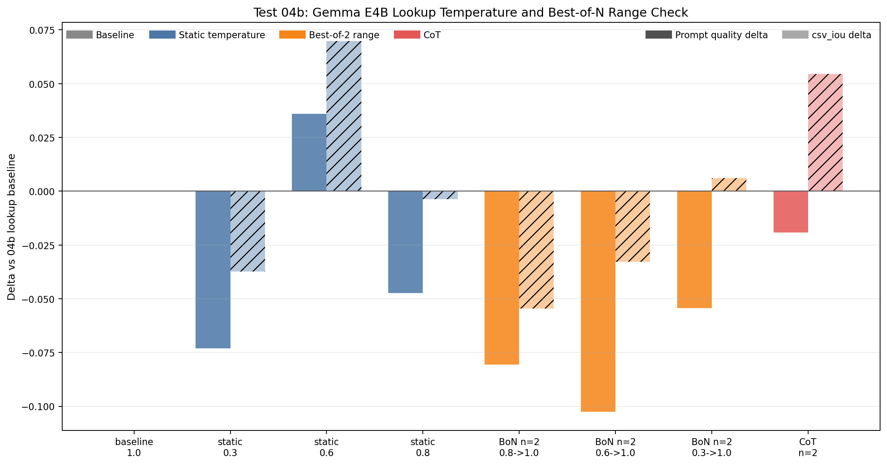
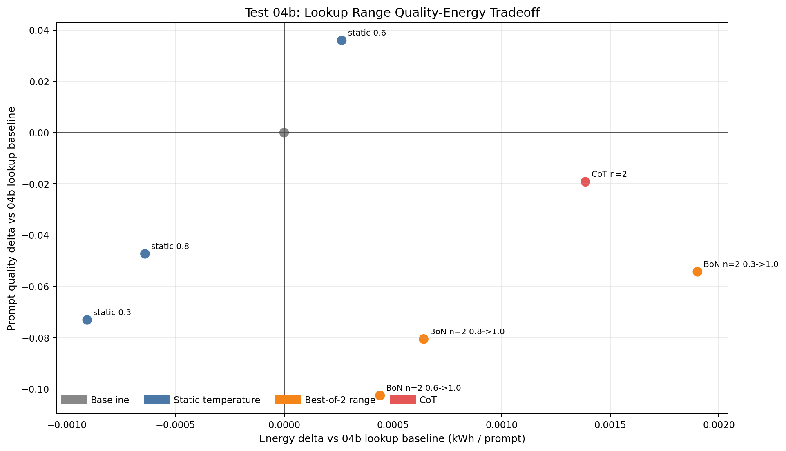
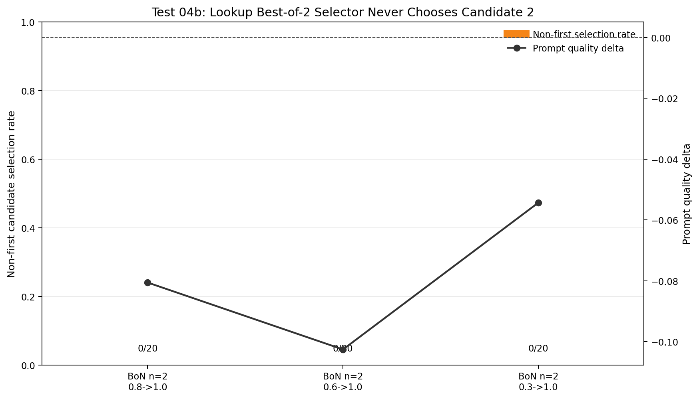

# Test 04 Report: Gemma E4B Compute Expansion

## Data Source

Results analyzed from:

```text
/home/oss/Downloads/04_compute_expansion_n_and_cot/
```

Follow-up range-check results analyzed from:

```text
/home/oss/Downloads/04b_lookup_bon_range/
```

Completed result folders:

```text
gemma4_e4b/rep01
gemma4_e4b/rep02
```

Each repeat contains:

```text
10 configs x 10 prompts = 100 benchmark rows
```

The follow-up `04b` run contains:

```text
8 lookup-only configs x 10 prompts x 2 repeats = 160 benchmark rows
```

This test is limited to:

```text
gemma4:e4b
```

The purpose is to see whether the small thinking model can recover accuracy through extra inference calls: Best-of-N or CoT refinement.

## Measurement Caveat

The absolute energy values in Test 04 are much lower than Test 03 for similar elapsed times. For example, each Test 04 repeat has about `17,100` seconds of runtime but only about `0.21 kWh` total energy.

Therefore, this report uses:

```text
elapsed_sec       primary compute-cost signal
energy deltas     useful within Test 04, but not compared directly against Test 03
```

The direction of energy deltas is still informative inside this test because configs were run under the same measurement setup.

## Method Notes

This test keeps the bulk-runner logic:

```text
vary one agent step at a time
keep the other two steps at baseline
```

It tests:

```text
lookup_sales_data:
  baseline
  best_of_n with temperature, n=2
  best_of_n with temperature, n=3
  cot_n=2

analyzing_data:
  baseline
  best_of_n with temperature, n=2

create_visualization:
  baseline
  best_of_n with top_k, n=2
  best_of_n with top_k, n=3
  cot_n=2
```

Interpretation uses the mean across `rep01` and `rep02`.

## Executive Findings

Compute expansion helps Gemma E4B, but the follow-up `04b` run changes the lookup interpretation.

- The original Test 04 run suggested that lookup compute expansion was the best intervention: `lookup_cot_n2` gave `+0.1142` quality and `lookup_bon_temperature_n2` gave `+0.1018`.
- The follow-up `04b` run shows that the cleaner lookup improvement is static temperature tuning, not Best-of-N. Static `lookup_temp_0_6` is best: prompt quality `+0.0360`, `csv_iou +0.0698`, and only `+0.00027 kWh` per prompt versus the `04b` lookup baseline.
- Lookup Best-of-2 is confounded. Across all three `04b` BoN ranges, the selector chose the second candidate `0/20` times. With two lookup candidates, the consensus score ties by construction, so `np.argmax` selects candidate 0.
- Lookup CoT remains conceptually plausible for SQL repair, but the `04b` run did not reproduce the original gain: `lookup_cot_n2` had prompt quality `-0.0192` versus the `04b` baseline.
- Analysis Best-of-N helps, but it is expensive: `+0.0771` quality for `+70.4s` per prompt. It should be compared against cheaper static settings from Test 02 before becoming a final recommendation.
- Visualization Best-of-N with `top_k`, `n=2` helps: `+0.0501` quality and perfect average `vis_score`, but costs `+53.4s`.
- `n=3` is not justified. It is worse than `n=2` for lookup and visualization while adding more calls.
- Visualization CoT is not useful in this run. It reduces average quality by `-0.0276`.

Practical thesis signal:

```text
Extra compute should be step-specific and benchmarked against cheaper static settings.
More calls are not automatically better, and Best-of-N can be confounded by the selector.
```

## Overall Resource Use

| Repeat | Rows | Total sec | Total kWh | Total GPU kWh | Mean sec / prompt | Mean kWh / prompt |
|---|---:|---:|---:|---:|---:|---:|
| `rep01` | 100 | 17,098.6 | 0.2108 | 0.1643 | 171.0 | 0.0021 |
| `rep02` | 100 | 17,219.0 | 0.2127 | 0.1659 | 172.2 | 0.0021 |

The two repeats have very similar runtime and measured energy, which makes within-test deltas stable enough for design decisions.

## Aggregate Results

| Config | Varied step | Quality | Quality delta | Step metric | Step delta | Sec / prompt | Sec delta | kWh / prompt | kWh delta |
|---|---|---:|---:|---:|---:|---:|---:|---:|---:|
| `lookup_baseline` | lookup | 0.8400 | 0.0000 | `csv_iou=0.8327` | 0.0000 | 164.3 | 0.0 | 0.0020 | 0.0000 |
| `lookup_bon_temperature_n2` | lookup | 0.9418 | +0.1018 | `csv_iou=0.9905` | +0.1579 | 178.4 | +14.1 | 0.0022 | +0.0002 |
| `lookup_bon_temperature_n3` | lookup | 0.8959 | +0.0559 | `csv_iou=0.8934` | +0.0608 | 167.5 | +3.1 | 0.0020 | -0.0000 |
| `lookup_cot_n2` | lookup | 0.9542 | +0.1142 | `csv_iou=0.9687` | +0.1361 | 170.2 | +5.9 | 0.0021 | +0.0001 |
| `analysis_baseline` | analysis | 0.8572 | 0.0000 | `text_score=0.7929` | 0.0000 | 121.8 | 0.0 | 0.0015 | 0.0000 |
| `analysis_bon_temperature_n2` | analysis | 0.9343 | +0.0771 | `text_score=0.9028` | +0.1099 | 192.2 | +70.4 | 0.0024 | +0.0009 |
| `visualization_baseline` | visualization | 0.9083 | 0.0000 | `vis_score=0.9795` | 0.0000 | 142.1 | 0.0 | 0.0018 | 0.0000 |
| `visualization_bon_top_k_n2` | visualization | 0.9584 | +0.0501 | `vis_score=1.0000` | +0.0205 | 195.5 | +53.4 | 0.0025 | +0.0007 |
| `visualization_bon_top_k_n3` | visualization | 0.9022 | -0.0060 | `vis_score=1.0000` | +0.0205 | 227.2 | +85.1 | 0.0029 | +0.0011 |
| `visualization_cot_n2` | visualization | 0.8807 | -0.0276 | `vis_score=0.9766` | -0.0029 | 156.7 | +14.6 | 0.0019 | +0.0002 |

The best overall config is:

```text
lookup_cot_n2
```

The best Best-of-N config is:

```text
lookup_bon_temperature_n2
```

This Best-of-N interpretation is qualified by the `04b` range check below. The same `0.6 -> 1.0` lookup BoN range did not reproduce its original gain, and static `temperature=0.6` was stronger.

The strongest negative result is:

```text
visualization_cot_n2
```

## Figures

The figures below show Test 04 as a compute-expansion experiment: when extra calls improve accuracy, how much cost they add, and whether the selector actually uses later candidates.


This is the main Test 04 decision plot. Points above zero improve full-pipeline quality, while points farther right add more energy per prompt. The strongest result is that lookup CoT and lookup Best-of-N both improve quality with relatively modest extra energy, while visualization `n=3` and visualization CoT are not attractive.


This plot isolates the direct metric of the varied agent: `csv_iou` for lookup, `text_score` for analysis, and `vis_score` for visualization. It shows that lookup compute expansion repairs the intended SQL metric, while visualization improvements are smaller because the baseline visual score was already high.


This plot shows that more calls are not monotonically better. `n=2` is the useful Best-of-N setting; `n=3` is dominated for lookup and visualization in this run.


This plot checks whether Best-of-N is really benefiting from later candidates. Later candidates are rarely selected, especially for lookup and visualization `n=3`, which supports the caveat that some Best-of-N gains may come from the first candidate's parameter setting rather than from the selector.



This follow-up plot isolates lookup Best-of-N range effects. It shows that static `temperature=0.6` is the strongest lookup setting, while all Best-of-2 range variants lose prompt quality versus the same-run baseline.



This plot shows the prompt-quality and energy tradeoff for the lookup range check. Static `temperature=0.6` is the only positive-quality point, with a small energy increase.



This plot shows the key methodological issue: lookup Best-of-2 never selected the second candidate in `04b`. The apparent Best-of-N effect is therefore not evidence of useful candidate selection.

## Lookup Agent

The original Test 04 run made lookup look like the clearest winner for compute expansion.

| Config | Quality delta | csv_iou delta | Sec delta | Interpretation |
|---|---:|---:|---:|---|
| `lookup_bon_temperature_n2` | +0.1018 | +0.1579 | +14.1 | Strong and consistent improvement. |
| `lookup_bon_temperature_n3` | +0.0559 | +0.0608 | +3.1 | Positive, but dominated by `n=2`. |
| `lookup_cot_n2` | +0.1142 | +0.1361 | +5.9 | Best quality-cost tradeoff in this test. |

`lookup_cot_n2` is especially important because SQL has an executable artifact and concrete failure modes. A feedback loop can repair joins, filters, grouping, and result shape in a way that is directly useful to the benchmark.

However, `lookup_bon_temperature_n2` should also be kept as a candidate for final confirmation because it is more repeat-stable:

```text
rep01 quality delta: +0.1028
rep02 quality delta: +0.1007
```

`lookup_cot_n2` is better on average, but more variable:

```text
rep01 quality delta: +0.1352
rep02 quality delta: +0.0931
```

### Lookup Range Check: Test 04b

The `04b` follow-up was designed to answer whether lookup Best-of-N was useful because of multiple candidates or simply because the first candidate used a better temperature. It compared static lookup temperatures against Best-of-2 ranges.

| Config | Prompt quality | Prompt delta | csv_iou | csv delta | Completion | Sec / prompt | kWh / prompt |
|---|---:|---:|---:|---:|---:|---:|---:|
| `lookup_temp_0_6` | 0.9745 | +0.0360 | 0.9954 | +0.0698 | 1.000 | 95.8 | 0.00896 |
| `lookup_baseline` | 0.9385 | 0.0000 | 0.9256 | 0.0000 | 1.000 | 94.6 | 0.00869 |
| `lookup_cot_n2` | 0.9193 | -0.0192 | 0.9801 | +0.0545 | 1.000 | 107.9 | 0.01008 |
| `lookup_temp_0_3` | 0.8654 | -0.0731 | 0.8883 | -0.0373 | 0.926 | 84.0 | 0.00778 |
| `lookup_temp_0_8` | 0.8912 | -0.0473 | 0.9219 | -0.0037 | 0.963 | 88.9 | 0.00805 |
| `lookup_bon_temp_n2_narrow` | 0.8579 | -0.0806 | 0.8710 | -0.0546 | 0.963 | 104.3 | 0.00933 |
| `lookup_bon_temp_n2_medium` | 0.8359 | -0.1026 | 0.8928 | -0.0328 | 0.926 | 102.9 | 0.00913 |
| `lookup_bon_temp_n2_wide` | 0.8842 | -0.0543 | 0.9318 | +0.0062 | 1.000 | 109.3 | 0.01059 |

The conclusion is that static `temperature=0.6` is the stronger and cheaper lookup intervention. `lookup_bon_temp_n2_medium` uses the same `0.6 -> 1.0` range as the original Test 04 `lookup_bon_temperature_n2`, but it did not reproduce the original gain.

The selector diagnostics explain why this matters:

```text
lookup_bon_temp_n2_narrow: 0 / 20 non-first selections
lookup_bon_temp_n2_medium: 0 / 20 non-first selections
lookup_bon_temp_n2_wide:   0 / 20 non-first selections
```

For lookup, the no-ground-truth Best-of-N selector scores candidates by consensus similarity. With exactly two candidates, candidate A's similarity to candidate B equals candidate B's similarity to candidate A, so the scores tie and `np.argmax` selects candidate 0. This means lookup Best-of-2 does not really test selection quality; it mostly tests the first candidate's parameter value.

## Analysis Agent

Analysis Best-of-N improves text quality, but the compute cost is much larger than lookup.

```text
quality_mean: +0.0771
text_score:   +0.1099
elapsed_sec:  +70.4s per prompt
energy:       +0.0009 kWh per prompt
```

This is useful evidence that Gemma E4B's analysis step benefits from candidate diversity. But it is not automatically the best thesis recommendation, because Test 02 found cheaper static analysis changes that should be compared against it.

Recommended interpretation:

```text
Analysis Best-of-N is accuracy-positive but probably not Pareto-optimal unless static settings fail in the final confirmation test.
```

## Visualization Agent

Visualization has a mixed result.

`visualization_bon_top_k_n2` is useful:

```text
quality_mean: +0.0501
vis_score:    0.9795 -> 1.0000
elapsed_sec:  +53.4s per prompt
```

`visualization_bon_top_k_n3` is not useful:

```text
quality_mean: -0.0060
elapsed_sec:  +85.1s per prompt
```

`visualization_cot_n2` is negative:

```text
quality_mean: -0.0276
vis_score:    -0.0029
elapsed_sec:  +14.6s per prompt
```

This suggests that visualization does benefit from controlled diversity, but not from adding more than two candidates and not from the current CoT loop.

## Candidate Selection Behavior

The candidate-selection logs show an important detail: Best-of-N often selected the first candidate.

| Config | Candidates | Non-first selections | Mean selection margin | Interpretation |
|---|---:|---:|---:|---|
| `lookup_bon_temperature_n2` | 2 | 0 / 20 | 0.0000 | Selection usually tied; first candidate dominated. |
| `lookup_bon_temperature_n3` | 3 | 2 / 20 | 0.0250 | Extra candidates were rarely selected. |
| `analysis_bon_temperature_n2` | 2 | 1 / 18 scored | 0.1296 | Some separation, but mostly first candidate. |
| `visualization_bon_top_k_n2` | 2 | 3 / 13 visual cases | 0.0462 | The second candidate is sometimes useful. |
| `visualization_bon_top_k_n3` | 3 | 0 / 12 visual cases | 0.0000 | Third candidate adds cost without selection benefit. |

This is thesis-relevant. Best-of-N is not only testing "more samples"; it is also testing the ordered candidate schedule. If the first candidate is usually selected, the gain may partly come from the first candidate's parameter value, not from the selector.

The `04b` follow-up makes this caveat stronger for lookup Best-of-2:

```text
lookup_bon_temp_n2_narrow: 0 / 20 non-first selections
lookup_bon_temp_n2_medium: 0 / 20 non-first selections
lookup_bon_temp_n2_wide:   0 / 20 non-first selections
```

Therefore, lookup Best-of-2 should not be presented as evidence that candidate selection improves SQL generation. It is better interpreted as a confounded static-temperature test.

For final confirmation, compare these against cheaper static settings:

```text
lookup_temp_0_6                vs lookup Best-of-N ranges
analysis_bon_temperature_n2    vs static analysis temperature/top_k from Test 02
visualization_bon_top_k_n2     vs static visualization top_k_low from Test 02
```

## CoT Findings

CoT behaves differently by agent.

| Step | CoT result | Interpretation |
|---|---|---|
| lookup | Positive in original Test 04, but not reproduced in `04b`. | Treat as plausible but unstable. SQL can exploit feedback, but static `temperature=0.6` is cleaner evidence. |
| visualization | Negative: `quality -0.0276`, `vis_score -0.0029`. | Reject in current form. The visualization baseline is already high, and the extra pass can perturb otherwise good outputs. |

This supports the user's original intuition only partially:

```text
SQL generation can benefit from feedback, but the effect was not stable in the follow-up.
Visualization does not benefit from this specific feedback loop in this run.
```

## Thesis Interpretation

This test supports four thesis-level claims.

First, extra compute is not universally valuable. It must be targeted at the agent step that can use it, and it must be compared against static parameter changes.

Second, `n=2` is the practical upper bound for this pipeline. `n=3` is dominated in both lookup and visualization.

Third, CoT should be artifact-aware. SQL has a natural correction loop; visualization, at least with the current implementation, does not show the same benefit.

Fourth, Best-of-N can be confounded with parameter scheduling. Since the first candidate is selected most of the time, a static parameter setting may recover much of the gain at lower cost. The `04b` lookup range check confirms this directly: static `temperature=0.6` beats every lookup Best-of-2 range.

## Recommended Follow-Up

Carry these configs into final confirmation or thesis discussion:

| Candidate | Why keep it |
|---|---|
| `lookup_temp_0_6` | Best follow-up lookup result; improves prompt quality and `csv_iou` without extra calls. |
| `lookup_cot_n2` | Conceptually useful for SQL repair, but should be treated as unstable because `04b` did not reproduce the original gain. |
| `analysis_bon_temperature_n2` | Large analysis gain, but must compete with cheaper static settings. |
| `visualization_bon_top_k_n2` | Useful controlled diversity; reaches perfect average `vis_score`. |

Reject these for final confirmation unless there is a new reason to retest:

| Candidate | Why reject it |
|---|---|
| `lookup_bon_temperature_n2` | Original gain is confounded; `04b` shows static `temperature=0.6` is stronger and lookup Best-of-2 never selects candidate 2. |
| `lookup_bon_temperature_n3` | Positive in the original run but not needed once static temperature and selector confounding are considered. |
| `visualization_bon_top_k_n3` | More expensive than `n=2` and lower full quality. |
| `visualization_cot_n2` | Negative average quality and no visual-score gain. |

The final thesis discussion can frame Test 04 as evidence that small thinking models can recover accuracy with selective extra computation, but the recovery is not free, not monotonic, and sometimes not due to extra compute at all. For lookup, the stronger lesson is agent-specific static tuning.
