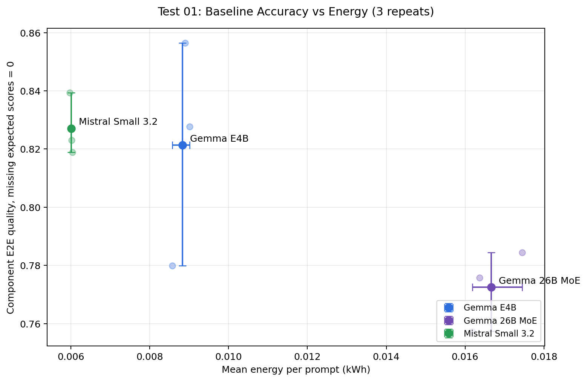
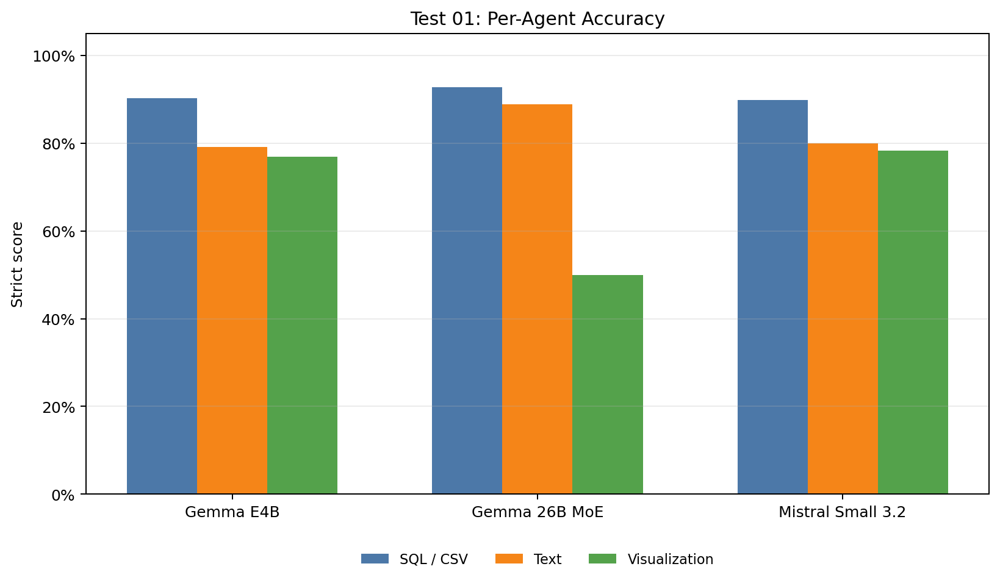
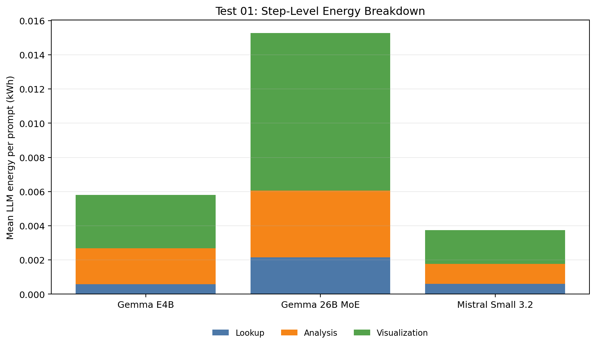
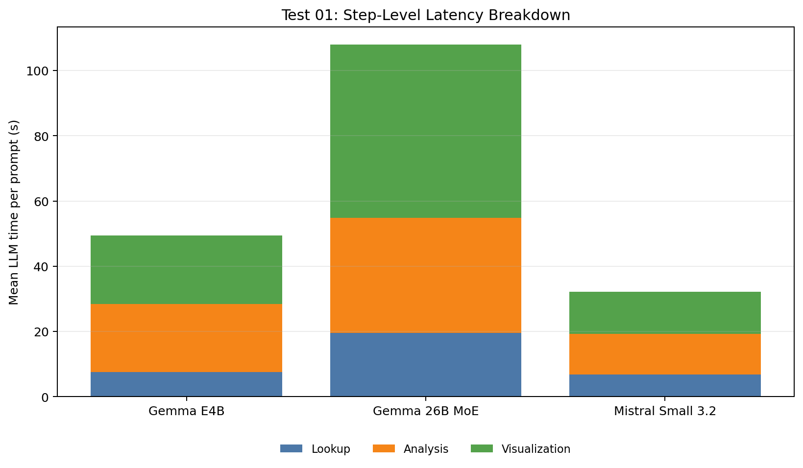
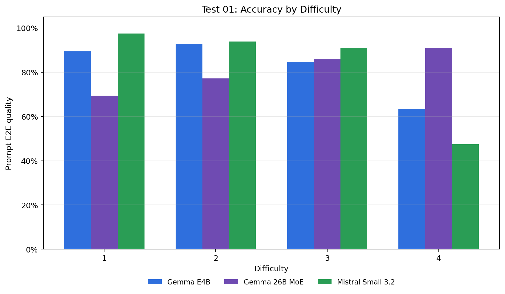
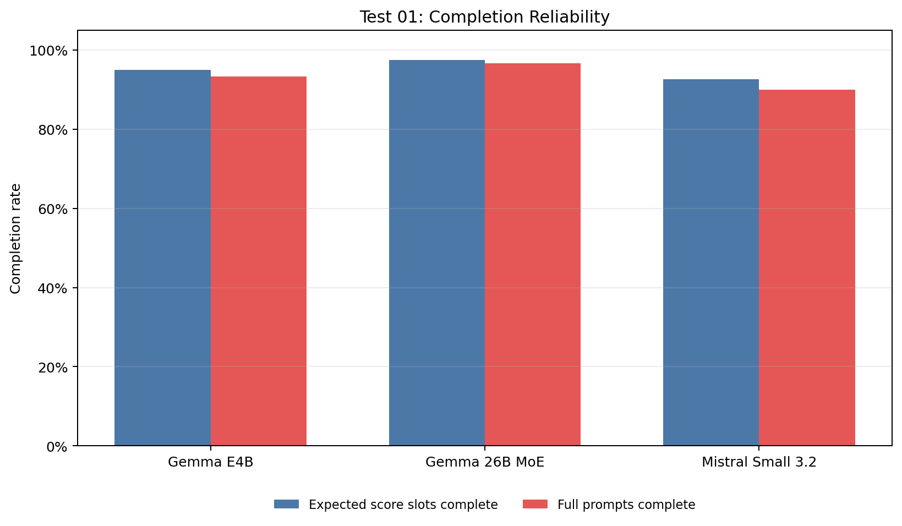
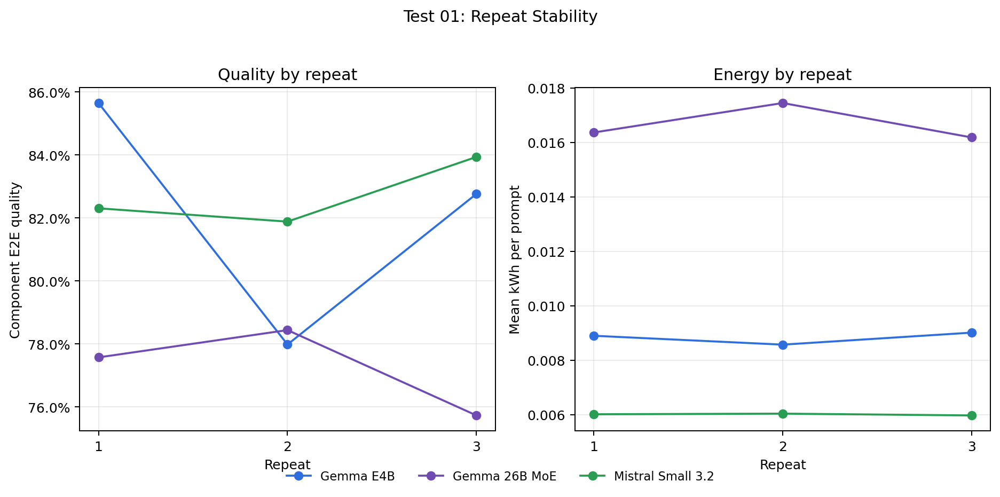
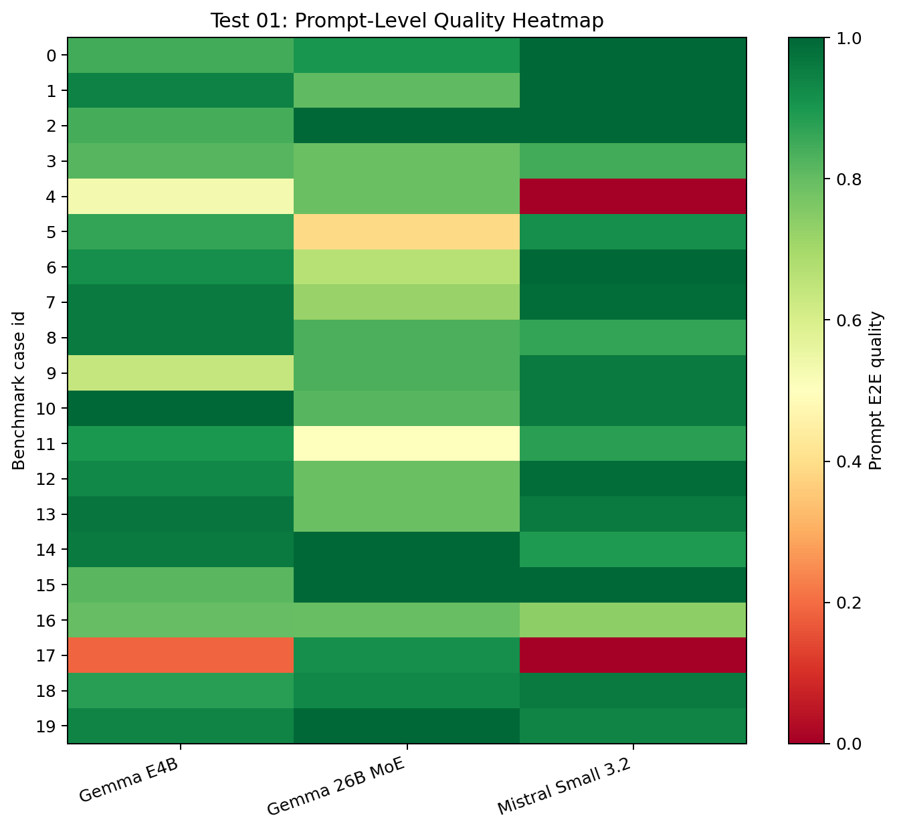
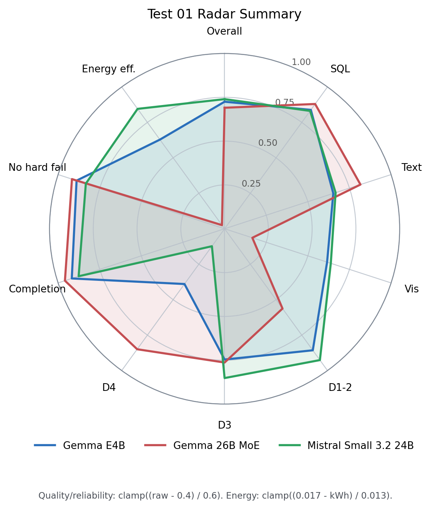

# Test 01 Final Report: Baseline Model Comparison

## Data Source

Results analyzed from:

```text
/home/oss/Downloads/01_model_baseline_comparison/
```

Run structure used:

```text
gemma4_e4b/rep01
gemma4_e4b/rep02
gemma4_e4b/rep03
gemma4_26b/rep01
gemma4_26b/rep02
gemma4_26b/rep03
mistral_small32_24b/rep01
mistral_small32_24b/rep02
mistral_small32_24b/rep03
```

The legacy one-off `rep` folders in the same download directory were intentionally excluded. This report uses the final three-repeat execution only: 3 models x 3 repeats x 20 prompts = 180 benchmark rows.

GT text and visualization judging was performed with `openai/gpt-5.4`; no-GT operational judging stayed on the local tested model, as shown by the runner metadata.

## Executive Findings

The final three-repeat run changes the Test 01 baseline story in an important way: `mistral-small3.2:24b` is now the best model by strict component-balanced end-to-end quality (0.827), while `mistral-small3.2:24b` remains the cheapest and fastest baseline (0.006009 kWh and 48.9s per prompt on average).

Main findings:

- `mistral-small3.2:24b` is the best aggregate Pareto baseline in this final Test 01 run: it has the highest strict component quality, highest prompt quality, lowest energy, lowest latency, and highest quality per kWh.
- `gemma4:e4b` is no longer merely the fragile small model seen in the earlier one-repeat report. Across three repeats it is very close to Mistral on strict quality, but costs about 1.47x more energy and 1.54x more time per prompt.
- `gemma4:26b` is not the Pareto winner here. It is strongest on the hardest prompts and has the best text score, but it is much slower and more energy-intensive, and its visualization score is the main factor holding back the aggregate quality.
- Repeat variance is small enough for the model-level conclusion to be meaningful. The largest quality range across repeats is `gemma4:e4b` at 0.077; the largest energy range is `gemma4:26b` at 0.001264 kWh per prompt.

## Metric Convention

The report uses the strict end-to-end interpretation agreed after the first analysis:

```text
If a score is expected by the GT flags but is missing, it counts as 0.0.
```

Three quality views are shown:

```text
official_quality              runner summary quality, kept for continuity
component_e2e_quality         mean(csv, text, vis), missing expected scores count as 0
prompt_e2e_quality            mean per prompt over expected components, missing expected scores count as 0
```

For thesis discussion, `component_e2e_quality` is the main model-comparison metric because it preserves the component-balanced interpretation while still penalizing failed pipeline steps.

## Aggregate Results

| Model | Role | Repeats | Rows | Official quality | Component E2E quality | Prompt E2E quality | csv E2E | text E2E | vis E2E | Mean sec | Mean kWh | Quality/kWh |
| --- | --- | --- | --- | --- | --- | --- | --- | --- | --- | --- | --- | --- |
| gemma4:e4b | small thinking | 3 | 60 | 0.867 | 0.821 | 0.835 | 0.903 | 0.792 | 0.769 | 75.4 | 0.008829 | 93.0 |
| gemma4:26b | larger thinking MoE | 3 | 60 | 0.792 | 0.772 | 0.814 | 0.928 | 0.890 | 0.500 | 136.0 | 0.016667 | 46.4 |
| mistral-small3.2:24b | larger non-thinking | 3 | 60 | 0.900 | 0.827 | 0.844 | 0.899 | 0.800 | 0.783 | 48.9 | 0.006009 | 137.6 |

Interpretation:

- The best strict quality is `mistral-small3.2:24b`, and it is also the lowest-energy model.
- The best prompt-level quality is `mistral-small3.2:24b` (0.844), which means it is the strongest model when each user request is treated as one unit rather than as separate component scores.
- The best efficiency point is `mistral-small3.2:24b`, so it remains the strongest candidate when accuracy and energy must be balanced.

## Figures

The first plot shows model means with repeat spread. Small transparent points are individual repeats; the larger point and error bars summarize the three-repeat mean and range.

















## Completeness And Reliability

| Model | Rows | csv expected | csv complete | text expected | text complete | vis expected | vis complete | Timeouts |
| --- | --- | --- | --- | --- | --- | --- | --- | --- |
| gemma4:e4b | 60 | 60 | 60 | 60 | 56 | 42 | 38 | 0 |
| gemma4:26b | 60 | 60 | 60 | 60 | 58 | 42 | 40 | 0 |
| mistral-small3.2:24b | 60 | 60 | 60 | 60 | 54 | 42 | 36 | 0 |

Missing expected score slots:

- `gemma4:e4b`: 8 missing expected score slots; main affected prompts: case 17 (4 missing slots, mean quality 0.189); case 4 (2 missing slots, mean quality 0.528); case 9 (2 missing slots, mean quality 0.639).
- `gemma4:26b`: 4 missing expected score slots; main affected prompts: case 5 (2 missing slots, mean quality 0.389); case 11 (2 missing slots, mean quality 0.500).
- `mistral-small3.2:24b`: 12 missing expected score slots; main affected prompts: case 4 (6 missing slots, mean quality 0.000); case 17 (6 missing slots, mean quality 0.000).

The completion-rate plot is important because a model can look strong on the scores it produced while still failing a full user request. In this final run, missing expected scores are much less dominant than in the earlier one-repeat analysis, but they still explain part of the gap between official and strict quality.

## Repeat Stability

Per-repeat metrics:

| Model | Repeat | Component E2E quality | Prompt E2E quality | Mean kWh | Mean sec | Slot completion rate | Full prompt completion |
| --- | --- | --- | --- | --- | --- | --- | --- |
| gemma4:e4b | rep 01 | 0.856 | 0.865 | 0.008899 | 76.7 | 96.3% | 95.0% |
| gemma4:e4b | rep 02 | 0.780 | 0.804 | 0.008573 | 72.9 | 92.6% | 90.0% |
| gemma4:e4b | rep 03 | 0.828 | 0.835 | 0.009015 | 76.5 | 96.3% | 95.0% |
| gemma4:26b | rep 01 | 0.776 | 0.815 | 0.016366 | 134.0 | 96.3% | 95.0% |
| gemma4:26b | rep 02 | 0.784 | 0.840 | 0.017449 | 142.0 | 100.0% | 100.0% |
| gemma4:26b | rep 03 | 0.757 | 0.787 | 0.016185 | 131.9 | 96.3% | 95.0% |
| mistral-small3.2:24b | rep 01 | 0.823 | 0.839 | 0.006016 | 49.0 | 92.6% | 90.0% |
| mistral-small3.2:24b | rep 02 | 0.819 | 0.834 | 0.006039 | 49.0 | 92.6% | 90.0% |
| mistral-small3.2:24b | rep 03 | 0.839 | 0.859 | 0.005973 | 48.6 | 92.6% | 90.0% |

Repeat-level dispersion:

| Model | Mean quality | Quality std | Quality range | Mean kWh | kWh std | kWh range | kWh CV | Mean sec | sec std |
| --- | --- | --- | --- | --- | --- | --- | --- | --- | --- |
| gemma4:e4b | 0.821 | 0.039 | 0.077 | 0.008829 | 0.000229 | 0.000441 | 2.6% | 75.4 | 2.1 |
| gemma4:26b | 0.772 | 0.014 | 0.027 | 0.016667 | 0.000684 | 0.001264 | 4.1% | 136.0 | 5.3 |
| mistral-small3.2:24b | 0.827 | 0.011 | 0.021 | 0.006009 | 0.000033 | 0.000066 | 0.6% | 48.9 | 0.3 |

The repeat stability supports using two or three repeats for final reporting: quality movement exists, but it is not large enough to reverse the main Pareto reading. Energy and latency are more variable than scores, which is expected because they depend on generated-token length, thinking behavior, and GPU/Ollama runtime state.

## Prompt Difficulty Analysis

Prompt-level strict quality by difficulty:

| Difficulty | gemma4:e4b | gemma4:26b | mistral-small3.2:24b |
| --- | --- | --- | --- |
| 1 | 0.895 | 0.695 | 0.976 |
| 2 | 0.929 | 0.772 | 0.940 |
| 3 | 0.848 | 0.858 | 0.911 |
| 4 | 0.634 | 0.910 | 0.474 |


The difficulty split is the main nuance missing from a single aggregate number. `mistral-small3.2:24b` wins the overall baseline because it is strong on difficulty 1-3 prompts and very efficient, but it collapses on the two hardest monthly-comparison prompts. `gemma4:26b` is the opposite: it is clearly strongest on difficulty 4, but weak visualization performance on easier chart prompts drags down the aggregate score. `gemma4:e4b` sits between them: more robust than Mistral on difficulty 4, but not as strong as the larger Gemma MoE.

## Cost And Energy

Relative to `mistral-small3.2:24b`:

| Model | Relative prompt quality | Relative component quality | Relative time | Relative energy |
| --- | --- | --- | --- | --- |
| gemma4:e4b | 0.989 | 0.993 | 1.543 | 1.469 |
| gemma4:26b | 0.965 | 0.934 | 2.783 | 2.774 |
| mistral-small3.2:24b | 1.000 | 1.000 | 1.000 | 1.000 |

This table is useful for the thesis because it separates two claims:

- If the goal is maximum aggregate strict quality, `mistral-small3.2:24b` is strongest in this final baseline run.
- If the goal is the best quality-energy tradeoff, Mistral remains better: the quality loss is small while the energy and latency savings are large.

## Radar Summary

The radar plot summarizes the baseline model profiles across aggregate quality,
agent-step quality, prompt difficulty, reliability, and energy efficiency. The
quality and reliability axes use a fixed anchored scale:

```text
normalized = clamp((raw - 0.4) / 0.6, 0, 1)
```

Energy uses an anchored inverse kWh scale:

```text
normalized = clamp((0.017 - kWh_per_prompt) / 0.013, 0, 1)
```

The lower `0.4` anchor avoids forcing weak-but-informative component scores to
zero, while still making genuine weak points visible.

Radar axes:

- `Overall`: strict prompt-level E2E quality, averaging expected SQL/text/visual slots per prompt; missing expected scores count as `0`.
- `SQL`: strict `csv_iou` over prompts with data GT; missing expected data scores count as `0`.
- `Text`: strict `text_score` over prompts with analysis GT; missing expected text scores count as `0`.
- `Vis`: strict `vis_score` over prompts with visualization GT; missing expected visualization scores count as `0`.
- `D1-2`: strict prompt-level E2E quality averaged over difficulty 1 and 2 prompts.
- `D3`: strict prompt-level E2E quality averaged over difficulty 3 prompts.
- `D4`: strict prompt-level E2E quality averaged over difficulty 4 prompts.
- `Completion`: completed expected GT score slots divided by all expected GT score slots.
- `No hard fail`: fraction of prompts with strict prompt-level quality greater than `0`.
- `Energy eff.`: anchored inverse energy score from kWh per prompt; higher is better.



Raw radar values:

| Model | Overall | SQL | Text | Vis | D1-2 | D3 | D4 | Completion | No hard fail | kWh / prompt | Energy eff. |
| --- | --- | --- | --- | --- | --- | --- | --- | --- | --- | --- | --- |
| Gemma E4B | 0.835 | 0.903 | 0.792 | 0.769 | 0.914 | 0.848 | 0.634 | 0.951 | 0.933 | 0.00883 | 0.629 |
| Gemma 26B MoE | 0.814 | 0.928 | 0.890 | 0.500 | 0.738 | 0.858 | 0.910 | 0.975 | 0.950 | 0.01667 | 0.026 |
| Mistral Small 3.2 24B | 0.844 | 0.899 | 0.800 | 0.783 | 0.956 | 0.911 | 0.474 | 0.926 | 0.900 | 0.00601 | 0.845 |

The radar view makes the baseline tradeoff compact. Mistral has the best
energy-efficiency profile and is strongest on easy-to-medium prompts, but its
difficulty-4 axis collapses. Gemma 26B has the opposite profile: strong SQL,
text, completion, and hard-prompt behavior, but weak visualization and poor
energy efficiency. Gemma E4B is the most balanced thinking baseline, although
it is still more expensive than Mistral.

## Step-Level Cost

Mean per-step LLM time:

| Model | Lookup sec | Analysis sec | Visualization sec | Visualization time share |
| --- | --- | --- | --- | --- |
| gemma4:e4b | 7.5 | 20.9 | 21.1 | 42.6% |
| gemma4:26b | 19.6 | 35.3 | 53.1 | 49.2% |
| mistral-small3.2:24b | 6.9 | 12.4 | 13.0 | 40.4% |

Mean per-step LLM energy:

| Model | Lookup kWh | Analysis kWh | Visualization kWh | Visualization energy share |
| --- | --- | --- | --- | --- |
| gemma4:e4b | 0.000572 | 0.002102 | 0.003130 | 53.9% |
| gemma4:26b | 0.002147 | 0.003918 | 0.009205 | 60.3% |
| mistral-small3.2:24b | 0.000595 | 0.001181 | 0.001957 | 52.4% |

Visualization remains the main cost center for all models, especially the Gemma models. This supports keeping visualization-specific parameter tuning in the thesis rather than treating the pipeline as a single black-box call.

## Prompt-Level Weaknesses

Worst average prompt-level rows by model:

| Model | Case | Difficulty | Prompt quality | csv | text | vis | Missing slots | Prompt |
| --- | --- | --- | --- | --- | --- | --- | --- | --- |
| gemma4:e4b | 17 | 4 | 0.189 | 0.234 | 0.000 | 0.333 | 4 | Compare average monthly revenue between store types for 2022 and 2023 |
| gemma4:e4b | 4 | 4 | 0.528 | 0.667 | 0.583 | 0.333 | 2 | Compare average monthly revenue between store regions for 2022 and 2023 |
| gemma4:e4b | 9 | 3 | 0.639 | 0.667 | 0.667 | 0.583 | 2 | Show store cities where total revenue in 2022 exceeded 200,000 as a bar chart |
| gemma4:e4b | 16 | 3 | 0.800 | 0.982 | 0.750 | 0.667 | 0 | Show 2023 revenue by region comparing Organic and Non-Organic products as a grouped bar chart |
| gemma4:e4b | 15 | 3 | 0.812 | 1.000 | 0.625 |  | 0 | Return the top 8 cities by total revenue in 2023 |
| gemma4:26b | 5 | 1 | 0.389 | 0.251 | 0.583 | 0.333 | 2 | Show promo vs non-promo revenue in 2023 as a bar chart |
| gemma4:26b | 11 | 2 | 0.500 | 0.667 | 0.500 | 0.333 | 2 | Show monthly revenue split by promo flag for 2023 as a grouped bar chart |
| gemma4:26b | 6 | 1 | 0.667 | 0.667 | 0.667 |  | 0 | Return the top 10 product class codes by total units sold in 2023 |
| gemma4:26b | 7 | 1 | 0.722 | 1.000 | 1.000 | 0.167 | 0 | Show the top 8 stores by total units sold in 2022 as a bar chart, identifying each store by its store number |
| gemma4:26b | 3 | 3 | 0.792 | 1.000 | 0.792 | 0.583 | 0 | Show total revenue by product brand for 2023 as a bar chart |
| mistral-small3.2:24b | 4 | 4 | 0.000 | 0.000 | 0.000 | 0.000 | 6 | Compare average monthly revenue between store regions for 2022 and 2023 |
| mistral-small3.2:24b | 17 | 4 | 0.000 | 0.000 | 0.000 | 0.000 | 6 | Compare average monthly revenue between store types for 2022 and 2023 |
| mistral-small3.2:24b | 16 | 3 | 0.736 | 1.000 | 0.333 | 0.875 | 0 | Show 2023 revenue by region comparing Organic and Non-Organic products as a grouped bar chart |
| mistral-small3.2:24b | 3 | 3 | 0.847 | 1.000 | 0.792 | 0.750 | 0 | Show total revenue by product brand for 2023 as a bar chart |
| mistral-small3.2:24b | 8 | 2 | 0.865 | 0.980 | 0.750 |  | 0 | Return the top 10 sales days in 2023 with total revenue and total units sold |

The heatmap makes the same point visually: the model ranking is not uniform across prompts. Some prompts are easy for all models, while others expose different weaknesses in SQL generation, textual explanation, or visualization construction.

## Thesis Implications

1. The final baseline comparison confirms Mistral as the aggregate Pareto baseline, but adds an important hard-prompt nuance.

The first one-repeat report suggested Mistral was the clean Pareto winner and `gemma4:e4b` was brittle. With three repeats and GPT-5.4 GT judging, Mistral remains the best aggregate Pareto point, but the result is less one-sided: `gemma4:e4b` is close in aggregate quality, and `gemma4:26b` is strongest on the hardest prompts.

2. Thinking does not automatically imply higher cost-adjusted quality.

The small thinking Gemma model can be very accurate, but it is not the cheapest. The larger thinking MoE does not dominate the smaller thinking model or the larger non-thinking Mistral model.

3. The larger MoE model needs targeted visualization tuning, not just more capacity.

`gemma4:26b` spends more time and energy, with visualization still the main weakness. This matches the later Test 2 and Test 4 rationale: tune the agent step that is weak, rather than assuming model scale fixes the whole pipeline.

4. The final thesis should report both strict quality and efficiency.

Using only official score means can understate failures; using only strict quality can hide the practical energy cost. The most defensible thesis view is a paired quality-energy Pareto discussion.

## Recommendations For Later Tests

- Keep `mistral-small3.2:24b` as the efficiency baseline.
- Keep `gemma4:e4b` in the final Pareto candidate set because its strict quality is close to Mistral after repeats, even if it is more expensive.
- Keep `gemma4:26b` only with configurations that address visualization quality or exploit its hard-prompt strength; do not select it just because it is larger.
- Use strict missing-as-zero quality in all final reports, and include completion rate next to every quality table.
- For Test 5, include configurations that preserve the strong `gemma4:e4b` quality while trying to reduce visualization and thinking cost.
