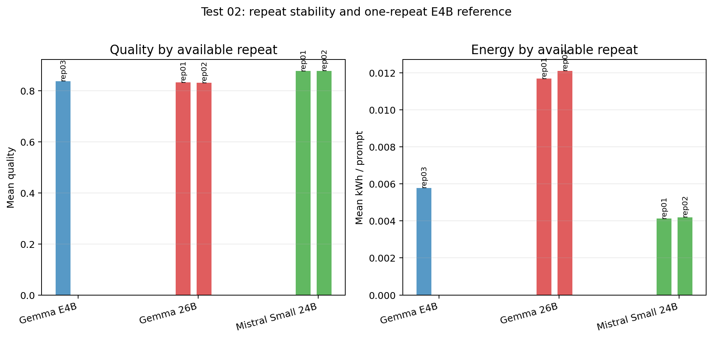

# Test 02 Final Report: Agent-Step Parameter Sensitivity

## Data Source

Results analyzed from:

```text
/home/oss/Downloads/02v2_agent_step_parameter_sensitivity
```

Completeness check:

| Model | Repeat | Expected configs | Completed configs | Rows | Status |
| --- | --- | --- | --- | --- | --- |
| `gemma4:26b` | rep01 | 153 | 153 | 2295 | included |
| `gemma4:26b` | rep02 | 153 | 153 | 2295 | included |
| `mistral-small3.2:24b` | rep01 | 153 | 153 | 2295 | included |
| `mistral-small3.2:24b` | rep02 | 153 | 153 | 2295 | included |
| `gemma4:e4b` | rep01 | 153 | 39 | None | excluded: missing summary.csv; missing detail.csv; 39/153 completed config CSVs |
| `gemma4:e4b` | rep02 | 153 | 14 | None | excluded: missing summary.csv; missing detail.csv; 14/153 completed config CSVs |
| `gemma4:e4b` | rep03 | 153 | 153 | 2295 | supplemental: complete one-repeat reconstruction from per-config CSVs |

The main two-repeat analysis and plots use only `gemma4:26b` and `mistral-small3.2:24b`, because these are the two models with complete matched repeats. The complete `gemma4:e4b` rep03 run is analyzed separately as supplemental evidence. It is useful for directional interpretation, but it is not used for repeat-stability claims or for final parameter ranking because no second complete E4B repeat is available.

## Method Notes

This test varies one agent step at a time while the other two stay fixed. Each phase tests `temperature`, `top_p`, `top_k`, `repeat_penalty`, and `repeat_last_n`. Expected missing GT score slots are counted as `0`, so failures remain part of accuracy.

## Executive Findings

- `mistral-small3.2:24b` remains the efficient control, with lower time and energy than `gemma4:26b`.
- `gemma4:26b` is more sensitive: it has larger positive movements but also much larger losses.
- Repeat energy variance is small relative to the model gap; quality variance is visible enough that close config rankings should remain tentative.
- The supplemental one-repeat `gemma4:e4b` run suggests that E4B is also highly step-sensitive, especially at lookup, but this evidence is weaker than the two-repeat results and should be treated as directional.

## Overall Resource Use

| Model | Repeats | Rows | Mean quality | Mean sec / prompt | Mean kWh / prompt | Mean completion |
| --- | --- | --- | --- | --- | --- | --- |
| `gemma4:26b` | 2 | 4,590 | 0.8325 | 189.0 | 0.01189 | 98.7% |
| `mistral-small3.2:24b` | 2 | 4,590 | 0.8783 | 67.2 | 0.00416 | 95.2% |

## Repeat Stability

| Model | Matched configs | Mean quality rep01 | Mean quality rep02 | Abs mean quality diff | Median quality diff | P90 quality diff | Mean kWh rep01 | Mean kWh rep02 | Abs mean kWh diff | Abs mean sec diff |
| --- | --- | --- | --- | --- | --- | --- | --- | --- | --- | --- |
| `gemma4:26b` | 153 | 0.8332 | 0.8318 | 0.0408 | 0.0319 | 0.0858 | 0.01168 | 0.01210 | 0.00139 | 22.4 |
| `mistral-small3.2:24b` | 153 | 0.8781 | 0.8786 | 0.0156 | 0.0083 | 0.0473 | 0.00413 | 0.00420 | 0.00010 | 2.6 |

A small energy difference means more repeats are not needed for the broad energy conclusion. Accuracy is less stable, especially for `gemma4:26b`; large effects are meaningful, but small differences should not decide final parameters alone.

## Sensitivity Range

| Model | Step | Baseline quality | Best delta | Worst delta | Range | Best config | Worst config |
| --- | --- | --- | --- | --- | --- | --- | --- |
| `gemma4:26b` | Analysis | 0.8675 | +0.0065 | -0.1111 | 0.1176 | `analysis_top_k_24` | `analysis_top_p_0p75` |
| `gemma4:26b` | Visualization | 0.8116 | +0.0684 | -0.0337 | 0.1021 | `visualization_repeat_penalty_1` | `visualization_top_p_0p8` |
| `gemma4:26b` | Lookup | 0.8480 | +0.0319 | -0.1229 | 0.1548 | `lookup_repeat_last_n_96` | `lookup_top_k_56` |
| `mistral-small3.2:24b` | Analysis | 0.8861 | +0.0069 | -0.0986 | 0.1056 | `analysis_top_k_56` | `analysis_repeat_penalty_1p2` |
| `mistral-small3.2:24b` | Visualization | 0.8889 | +0.0014 | -0.0401 | 0.0415 | `visualization_repeat_last_n_56` | `visualization_temperature_0p1` |
| `mistral-small3.2:24b` | Lookup | 0.8861 | +0.0042 | -0.0362 | 0.0404 | `lookup_repeat_penalty_1p3` | `lookup_repeat_last_n_80` |

## Direct Agent Metrics

| Model | Step | Metric | Baseline | Best | Best config | Worst | Worst config |
| --- | --- | --- | --- | --- | --- | --- | --- |
| `gemma4:26b` | Analysis | `text_score` | 0.9750 | 0.9750 | `analysis_repeat_penalty_1p3` | 0.8375 | `analysis_top_p_0p75` |
| `gemma4:26b` | Visualization | `vis_score` | 0.5677 | 0.6198 | `visualization_repeat_penalty_1` | 0.3880 | `visualization_top_p_0p85` |
| `gemma4:26b` | Lookup | `csv_iou` | 0.9441 | 0.9982 | `lookup_repeat_penalty_1p3` | 0.8982 | `lookup_repeat_last_n_256` |
| `mistral-small3.2:24b` | Analysis | `text_score` | 0.8583 | 0.8667 | `analysis_top_k_56` | 0.6875 | `analysis_repeat_penalty_1p2` |
| `mistral-small3.2:24b` | Visualization | `vis_score` | 0.8542 | 0.8542 | `visualization_temperature_0p175` | 0.8229 | `visualization_top_k_32` |
| `mistral-small3.2:24b` | Lookup | `csv_iou` | 0.9333 | 0.9333 | `lookup_temperature_0p03` | 0.9126 | `lookup_top_k_32` |

## Figures




The figures above retain the complete two-repeat models only. The supplemental `gemma4:e4b` rep03 run is summarized in tables below instead of being added to the plots, to avoid visually equating one repeat with two-repeat evidence.

## Best And Worst Static Changes

Top quality improvements:

| Model | Step | Config | Delta quality | Delta metric | Delta kWh | Delta sec |
| --- | --- | --- | --- | --- | --- | --- |
| `gemma4:26b` | Visualization | `visualization_repeat_penalty_1` | +0.0684 | +0.0521 | 0.00128 | +23.5 |
| `gemma4:26b` | Visualization | `visualization_top_k_20` | +0.0663 | +0.0443 | 0.00107 | +21.0 |
| `gemma4:26b` | Visualization | `visualization_top_k_48` | +0.0593 | +0.0234 | 0.00083 | +17.8 |
| `gemma4:26b` | Visualization | `visualization_top_k_128` | +0.0559 | +0.0052 | 0.00070 | +15.6 |
| `gemma4:26b` | Visualization | `visualization_repeat_last_n_256` | +0.0517 | +0.0156 | 0.00143 | +26.6 |
| `gemma4:26b` | Visualization | `visualization_repeat_penalty_1p03` | +0.0517 | +0.0521 | 0.00057 | +12.9 |
| `gemma4:26b` | Visualization | `visualization_temperature_1p3` | +0.0489 | -0.0052 | 0.00086 | +19.2 |
| `gemma4:26b` | Visualization | `visualization_top_k_16` | +0.0489 | -0.0208 | 0.00078 | +16.4 |
| `gemma4:26b` | Visualization | `visualization_temperature_1p1` | +0.0475 | -0.0365 | 0.00118 | +25.5 |
| `gemma4:26b` | Visualization | `visualization_temperature_0p95` | +0.0468 | +0.0182 | 0.00230 | +39.4 |

Largest quality losses:

| Model | Step | Config | Delta quality | Delta metric | Delta kWh | Delta sec |
| --- | --- | --- | --- | --- | --- | --- |
| `gemma4:26b` | Lookup | `lookup_top_k_56` | -0.1229 | 0.0000 | 0.00157 | +34.4 |
| `gemma4:26b` | Analysis | `analysis_top_p_0p75` | -0.1111 | -0.1375 | -0.00000 | -1.5 |
| `mistral-small3.2:24b` | Analysis | `analysis_repeat_penalty_1p2` | -0.0986 | -0.1708 | 0.00337 | +90.4 |
| `gemma4:26b` | Analysis | `analysis_top_p_0p88` | -0.0896 | -0.1125 | -0.00028 | -5.6 |
| `gemma4:26b` | Analysis | `analysis_repeat_last_n_96` | -0.0868 | -0.0750 | -0.00069 | -18.7 |
| `gemma4:26b` | Analysis | `analysis_repeat_last_n_16` | -0.0868 | -0.1042 | -0.00057 | -15.8 |
| `gemma4:26b` | Lookup | `lookup_top_k_48` | -0.0834 | -0.0432 | 0.00471 | +72.1 |
| `gemma4:26b` | Analysis | `analysis_temperature_0p7` | -0.0791 | -0.0833 | -0.00014 | -2.3 |

## Supplemental Gemma E4B One-Repeat Check

After the original Test 02 report, a complete `gemma4:e4b` rep03 execution became available in per-config form:

```text
/home/oss/Downloads/02v2_agent_step_parameter_sensitivity/gemma4_e4b/rep03/
```

It contains all 153 configurations and 2,295 prompt rows, judged with `openai / gpt-5.4`. Because this is a single complete repeat, it is not used for repeat-stability or final ranking claims. It is useful only as directional evidence about whether the E4B model behaves like the two complete models.

Aggregate one-repeat summary:

| Model | Repeat | Configs | Rows | Mean quality | Mean sec / prompt | Mean kWh / prompt | Mean completion |
| --- | --- | ---: | ---: | ---: | ---: | ---: | ---: |
| `gemma4:e4b` | rep03 | 153 | 2,295 | 0.8381 | 99.8 | 0.00578 | 95.1% |

Step sensitivity from the same strict scoring rule:

| Step | Baseline quality | Best delta | Worst delta | Range | Best config | Worst config |
| --- | ---: | ---: | ---: | ---: | --- | --- |
| Lookup | 0.8062 | +0.1168 | -0.1061 | 0.2230 | `lookup_top_p_0p94` | `lookup_repeat_penalty_1p2` |
| Analysis | 0.8689 | +0.0618 | -0.1291 | 0.1909 | `analysis_top_k_96` | `analysis_repeat_last_n_128` |
| Visualization | 0.8480 | +0.0842 | -0.1121 | 0.1963 | `visualization_top_p_0p7` | `visualization_temperature_0p7` |

The one-repeat E4B run suggests that the small thinking model is not flat like Mistral. It has large OFAT swings in all three agents, with the largest range in lookup. The best lookup settings are mainly `top_p` and temperature variants near the baseline, which is consistent with the final Test 05 result where E4B benefits most when the lookup step is repaired. The most important caveat is variance: with only one complete repeat, these values should be used to explain E4B behavior qualitatively, not to select exact static parameters.

## Prompt Difficulty Analysis

This difficulty view keeps the Test 02 logic intact: each row compares configurations only against the baseline for the same model, same agent step, and same prompt difficulty. The plotted difficulty view remains based on the two complete-repeat models. The one-repeat `gemma4:e4b` reconstruction is not added to the figures, but it shows the same qualitative warning: E4B has large hard-prompt swings, especially when analysis settings destabilize generation.


Largest difficulty-specific gains:

| Model | Step | Difficulty | Baseline quality | Best config | Best delta |
| --- | --- | --- | --- | --- | --- |
| gemma4:26b | Visualization | 1 | 0.622 | visualization_repeat_penalty_1 | +0.246 |
| gemma4:26b | Lookup | 1 | 0.715 | lookup_repeat_last_n_128 | +0.194 |
| gemma4:26b | Visualization | 3 | 0.803 | visualization_temperature_0p95 | +0.101 |
| gemma4:26b | Analysis | 3 | 0.832 | analysis_top_p_1 | +0.069 |
| gemma4:26b | Visualization | 2 | 0.870 | visualization_top_k_16 | +0.057 |
| gemma4:26b | Analysis | 4 | 0.917 | analysis_repeat_last_n_56 | +0.042 |
| gemma4:26b | Lookup | 4 | 0.924 | lookup_temperature_0p95 | +0.042 |
| gemma4:26b | Analysis | 2 | 0.885 | analysis_repeat_last_n_56 | +0.036 |

Largest difficulty-specific losses:

| Model | Step | Difficulty | Baseline quality | Worst config | Worst delta |
| --- | --- | --- | --- | --- | --- |
| gemma4:26b | Analysis | 4 | 0.917 | analysis_repeat_last_n_96 | -0.312 |
| gemma4:26b | Visualization | 4 | 0.938 | visualization_repeat_last_n_48 | -0.250 |
| mistral-small3.2:24b | Analysis | 3 | 0.917 | analysis_repeat_penalty_1p2 | -0.242 |
| gemma4:26b | Analysis | 1 | 0.854 | analysis_temperature_1p2 | -0.229 |
| gemma4:26b | Lookup | 4 | 0.924 | lookup_temperature_0p8 | -0.215 |
| gemma4:26b | Lookup | 3 | 0.857 | lookup_top_k_56 | -0.215 |
| mistral-small3.2:24b | Analysis | 4 | 0.653 | analysis_repeat_last_n_96 | -0.169 |
| mistral-small3.2:24b | Lookup | 4 | 0.646 | lookup_repeat_last_n_80 | -0.146 |

Interpretation: parameter sensitivity is not uniform across task difficulty. `gemma4:26b` gets the largest upside on visualization-heavy and harder slices, but it also has the largest negative swings when a parameter setting destabilizes an agent. `mistral-small3.2:24b` is flatter: this is good for robustness, but it also means Test 02 finds fewer large accuracy gains from simple one-parameter changes.

For the supplemental `gemma4:e4b` repeat, the largest gains and losses also concentrate on difficulty 4. The strongest positive movements are visualization and lookup improvements above `+0.40` on this slice, while the worst analysis settings lose more than `-0.70`. This reinforces the main thesis claim that hard prompts are where tuning choices matter most, but the exact E4B values remain one-repeat evidence.

## Thesis Implications

The two complete models confirm that parameter sensitivity is agent-specific. Mistral is the stronger efficient baseline, while Gemma 26B needs careful step-level tuning and should not be summarized by a single global sampling setting. The supplemental one-repeat E4B run adds a useful bridge to the later tests: E4B also looks highly sensitive, but its most consequential static signal is lookup-side repair rather than the Gemma 26B visualization pattern. This supports using E4B in the final Pareto campaign, while still keeping the exact Test 02 E4B parameter values out of the main two-repeat conclusions.
