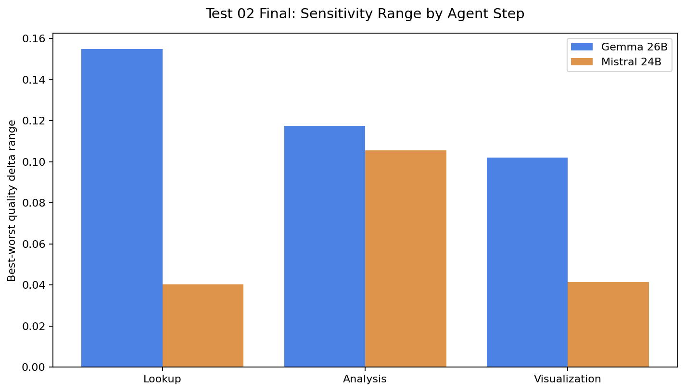
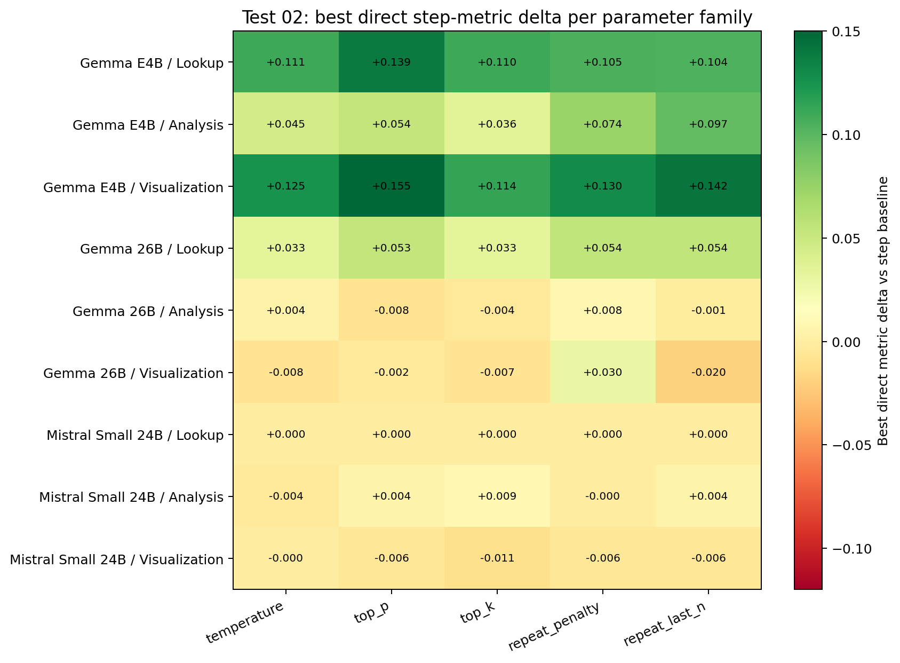
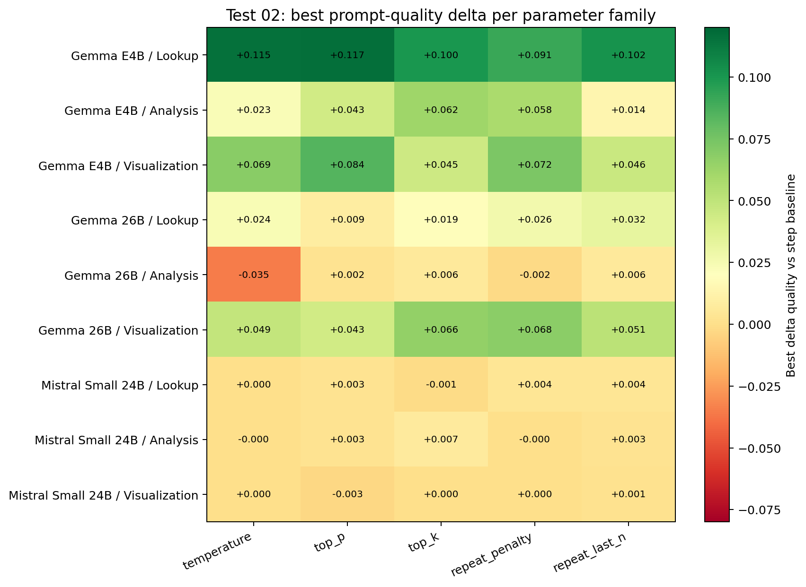
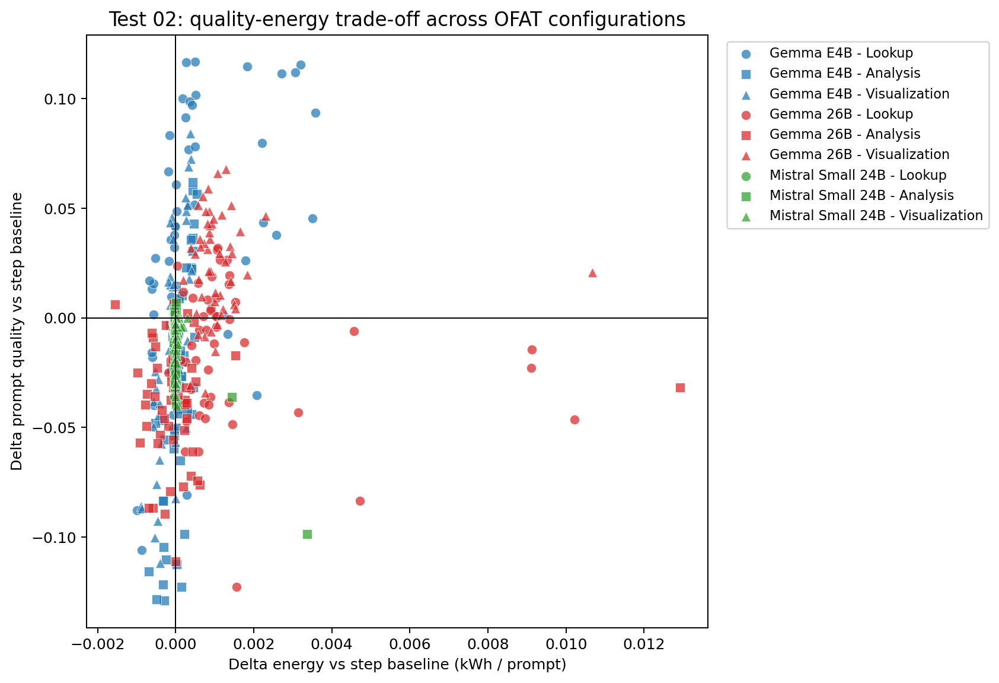
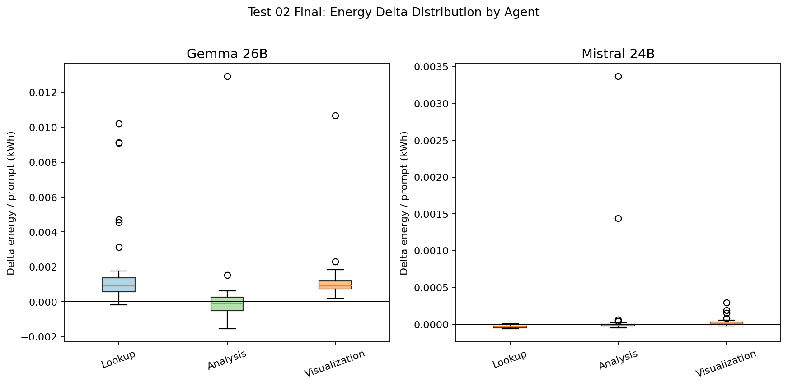
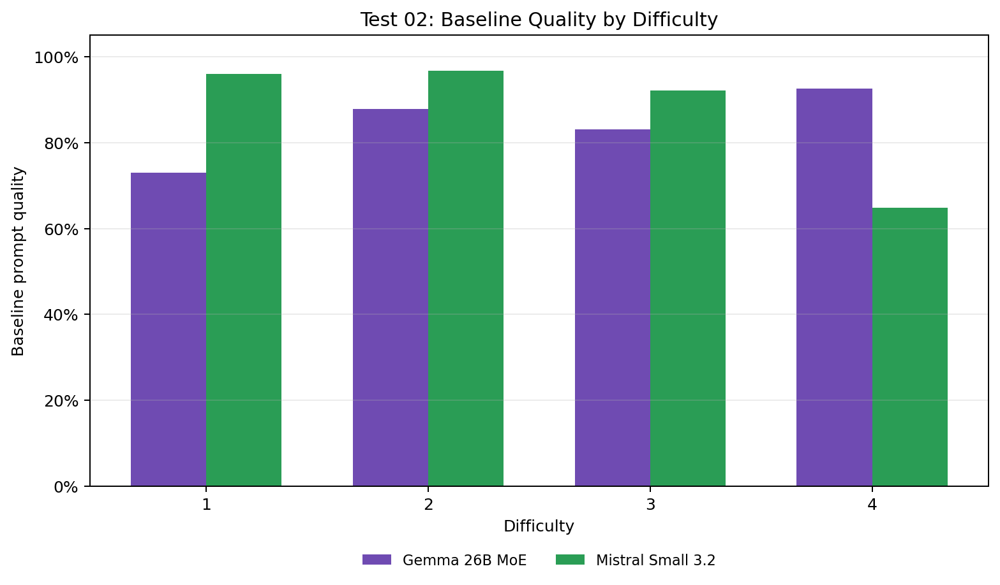
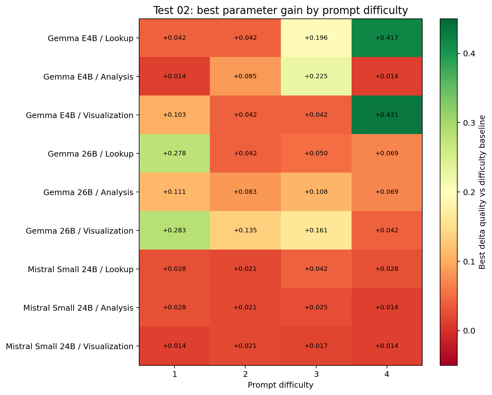

# Test 02 Final Report: Agent-Step Parameter Sensitivity

## Data Source

Results analyzed from:

```text
/home/oss/Downloads/02v2_agent_step_parameter_sensitivity
```

Completeness check:

| Model | Repeat | Expected configs | Completed configs | Rows | Status |
| --- | --- | --- | --- | --- | --- |
| `gemma4:e4b` | rep01 | 153 | 39 | None | excluded: incomplete run; missing `summary.csv` and `detail.csv` |
| `gemma4:e4b` | rep02 | 153 | 14 | None | excluded: incomplete run; missing `summary.csv` and `detail.csv` |
| `gemma4:e4b` | rep03 | 153 | 153 | 2295 | included; complete run |
| `gemma4:26b` | rep01 | 153 | 153 | 2295 | included |
| `gemma4:26b` | rep02 | 153 | 153 | 2295 | included |
| `mistral-small3.2:24b` | rep01 | 153 | 153 | 2295 | included |
| `mistral-small3.2:24b` | rep02 | 153 | 153 | 2295 | included |

The analysis and plots include all complete data. Incomplete execution fragments are excluded from metric aggregation.

## Method Notes

This test varies one agent step at a time while the other two stay fixed. Each phase tests `temperature`, `top_p`, `top_k`, `repeat_penalty`, and `repeat_last_n`. Expected missing GT score slots are counted as `0`, so failed or missing downstream outputs remain part of accuracy.

## Executive Findings

- `gemma4:e4b` is included in the comparative Test 02 plots and tables. It is the most sensitive model in this run, especially at lookup.
- `gemma4:26b` remains highly tunable but fragile. Its best robust signal is still visualization tuning, where multiple parameter families improve quality.
- `mistral-small3.2:24b` remains the efficient and stable control. Static sampling changes rarely improve it, although bad analysis settings can still cause large regressions.
- Matched-repeat checks on `gemma4:26b` and `mistral-small3.2:24b` show small energy variance. Small accuracy deltas should still remain tentative.

## Overall Resource Use

| Model | Repeats | Rows | Mean quality | Mean sec / prompt | Mean kWh / prompt | Mean completion |
| --- | ---: | ---: | ---: | ---: | ---: | ---: |
| `gemma4:e4b` | 1 | 2,295 | 0.8382 | 99.8 | 0.00578 | 95.1% |
| `gemma4:26b` | 2 | 4,590 | 0.8325 | 189.0 | 0.01189 | 98.7% |
| `mistral-small3.2:24b` | 2 | 4,590 | 0.8783 | 67.2 | 0.00416 | 95.2% |

These averages are over all 153 OFAT configurations, including deliberately bad off-baseline settings. They should therefore not be read as baseline model quality. The useful comparison is structural: Mistral has the lowest cost, Gemma 26B is the most expensive, and E4B sits between them while showing much larger tuning swings than Mistral.

Measurement stability was checked on the two models with matched repeats. Energy was stable enough to support broad cost comparisons, while small quality deltas remain less reliable than the large step-level effects reported below. The `gemma4:e4b` configuration screen is included from the available complete run, so exact E4B value rankings should be read as directional.

## Sensitivity Range

| Model | Step | Baseline quality | Best delta | Worst delta | Range | Best config | Worst config |
| --- | --- | ---: | ---: | ---: | ---: | --- | --- |
| `gemma4:e4b` | Lookup | 0.8062 | +0.1168 | -0.1061 | 0.2230 | `lookup_top_p_0p94` | `lookup_repeat_penalty_1p2` |
| `gemma4:e4b` | Analysis | 0.8689 | +0.0618 | -0.1291 | 0.1909 | `analysis_top_k_96` | `analysis_repeat_last_n_128` |
| `gemma4:e4b` | Visualization | 0.8480 | +0.0842 | -0.1121 | 0.1963 | `visualization_top_p_0p7` | `visualization_temperature_0p7` |
| `gemma4:26b` | Lookup | 0.8480 | +0.0319 | -0.1229 | 0.1548 | `lookup_repeat_last_n_96` | `lookup_top_k_56` |
| `gemma4:26b` | Analysis | 0.8675 | +0.0065 | -0.1111 | 0.1176 | `analysis_top_k_24` | `analysis_top_p_0p75` |
| `gemma4:26b` | Visualization | 0.8121 | +0.0679 | -0.0342 | 0.1021 | `visualization_repeat_penalty_1` | `visualization_top_p_0p8` |
| `mistral-small3.2:24b` | Lookup | 0.8861 | +0.0042 | -0.0362 | 0.0404 | `lookup_repeat_penalty_1p3` | `lookup_repeat_last_n_80` |
| `mistral-small3.2:24b` | Analysis | 0.8861 | +0.0069 | -0.0986 | 0.1056 | `analysis_top_k_56` | `analysis_repeat_penalty_1p2` |
| `mistral-small3.2:24b` | Visualization | 0.8889 | +0.0014 | -0.0401 | 0.0415 | `visualization_repeat_last_n_56` | `visualization_temperature_0p1` |



Including E4B changes the story from a two-model comparison to a clearer model-family result. Both Gemma thinking models are sensitive to static sampling, while Mistral is mostly flat. The small thinking model shows the widest observed range: lookup alone spans 0.223 quality points between the best and worst setting.

## Direct Agent Metrics

| Model | Step | Metric | Baseline | Best | Best config | Worst | Worst config |
| --- | --- | --- | ---: | ---: | --- | ---: | --- |
| `gemma4:e4b` | Lookup | `csv_iou` | 0.8589 | 0.9982 | `lookup_top_p_0p94` | 0.6735 | `lookup_repeat_penalty_1p2` |
| `gemma4:e4b` | Analysis | `text_score` | 0.8929 | 0.9896 | `analysis_repeat_last_n_40` | 0.7321 | `analysis_top_p_0p94` |
| `gemma4:e4b` | Visualization | `vis_score` | 0.7955 | 0.9500 | `visualization_top_p_0p92` | 0.6080 | `visualization_repeat_penalty_1p12` |
| `gemma4:26b` | Lookup | `csv_iou` | 0.9441 | 0.9982 | `lookup_repeat_last_n_128` | 0.8982 | `lookup_repeat_last_n_256` |
| `gemma4:26b` | Analysis | `text_score` | 0.9750 | 0.9830 | `analysis_repeat_penalty_0p9` | 0.8649 | `analysis_top_p_0p75` |
| `gemma4:26b` | Visualization | `vis_score` | 0.6193 | 0.6489 | `visualization_repeat_penalty_1p03` | 0.4060 | `visualization_repeat_penalty_0p9` |
| `mistral-small3.2:24b` | Lookup | `csv_iou` | 0.9333 | 0.9333 | `lookup_repeat_last_n_128` | 0.9126 | `lookup_top_k_32` |
| `mistral-small3.2:24b` | Analysis | `text_score` | 0.9196 | 0.9286 | `analysis_top_k_56` | 0.7366 | `analysis_repeat_penalty_1p2` |
| `mistral-small3.2:24b` | Visualization | `vis_score` | 0.9318 | 0.9318 | `visualization_temperature_0p175` | 0.8977 | `visualization_top_k_32` |



The direct metrics show why E4B belongs in the same analysis rather than as a side note. Its lookup, analysis, and visualization scores all have large positive and negative movement. The exact best values should be treated cautiously, but the direction is useful: E4B's static sensitivity is broad, whereas Mistral's direct metrics are almost saturated at baseline except for analysis misconfigurations.

## Quality Delta Heatmap



The quality heatmap now exposes three regimes:

- `gemma4:e4b`: large apparent upside and downside in all three agents, with lookup as the strongest positive signal.
- `gemma4:26b`: visualization tuning is the most reliable opportunity, while lookup and analysis contain larger downside risks.
- `mistral-small3.2:24b`: most parameter families have negligible upside; the main result is identifying unsafe analysis settings.

## Quality-Energy Trade-off



E4B occupies a useful middle region: it is more expensive than Mistral but much cheaper than Gemma 26B, and many lookup configurations improve quality at very small energy cost. The strongest E4B lookup gains are `top_p` variants near the baseline, especially `lookup_top_p_0p94` and `lookup_top_p_0p98`. This supports the later focus on E4B lookup repair.

Gemma 26B's best quality-improving points are still visualization variants. Mistral remains clustered near zero energy delta, confirming that static sampling changes mostly affect quality rather than energy for that model.

## Energy Delta Distribution



Energy deltas are small relative to the model-level energy gap. E4B lookup gains can be obtained with very small additional energy for some `top_p` and `top_k` values. Gemma 26B has wider positive energy tails, especially at lookup, while Mistral remains tightly centered around zero.

## Best And Worst Static Changes

Top quality improvements:

| Model | Step | Config | Delta quality | Delta metric | Delta kWh | Delta sec | Repeats |
| --- | --- | --- | ---: | ---: | ---: | ---: | ---: |
| `gemma4:e4b` | Lookup | `lookup_top_p_0p94` | +0.1168 | +0.1393 | +0.00050 | +7.4 | 1 |
| `gemma4:e4b` | Lookup | `lookup_top_p_0p98` | +0.1165 | +0.1254 | +0.00028 | +5.5 | 1 |
| `gemma4:e4b` | Lookup | `lookup_temperature_0p95` | +0.1154 | +0.0851 | +0.00320 | +83.4 | 1 |
| `gemma4:e4b` | Lookup | `lookup_temperature_0p8` | +0.1148 | +0.0773 | +0.00183 | +46.8 | 1 |
| `gemma4:e4b` | Lookup | `lookup_top_p_0p85` | +0.1119 | +0.0950 | +0.00307 | +79.4 | 1 |
| `gemma4:e4b` | Lookup | `lookup_temperature_0p9` | +0.1115 | +0.1108 | +0.00271 | +72.6 | 1 |
| `gemma4:e4b` | Lookup | `lookup_repeat_last_n_256` | +0.1018 | +0.0481 | +0.00051 | +7.6 | 1 |
| `gemma4:e4b` | Lookup | `lookup_top_k_40` | +0.1001 | +0.1101 | +0.00017 | +3.3 | 1 |

Largest quality losses:

| Model | Step | Config | Delta quality | Delta metric | Delta kWh | Delta sec | Repeats |
| --- | --- | --- | ---: | ---: | ---: | ---: | ---: |
| `gemma4:e4b` | Analysis | `analysis_repeat_last_n_128` | -0.1291 | -0.1236 | -0.00030 | -4.7 | 1 |
| `gemma4:e4b` | Analysis | `analysis_top_p_0p7` | -0.1285 | -0.0852 | -0.00049 | -8.1 | 1 |
| `gemma4:26b` | Lookup | `lookup_top_k_56` | -0.1229 | +0.0000 | +0.00157 | +34.4 | 2 |
| `gemma4:e4b` | Analysis | `analysis_temperature_1p05` | -0.1229 | -0.1250 | +0.00015 | +1.7 | 1 |
| `gemma4:e4b` | Analysis | `analysis_repeat_penalty_1p08` | -0.1217 | +0.0014 | -0.00033 | -4.3 | 1 |
| `gemma4:e4b` | Analysis | `analysis_repeat_last_n_40` | -0.1158 | +0.0967 | -0.00068 | -11.7 | 1 |
| `gemma4:e4b` | Analysis | `analysis_repeat_last_n_96` | -0.1124 | -0.0804 | +0.00003 | +0.3 | 1 |
| `gemma4:e4b` | Visualization | `visualization_temperature_0p7` | -0.1121 | +0.0420 | -0.00039 | -6.1 | 1 |

The top-improvement table should not be read as final proof that every listed E4B value is better than every Gemma 26B value. It does show, however, that E4B lookup is the most promising static-tuning target in this run, and that the useful E4B settings are not necessarily expensive.

## Prompt Difficulty Analysis

This difficulty view keeps the Test 02 logic intact: each row compares configurations only against the baseline for the same model, same agent step, and same prompt difficulty.





Largest difficulty-specific gains:

| Model | Step | Difficulty | Best config | Best delta |
| --- | --- | ---: | --- | ---: |
| `gemma4:e4b` | Visualization | 4 | `visualization_repeat_penalty_0p9` | +0.431 |
| `gemma4:e4b` | Lookup | 4 | `lookup_repeat_penalty_1p08` | +0.417 |
| `gemma4:26b` | Visualization | 1 | `visualization_top_k_20` | +0.246 |
| `gemma4:e4b` | Analysis | 3 | `analysis_temperature_0p6` | +0.225 |
| `gemma4:e4b` | Lookup | 3 | `lookup_temperature_0p7` | +0.196 |
| `gemma4:26b` | Lookup | 1 | `lookup_repeat_last_n_128` | +0.194 |
| `gemma4:e4b` | Visualization | 1 | `visualization_repeat_penalty_1p15` | +0.104 |
| `gemma4:26b` | Visualization | 3 | `visualization_temperature_0p95` | +0.101 |

Largest difficulty-specific losses:

| Model | Step | Difficulty | Worst config | Worst delta |
| --- | --- | ---: | --- | ---: |
| `gemma4:e4b` | Analysis | 4 | `analysis_temperature_1p2` | -0.728 |
| `gemma4:e4b` | Visualization | 2 | `visualization_temperature_0p7` | -0.398 |
| `gemma4:e4b` | Lookup | 1 | `lookup_repeat_penalty_1p2` | -0.394 |
| `gemma4:e4b` | Lookup | 4 | `lookup_repeat_penalty_0p9` | -0.347 |
| `gemma4:e4b` | Analysis | 1 | `analysis_repeat_last_n_128` | -0.333 |
| `gemma4:e4b` | Visualization | 1 | `visualization_top_k_80` | -0.313 |
| `gemma4:26b` | Analysis | 4 | `analysis_repeat_last_n_96` | -0.312 |
| `gemma4:e4b` | Visualization | 3 | `visualization_top_k_16` | -0.276 |

Prompt difficulty amplifies the E4B signal. The largest E4B gains occur on hard lookup and visualization prompts, while the largest losses occur when analysis settings destabilize difficult prompts. This supports the broader thesis claim that parameter tuning matters most when task complexity is high.

## Thesis Implications

Test 02 establishes that sensitivity to static sampling parameter tuning is a model-level property:

1. `gemma4:e4b` should be included in the Test 02 comparative analysis. It is the most sensitive model in the available data, especially in lookup, and it guides the later E4B repair configurations.
2. `gemma4:26b` is highly tunable but fragile. Visualization remains its strongest tuning opportunity, consistent with the weakness found in Test 01.
3. `mistral-small3.2:24b` is robust and efficient, but static parameter tuning gives almost no upside. Its main Test 02 lesson is which analysis settings to avoid.
4. Prompt difficulty is a major interaction term. Harder prompts create both the largest gains and the largest failures, especially for the thinking Gemma models.
