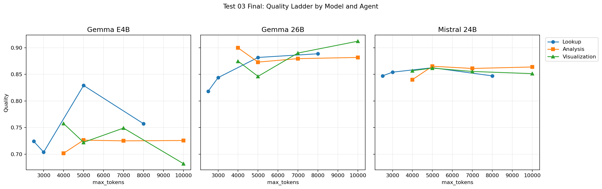
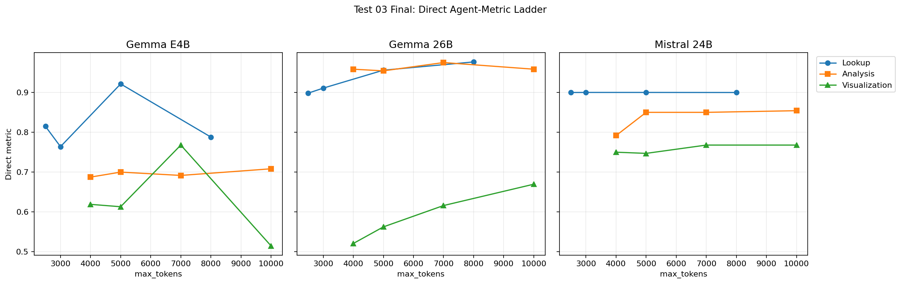
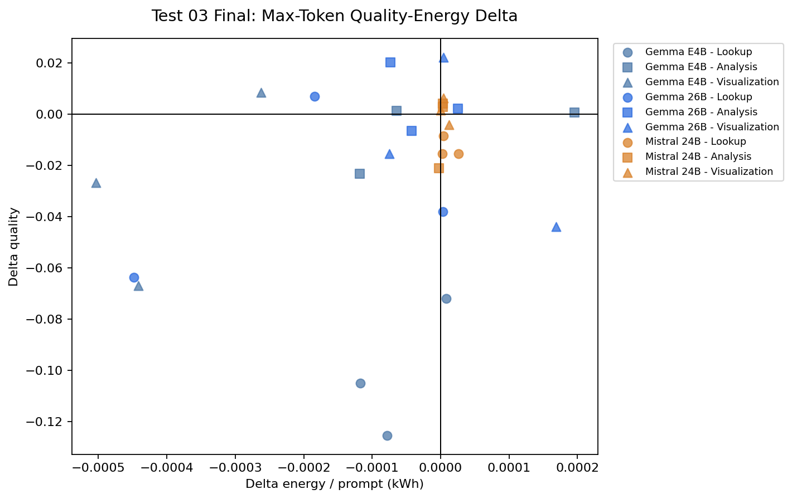
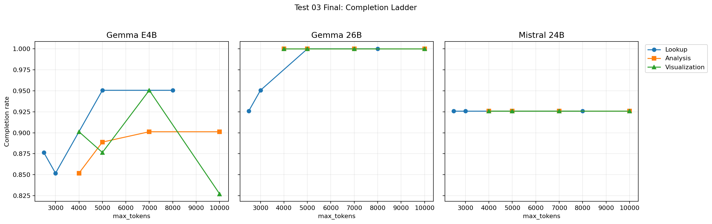
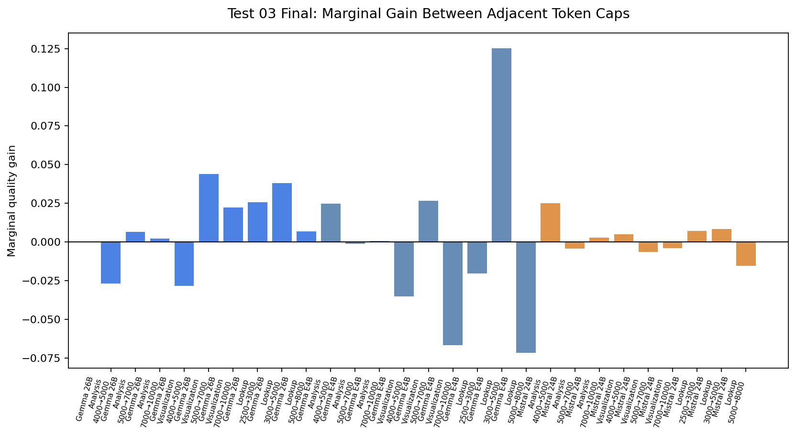

# Test 03 Final Report: Max Tokens Agent Ladder

## Data Source

```text
/home/oss/Downloads/thesis_tests_final_test34/03_max_tokens_agent_ladder
```

Completeness check:

| Model | Repeat | Expected configs | Completed configs | Rows | Status |
| --- | --- | --- | --- | --- | --- |
| `gemma4:26b` | rep01 | 12 | 12 | 120 | included |
| `gemma4:26b` | rep02 | 12 | 12 | 120 | included |
| `gemma4:26b` | rep03 | 12 | 12 | 120 | included |
| `gemma4:e4b` | rep01 | 12 | 12 | 120 | included |
| `gemma4:e4b` | rep02 | 12 | 12 | 120 | included |
| `gemma4:e4b` | rep03 | 12 | 12 | 120 | included |
| `mistral-small3.2:24b` | rep01 | 12 | 12 | 120 | included |
| `mistral-small3.2:24b` | rep02 | 12 | 12 | 120 | included |
| `mistral-small3.2:24b` | rep03 | 12 | 12 | 120 | included |

## Method Notes

This test varies `max_tokens` for one agent at a time. Expected missing GT score slots are counted as `0`.

```text
lookup:        2500, 3000, 5000 baseline, 8000
analysis:      4000, 5000, 7000 baseline, 10000
visualization: 4000, 5000, 7000 baseline, 10000
```

## Executive Findings

- `max_tokens` is a per-agent safety bound, not a universal accuracy knob.
- Higher caps are not automatically more expensive, but they are also not always more accurate.
- Low caps can cause structural failures for specific model/agent combinations; those are the cases where generous caps matter.

## Overall Resource Use

| Model | Repeats | Rows | Mean quality | Mean sec / prompt | Mean kWh / prompt | Mean completion |
| --- | --- | --- | --- | --- | --- | --- |
| `gemma4:e4b` | 3 | 360 | 0.7338 | 142.7 | 0.00291 | 89.4% |
| `gemma4:26b` | 3 | 360 | 0.8742 | 199.5 | 0.00403 | 99.0% |
| `mistral-small3.2:24b` | 3 | 360 | 0.8556 | 115.2 | 0.00235 | 92.6% |

## Sensitivity Ranges

| Model | Step | Quality range | Metric range | Best quality cap | Best metric cap | Worst cap |
| --- | --- | --- | --- | --- | --- | --- |
| `gemma4:26b` | Analysis | 0.0268 | 0.0208 | 4,000 | 7,000 | 5,000 |
| `gemma4:26b` | Visualization | 0.0661 | 0.1488 | 10,000 | 10,000 | 5,000 |
| `gemma4:26b` | Lookup | 0.0706 | 0.0783 | 8,000 | 8,000 | 2,500 |
| `gemma4:e4b` | Analysis | 0.0246 | 0.0208 | 5,000 | 10,000 | 4,000 |
| `gemma4:e4b` | Visualization | 0.0752 | 0.2530 | 4,000 | 7,000 | 10,000 |
| `gemma4:e4b` | Lookup | 0.1252 | 0.1574 | 5,000 | 5,000 | 3,000 |
| `mistral-small3.2:24b` | Analysis | 0.0251 | 0.0625 | 5,000 | 10,000 | 4,000 |
| `mistral-small3.2:24b` | Visualization | 0.0104 | 0.0208 | 5,000 | 7,000 | 10,000 |
| `mistral-small3.2:24b` | Lookup | 0.0154 | 0.0002 | 5,000 | 3,000 | 2,500 |

## Best Caps By Step

| Model | Step | Baseline cap | Baseline quality | Best quality cap | Best quality | Quality gain | Best metric cap | Metric gain | Energy delta |
| --- | --- | --- | --- | --- | --- | --- | --- | --- | --- |
| `gemma4:26b` | Analysis | 7,000 | 0.8796 | 4,000 | 0.8998 | +0.0202 | 7,000 | 0.0000 | -0.00007 |
| `gemma4:26b` | Visualization | 7,000 | 0.8901 | 10,000 | 0.9123 | +0.0222 | 10,000 | +0.0536 | 0.00000 |
| `gemma4:26b` | Lookup | 5,000 | 0.8818 | 8,000 | 0.8887 | +0.0069 | 8,000 | +0.0208 | -0.00018 |
| `gemma4:e4b` | Analysis | 7,000 | 0.7251 | 5,000 | 0.7264 | +0.0014 | 10,000 | +0.0167 | -0.00006 |
| `gemma4:e4b` | Visualization | 7,000 | 0.7491 | 4,000 | 0.7576 | +0.0085 | 7,000 | 0.0000 | -0.00026 |
| `gemma4:e4b` | Lookup | 5,000 | 0.8292 | 5,000 | 0.8292 | 0.0000 | 5,000 | 0.0000 | 0.00000 |
| `mistral-small3.2:24b` | Analysis | 7,000 | 0.8611 | 5,000 | 0.8653 | +0.0042 | 10,000 | +0.0042 | 0.00000 |
| `mistral-small3.2:24b` | Visualization | 7,000 | 0.8555 | 5,000 | 0.8618 | +0.0063 | 7,000 | 0.0000 | 0.00000 |
| `mistral-small3.2:24b` | Lookup | 5,000 | 0.8625 | 5,000 | 0.8625 | 0.0000 | 3,000 | 0.0000 | 0.00000 |

## Figures











## Thesis Interpretation

The strongest thesis claim is not that higher `max_tokens` is always better. The evidence supports setting token caps per agent: generous where low caps cause missing or malformed outputs, conservative where the ladder is flat.
