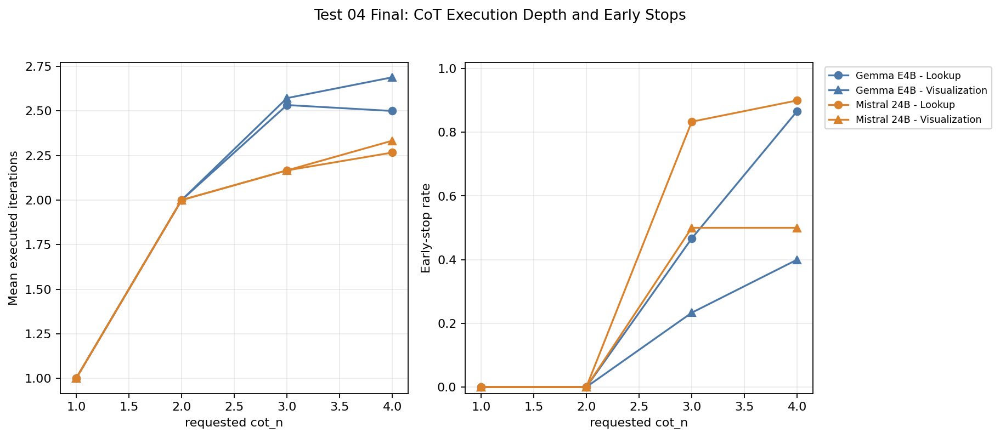

# Test 04 Final Report: CoT Depth Effectiveness

## Data Source

```text
/home/oss/Downloads/thesis_tests_final_test34/04_compute_expansion_n_and_cot
```

Completeness check:

| Model | Repeat | Expected configs | Completed configs | Rows | Status |
| --- | --- | --- | --- | --- | --- |
| `gemma4:e4b` | rep01 | 8 | 8 | 80 | included |
| `gemma4:e4b` | rep02 | 8 | 8 | 80 | included |
| `gemma4:e4b` | rep03 | 8 | 8 | 80 | included |
| `mistral-small3.2:24b` | rep01 | 8 | 8 | 80 | included |
| `mistral-small3.2:24b` | rep02 | 8 | 8 | 80 | included |
| `mistral-small3.2:24b` | rep03 | 8 | 8 | 80 | included |

## Method Notes

This test isolates CoT depth for lookup and visualization. `cot_n=1` is the phase baseline. Expected missing GT score slots are counted as `0`.

## Executive Findings

- CoT is step-specific and not monotonic.
- Lookup is the most plausible CoT target because SQL has executable feedback.
- Visualization CoT can add cost without consistently improving quality.
- The early-stop diagnostics matter because requested depth and executed depth can differ.

## Overall Resource Use

| Model | Repeats | Rows | Mean quality | Mean sec / prompt | Mean kWh / prompt | Mean completion |
| --- | --- | --- | --- | --- | --- | --- |
| `gemma4:e4b` | 3 | 240 | 0.7733 | 174.3 | 0.00353 | 92.0% |
| `mistral-small3.2:24b` | 3 | 240 | 0.8682 | 132.9 | 0.00270 | 94.1% |

## Aggregate Results

| Model | Config | Step | cot_n | Quality | Delta quality | Metric | Delta metric | Sec / prompt | kWh / prompt |
| --- | --- | --- | --- | --- | --- | --- | --- | --- | --- |
| `gemma4:e4b` | `visualization_cot_n1` | Visualization | 1 | 0.7565 | 0.0000 | `vis_score=0.7262` | 0.0000 | 137.7 | 0.00280 |
| `gemma4:e4b` | `visualization_cot_n2` | Visualization | 2 | 0.7149 | -0.0417 | `vis_score=0.6131` | -0.1131 | 152.5 | 0.00310 |
| `gemma4:e4b` | `visualization_cot_n3` | Visualization | 3 | 0.6413 | -0.1152 | `vis_score=0.5655` | -0.1607 | 247.8 | 0.00500 |
| `gemma4:e4b` | `visualization_cot_n4` | Visualization | 4 | 0.7438 | -0.0128 | `vis_score=0.6726` | -0.0536 | 167.2 | 0.00339 |
| `gemma4:e4b` | `lookup_cot_n1` | Lookup | 1 | 0.6939 | 0.0000 | `csv_iou=0.7573` | 0.0000 | 123.1 | 0.00251 |
| `gemma4:e4b` | `lookup_cot_n2` | Lookup | 2 | 0.8795 | +0.1856 | `csv_iou=0.9540` | +0.1968 | 170.5 | 0.00346 |
| `gemma4:e4b` | `lookup_cot_n3` | Lookup | 3 | 0.8594 | +0.1655 | `csv_iou=0.9432` | +0.1860 | 176.1 | 0.00356 |
| `gemma4:e4b` | `lookup_cot_n4` | Lookup | 4 | 0.8972 | +0.2033 | `csv_iou=0.9834` | +0.2261 | 219.8 | 0.00444 |
| `mistral-small3.2:24b` | `visualization_cot_n1` | Visualization | 1 | 0.8597 | 0.0000 | `vis_score=0.7619` | 0.0000 | 128.9 | 0.00262 |
| `mistral-small3.2:24b` | `visualization_cot_n2` | Visualization | 2 | 0.8542 | -0.0056 | `vis_score=0.7500` | -0.0119 | 131.4 | 0.00267 |
| `mistral-small3.2:24b` | `visualization_cot_n3` | Visualization | 3 | 0.8401 | -0.0196 | `vis_score=0.7560` | -0.0060 | 134.8 | 0.00274 |
| `mistral-small3.2:24b` | `visualization_cot_n4` | Visualization | 4 | 0.8264 | -0.0333 | `vis_score=0.7560` | -0.0060 | 138.0 | 0.00280 |
| `mistral-small3.2:24b` | `lookup_cot_n1` | Lookup | 1 | 0.8562 | 0.0000 | `csv_iou=0.9000` | 0.0000 | 115.6 | 0.00236 |
| `mistral-small3.2:24b` | `lookup_cot_n2` | Lookup | 2 | 0.8958 | +0.0396 | `csv_iou=0.9333` | +0.0333 | 133.3 | 0.00271 |
| `mistral-small3.2:24b` | `lookup_cot_n3` | Lookup | 3 | 0.9188 | +0.0626 | `csv_iou=0.9898` | +0.0898 | 144.2 | 0.00293 |
| `mistral-small3.2:24b` | `lookup_cot_n4` | Lookup | 4 | 0.8944 | +0.0382 | `csv_iou=0.9333` | +0.0333 | 137.2 | 0.00279 |

## CoT Execution Diagnostics

| Model | Step | Config | Requested | Executed mean | Early stop |
| --- | --- | --- | --- | --- | --- |
| `gemma4:e4b` | Visualization | `visualization_cot_n1` | 1 | 1.00 | 0.0% |
| `gemma4:e4b` | Visualization | `visualization_cot_n2` | 2 | 2.00 | 0.0% |
| `gemma4:e4b` | Visualization | `visualization_cot_n3` | 3 | 2.57 | 23.3% |
| `gemma4:e4b` | Visualization | `visualization_cot_n4` | 4 | 2.69 | 40.0% |
| `gemma4:e4b` | Lookup | `lookup_cot_n1` | 1 | 1.00 | 0.0% |
| `gemma4:e4b` | Lookup | `lookup_cot_n2` | 2 | 2.00 | 0.0% |
| `gemma4:e4b` | Lookup | `lookup_cot_n3` | 3 | 2.53 | 46.7% |
| `gemma4:e4b` | Lookup | `lookup_cot_n4` | 4 | 2.50 | 86.7% |
| `mistral-small3.2:24b` | Visualization | `visualization_cot_n1` | 1 | 1.00 | 0.0% |
| `mistral-small3.2:24b` | Visualization | `visualization_cot_n2` | 2 | 2.00 | 0.0% |
| `mistral-small3.2:24b` | Visualization | `visualization_cot_n3` | 3 | 2.17 | 50.0% |
| `mistral-small3.2:24b` | Visualization | `visualization_cot_n4` | 4 | 2.33 | 50.0% |
| `mistral-small3.2:24b` | Lookup | `lookup_cot_n1` | 1 | 1.00 | 0.0% |
| `mistral-small3.2:24b` | Lookup | `lookup_cot_n2` | 2 | 2.00 | 0.0% |
| `mistral-small3.2:24b` | Lookup | `lookup_cot_n3` | 3 | 2.17 | 83.3% |
| `mistral-small3.2:24b` | Lookup | `lookup_cot_n4` | 4 | 2.27 | 90.0% |

## Figures




## Thesis Interpretation

CoT should be discussed as a targeted compute lever. It is useful only when the quality gain is large enough to justify the measured extra time and energy, and when high requested depth is not simply adding redundant iterations.
