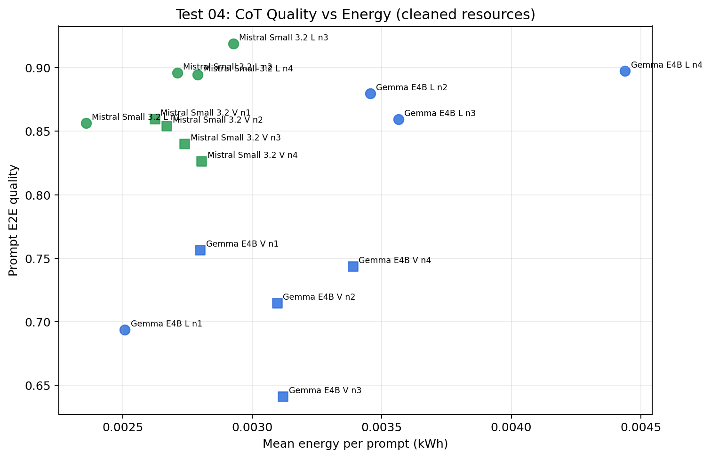
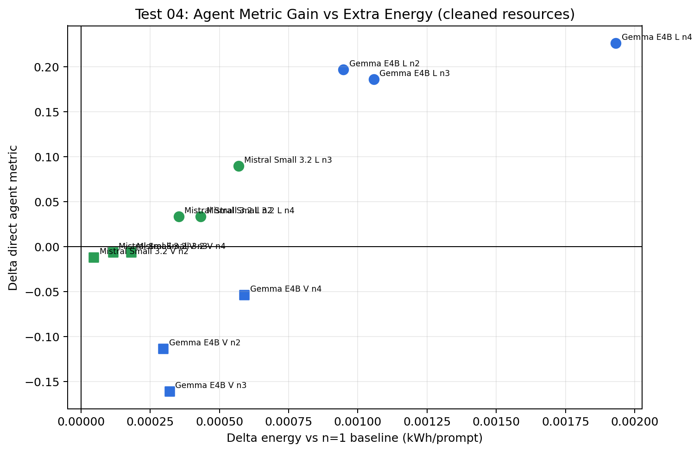
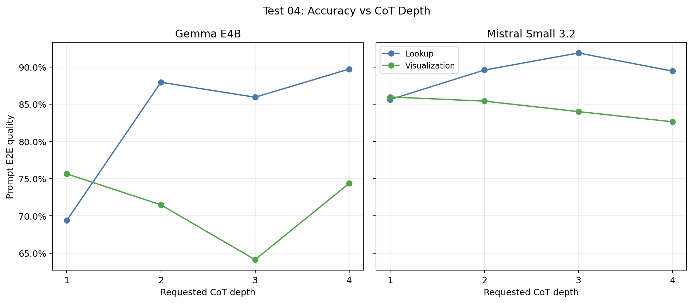
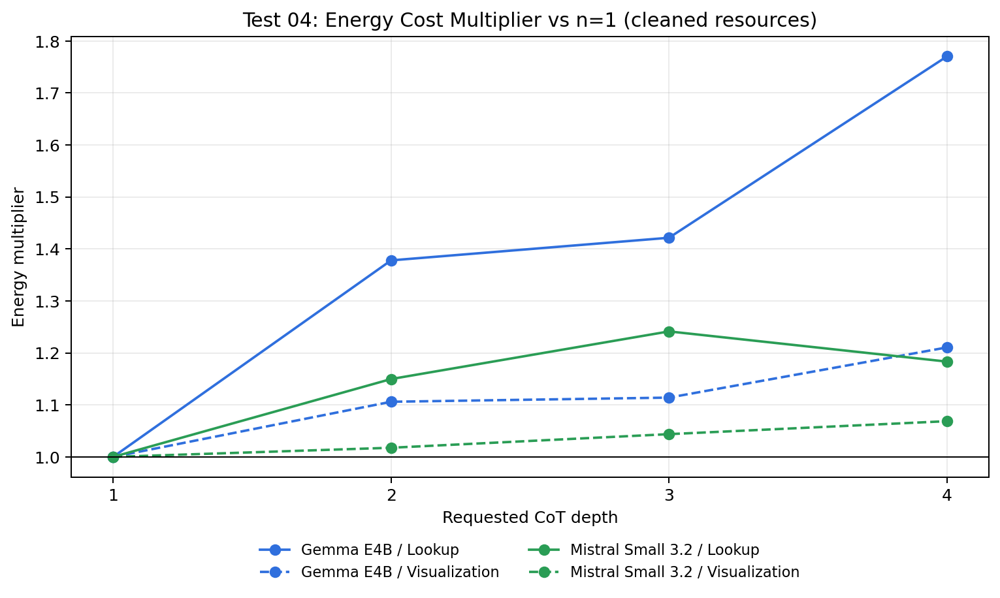
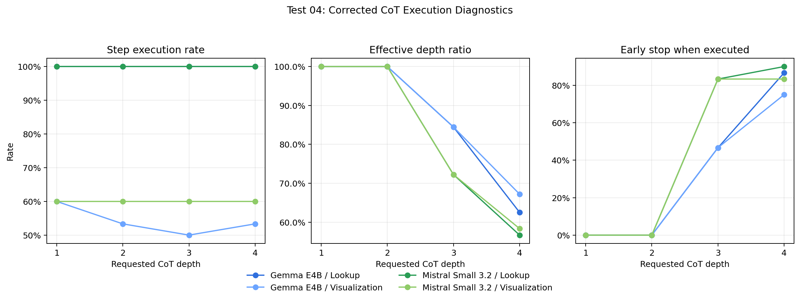
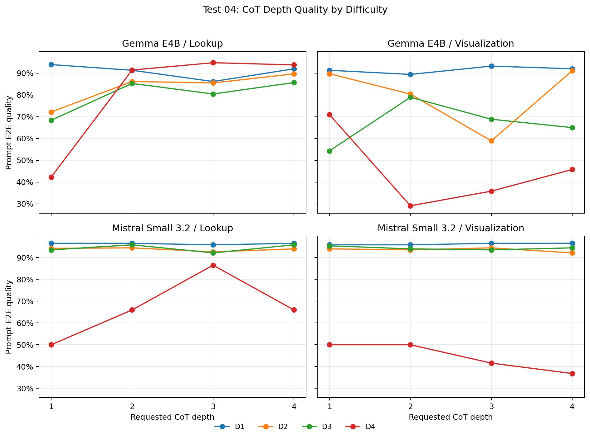
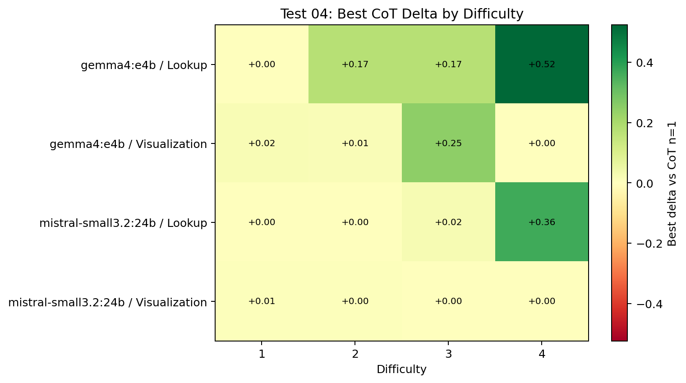

# Test 04 Final Report: CoT Depth Effectiveness

## Data Source

```text
/home/oss/Downloads/thesis_tests_final_test34/04_compute_expansion_n_and_cot
```

Completeness check:

| Model | Repeat | Expected configs | Completed configs | Rows | Status |
| --- | --- | --- | --- | --- | --- |
| `gemma4:e4b` | rep01 | 8 | 8 | 80 | included |
| `gemma4:e4b` | rep02 | 8 | 8 | 80 | included |
| `gemma4:e4b` | rep03 | 8 | 8 | 80 | included |
| `mistral-small3.2:24b` | rep01 | 8 | 8 | 80 | included |
| `mistral-small3.2:24b` | rep02 | 8 | 8 | 80 | included |
| `mistral-small3.2:24b` | rep03 | 8 | 8 | 80 | included |

## Method Notes

This test isolates CoT depth for lookup and visualization. `cot_n=1` is the phase baseline. Expected missing GT score slots are counted as `0`.

Resource cleaning note: the raw downloaded run files were kept unchanged, but the analysis uses a cleaned resource view for one clear run anomaly. In `gemma4:e4b`, `rep03`, `visualization_cot_n3`, two rows had abnormal wall-clock time and energy that were inconsistent with the surrounding repetitions. Only resource and timing columns were replaced with the mean of the same model/config/test case from `rep01` and `rep02`; quality scores, completion flags, and CoT execution diagnostics were left unchanged.

| Test case | Raw kWh | Clean kWh | Raw sec | Clean sec |
| --- | --- | --- | --- | --- |
| 2 | 0.03674 | 0.00515 | 1837.4 | 255.4 |
| 3 | 0.02797 | 0.00304 | 1399.1 | 149.7 |

This correction changes `gemma4:e4b` `visualization_cot_n3` from `0.00500` to `0.00312` kWh/prompt and from `247.8` to `153.4` seconds/prompt. The qualitative conclusion is unchanged: visualization CoT still reduces quality for Gemma E4B in this test, but its cost is no longer overstated by the abnormal third repeat.

## Executive Findings

- CoT is step-specific and not monotonic.
- Lookup is the most plausible CoT target because SQL has executable feedback.
- Visualization CoT can add cost without consistently improving quality.
- The early-stop diagnostics matter because requested depth and executed depth can differ.

## Overall Resource Use

| Model | Repeats | Rows | Mean quality | Mean sec / prompt | Mean kWh / prompt | Mean completion |
| --- | --- | --- | --- | --- | --- | --- |
| `gemma4:e4b` | 3 | 240 | 0.7733 | 162.5 | 0.00330 | 92.0% |
| `mistral-small3.2:24b` | 3 | 240 | 0.8682 | 132.9 | 0.00270 | 94.1% |

## Aggregate Results

| Model | Config | Step | cot_n | Quality | Delta quality | Metric | Delta metric | Sec / prompt | kWh / prompt |
| --- | --- | --- | --- | --- | --- | --- | --- | --- | --- |
| `gemma4:e4b` | `lookup_cot_n1` | Lookup | 1 | 0.6939 | 0.0000 | `csv_iou=0.7573` | 0.0000 | 123.1 | 0.00251 |
| `gemma4:e4b` | `lookup_cot_n2` | Lookup | 2 | 0.8795 | +0.1856 | `csv_iou=0.9540` | +0.1968 | 170.5 | 0.00346 |
| `gemma4:e4b` | `lookup_cot_n3` | Lookup | 3 | 0.8594 | +0.1655 | `csv_iou=0.9433` | +0.1860 | 176.1 | 0.00356 |
| `gemma4:e4b` | `lookup_cot_n4` | Lookup | 4 | 0.8972 | +0.2033 | `csv_iou=0.9834` | +0.2261 | 219.8 | 0.00444 |
| `gemma4:e4b` | `visualization_cot_n1` | Visualization | 1 | 0.7565 | 0.0000 | `vis_score=0.7262` | 0.0000 | 137.7 | 0.00280 |
| `gemma4:e4b` | `visualization_cot_n2` | Visualization | 2 | 0.7149 | -0.0417 | `vis_score=0.6131` | -0.1131 | 152.5 | 0.00310 |
| `gemma4:e4b` | `visualization_cot_n3` | Visualization | 3 | 0.6413 | -0.1152 | `vis_score=0.5655` | -0.1607 | 153.4 | 0.00312 |
| `gemma4:e4b` | `visualization_cot_n4` | Visualization | 4 | 0.7438 | -0.0128 | `vis_score=0.6726` | -0.0536 | 167.2 | 0.00339 |
| `mistral-small3.2:24b` | `lookup_cot_n1` | Lookup | 1 | 0.8562 | 0.0000 | `csv_iou=0.9000` | 0.0000 | 115.6 | 0.00236 |
| `mistral-small3.2:24b` | `lookup_cot_n2` | Lookup | 2 | 0.8958 | +0.0396 | `csv_iou=0.9333` | +0.0333 | 133.3 | 0.00271 |
| `mistral-small3.2:24b` | `lookup_cot_n3` | Lookup | 3 | 0.9188 | +0.0626 | `csv_iou=0.9898` | +0.0898 | 144.2 | 0.00293 |
| `mistral-small3.2:24b` | `lookup_cot_n4` | Lookup | 4 | 0.8944 | +0.0382 | `csv_iou=0.9333` | +0.0333 | 137.2 | 0.00279 |
| `mistral-small3.2:24b` | `visualization_cot_n1` | Visualization | 1 | 0.8597 | 0.0000 | `vis_score=0.7619` | 0.0000 | 128.9 | 0.00262 |
| `mistral-small3.2:24b` | `visualization_cot_n2` | Visualization | 2 | 0.8542 | -0.0056 | `vis_score=0.7500` | -0.0119 | 131.4 | 0.00267 |
| `mistral-small3.2:24b` | `visualization_cot_n3` | Visualization | 3 | 0.8401 | -0.0196 | `vis_score=0.7560` | -0.0060 | 134.8 | 0.00274 |
| `mistral-small3.2:24b` | `visualization_cot_n4` | Visualization | 4 | 0.8264 | -0.0333 | `vis_score=0.7560` | -0.0060 | 138.0 | 0.00280 |

## CoT Execution Diagnostics

The previous version of this table was not correct for visualization. It computed early-stop percentages over all 30 benchmark rows, while the executed-iteration mean ignored rows where visualization CoT did not run. This mixed two different denominators and made visualization early stops look lower than they were.

The corrected table separates three concepts:

```text
step execution rate             rows where the CoT step executed / all rows
early stop when executed         early stops / rows where the CoT step executed
full depth when executed         requested depth reached / rows where the CoT step executed
```

| Model | Step | Config | Requested | Total rows | Executed rows | Step execution rate | Executed mean | Effective depth | Early stop when executed | Full depth when executed |
| --- | --- | --- | --- | --- | --- | --- | --- | --- | --- | --- |
| `gemma4:e4b` | Lookup | `lookup_cot_n1` | 1 | 30 | 30 | 100.0% | 1.00 | 100.0% | 0.0% | 100.0% |
| `gemma4:e4b` | Lookup | `lookup_cot_n2` | 2 | 30 | 30 | 100.0% | 2.00 | 100.0% | 0.0% | 100.0% |
| `gemma4:e4b` | Lookup | `lookup_cot_n3` | 3 | 30 | 30 | 100.0% | 2.53 | 84.4% | 46.7% | 53.3% |
| `gemma4:e4b` | Lookup | `lookup_cot_n4` | 4 | 30 | 30 | 100.0% | 2.50 | 62.5% | 86.7% | 13.3% |
| `gemma4:e4b` | Visualization | `visualization_cot_n1` | 1 | 30 | 18 | 60.0% | 1.00 | 100.0% | 0.0% | 100.0% |
| `gemma4:e4b` | Visualization | `visualization_cot_n2` | 2 | 30 | 16 | 53.3% | 2.00 | 100.0% | 0.0% | 100.0% |
| `gemma4:e4b` | Visualization | `visualization_cot_n3` | 3 | 30 | 15 | 50.0% | 2.53 | 84.4% | 46.7% | 53.3% |
| `gemma4:e4b` | Visualization | `visualization_cot_n4` | 4 | 30 | 16 | 53.3% | 2.69 | 67.2% | 75.0% | 25.0% |
| `mistral-small3.2:24b` | Lookup | `lookup_cot_n1` | 1 | 30 | 30 | 100.0% | 1.00 | 100.0% | 0.0% | 100.0% |
| `mistral-small3.2:24b` | Lookup | `lookup_cot_n2` | 2 | 30 | 30 | 100.0% | 2.00 | 100.0% | 0.0% | 100.0% |
| `mistral-small3.2:24b` | Lookup | `lookup_cot_n3` | 3 | 30 | 30 | 100.0% | 2.17 | 72.2% | 83.3% | 16.7% |
| `mistral-small3.2:24b` | Lookup | `lookup_cot_n4` | 4 | 30 | 30 | 100.0% | 2.27 | 56.7% | 90.0% | 10.0% |
| `mistral-small3.2:24b` | Visualization | `visualization_cot_n1` | 1 | 30 | 18 | 60.0% | 1.00 | 100.0% | 0.0% | 100.0% |
| `mistral-small3.2:24b` | Visualization | `visualization_cot_n2` | 2 | 30 | 18 | 60.0% | 2.00 | 100.0% | 0.0% | 100.0% |
| `mistral-small3.2:24b` | Visualization | `visualization_cot_n3` | 3 | 30 | 18 | 60.0% | 2.17 | 72.2% | 83.3% | 16.7% |
| `mistral-small3.2:24b` | Visualization | `visualization_cot_n4` | 4 | 30 | 18 | 60.0% | 2.33 | 58.3% | 83.3% | 16.7% |

For example, `mistral-small3.2:24b` with `visualization_cot_n4` previously appeared to early-stop only 50.0% of the time. The corrected value is 83.3% among executed visualization-CoT rows: 18 rows executed visualization CoT, 15 stopped early, and 12 rows did not execute visualization CoT at all. This also explains why the executed mean is 2.33 rather than at least 3.00.

## Figures











## Prompt Difficulty Analysis

This view checks whether CoT depth helps the same way on easy and hard prompts. `cot_n=1` is the baseline for each model, step, and difficulty level.





Best CoT depth by difficulty:

| Model | Step | Difficulty | Baseline quality | Best n | Best quality | Delta quality | Worst n | Worst quality | Range | Energy delta |
| --- | --- | --- | --- | --- | --- | --- | --- | --- | --- | --- |
| gemma4:e4b | Lookup | 1 | 0.939 | 1 | 0.939 | +0.000 | 3 | 0.861 | 0.078 | 0.000000 |
| gemma4:e4b | Lookup | 2 | 0.721 | 4 | 0.896 | +0.175 | 1 | 0.721 | 0.175 | 0.001210 |
| gemma4:e4b | Lookup | 3 | 0.684 | 4 | 0.856 | +0.173 | 1 | 0.684 | 0.173 | 0.003348 |
| gemma4:e4b | Lookup | 4 | 0.423 | 3 | 0.947 | +0.524 | 1 | 0.423 | 0.524 | 0.001791 |
| gemma4:e4b | Visualization | 1 | 0.913 | 3 | 0.932 | +0.019 | 2 | 0.894 | 0.038 | 0.000754 |
| gemma4:e4b | Visualization | 2 | 0.897 | 4 | 0.911 | +0.014 | 3 | 0.589 | 0.322 | 0.000780 |
| gemma4:e4b | Visualization | 3 | 0.543 | 2 | 0.789 | +0.246 | 1 | 0.543 | 0.246 | 0.001170 |
| gemma4:e4b | Visualization | 4 | 0.709 | 1 | 0.709 | +0.000 | 2 | 0.291 | 0.418 | 0.000000 |
| mistral-small3.2:24b | Lookup | 1 | 0.965 | 1 | 0.965 | +0.000 | 3 | 0.958 | 0.007 | 0.000000 |
| mistral-small3.2:24b | Lookup | 2 | 0.942 | 2 | 0.944 | +0.002 | 3 | 0.926 | 0.019 | 0.000268 |
| mistral-small3.2:24b | Lookup | 3 | 0.935 | 2 | 0.958 | +0.023 | 3 | 0.921 | 0.037 | 0.000283 |
| mistral-small3.2:24b | Lookup | 4 | 0.500 | 3 | 0.865 | +0.365 | 1 | 0.500 | 0.365 | 0.001691 |
| mistral-small3.2:24b | Visualization | 1 | 0.958 | 3 | 0.965 | +0.007 | 1 | 0.958 | 0.007 | 0.000266 |
| mistral-small3.2:24b | Visualization | 2 | 0.940 | 3 | 0.944 | +0.005 | 4 | 0.921 | 0.023 | 0.000738 |
| mistral-small3.2:24b | Visualization | 3 | 0.954 | 1 | 0.954 | +0.000 | 3 | 0.935 | 0.019 | 0.000000 |
| mistral-small3.2:24b | Visualization | 4 | 0.500 | 1 | 0.500 | +0.000 | 4 | 0.368 | 0.132 | 0.000000 |

Interpretation: CoT is most defensible when the prompt is difficult enough for executable feedback to correct the SQL or chart-generation trajectory. The lookup step benefits more consistently than visualization because SQL feedback is objective and immediately testable. Visualization CoT is less reliable: for some difficulty slices it adds iterations and cost without improving the final chart score.

## Thesis Interpretation

CoT should be discussed as a targeted compute lever. It is useful only when the quality gain is large enough to justify the measured extra time and energy, and when high requested depth is not simply adding redundant iterations.

The corrected execution diagnostics strengthen this point: requested CoT depth is a nominal upper bound, not the effective executed depth. At high `cot_n`, many runs converge early, so the real compute expansion is smaller than the requested depth, especially for Mistral lookup and for visualization when the visualization step actually executes.
