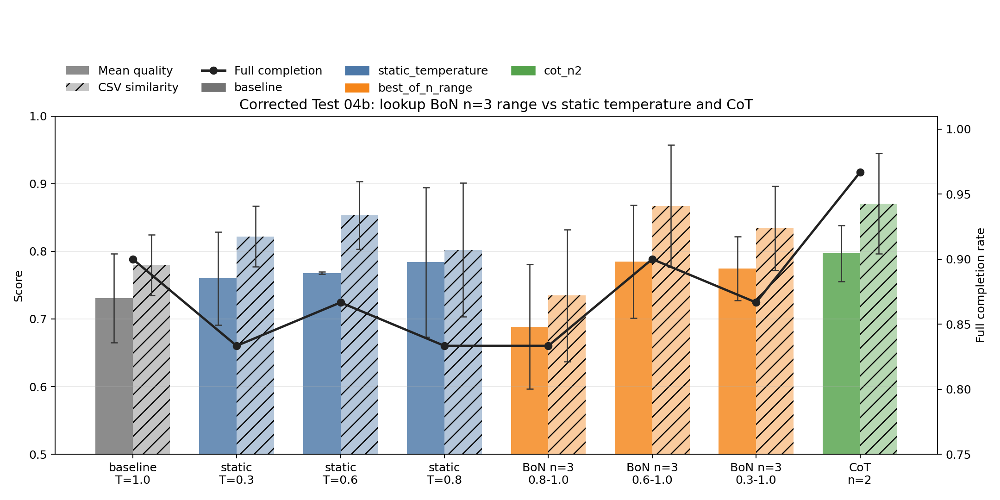
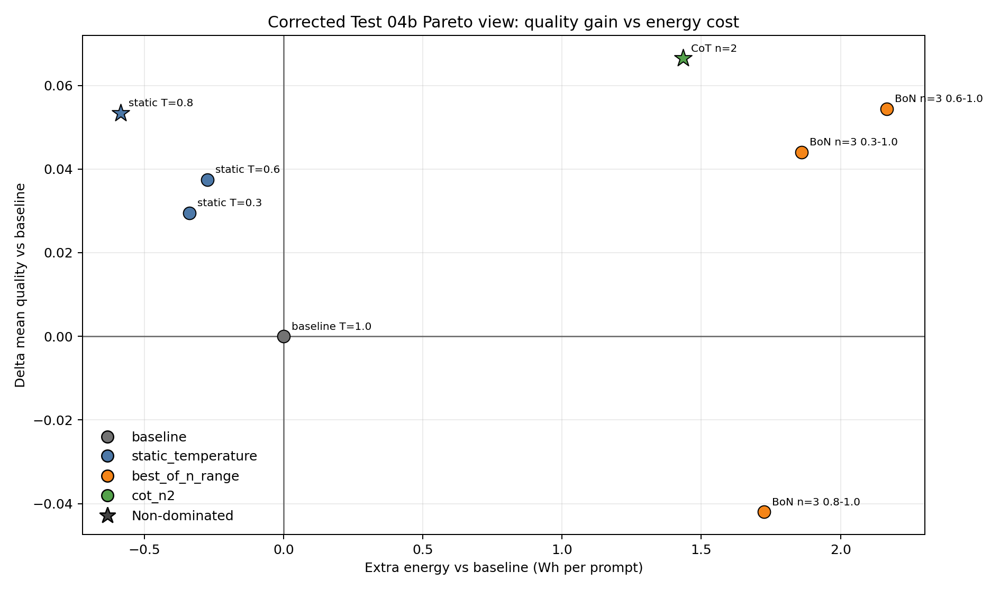
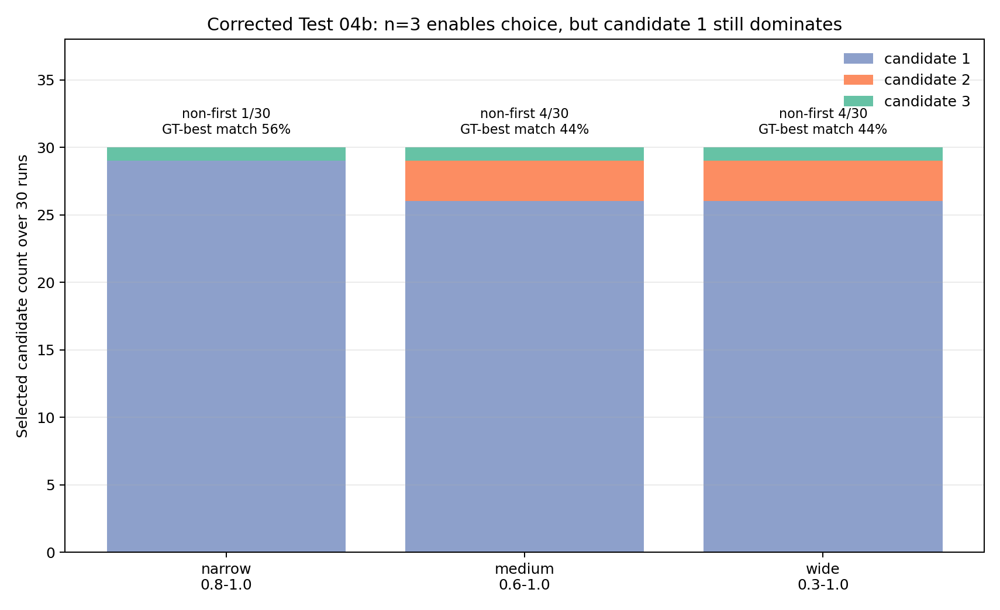

# Test 04b Final Report: Corrected Lookup Best-of-N Range Check

## Data Source

```text
/home/oss/Downloads/last_thesis_tests_final_test4b
```

This report replaces the previous Test 04b analysis. The earlier run used `n=2`, which is not a valid stress test for the current no-GT pairwise selector: with only two candidates, the selector has no real multi-candidate ranking problem. The corrected run uses `n=3`, so the selector can choose among three lookup outputs.

Completeness check:

| Model | Repeat | Expected configs | Completed configs | Rows | Status |
| --- | --- | --- | --- | --- | --- |
| `gemma4:e4b` | rep01 | 8 | 8 | 80 | included |
| `gemma4:e4b` | rep02 | 8 | 8 | 80 | included |
| `gemma4:e4b` | rep03 | 8 | 8 | 80 | included |

## Method Notes

This follow-up compares static lookup temperatures, Best-of-3 lookup temperature ranges, and `lookup_cot_n2` for `gemma4:e4b`.

- Only the lookup agent is changed; analysis and visualization remain fixed at the Gemma E4B baseline.
- GT scoring uses `openai/gpt-5.4`.
- No-GT candidate selection uses the local tested model, `ollama/gemma4:e4b`, as in the real execution path.
- Expected missing GT score slots are counted as `0`, so failures remain part of the accuracy measure.
- The selector diagnostics use the saved lookup candidate metadata. Per-candidate GT oracle statistics are available only for the subset of raw runs where `all_gt_scores` was stored.

## Executive Findings

- The corrected `n=3` run confirms that Best-of-N can now make real non-first selections, but the selector still chooses candidate 1 in most cases.
- The medium range `[0.6, 1.0]` is the best Best-of-N range: it gives the highest BoN CSV similarity (`0.8672`) and nearly matches the best quality score (`0.7850`), but it costs substantially more energy than static temperature settings.
- Static `T=0.8` is the strongest low-cost point: it improves quality by `+0.0534` while using slightly less energy than baseline.
- `lookup_cot_n2` remains the best quality point (`0.7971`) and the best CSV point (`0.8705`), with lower extra energy than the Best-of-3 medium range.
- Best-of-N is therefore useful as a diagnostic, but not the most attractive final recommendation for Gemma E4B lookup unless the no-GT selector is improved.

## Aggregate Results

| Config | Type | Quality | Delta quality | csv_iou | csv delta | Full completion | Sec / prompt | kWh / prompt | Delta kWh |
| --- | --- | ---: | ---: | ---: | ---: | ---: | ---: | ---: | ---: |
| `lookup_baseline` | baseline | 0.7306 | +0.0000 | 0.7798 | +0.0000 | 90.0% | 136.1 | 0.00676 | +0.00000 |
| `lookup_temp_0_3` | static_temperature | 0.7600 | +0.0295 | 0.8220 | +0.0422 | 83.3% | 126.4 | 0.00642 | -0.00034 |
| `lookup_temp_0_6` | static_temperature | 0.7680 | +0.0375 | 0.8533 | +0.0735 | 86.7% | 131.0 | 0.00649 | -0.00027 |
| `lookup_temp_0_8` | static_temperature | 0.7840 | +0.0534 | 0.8019 | +0.0221 | 83.3% | 125.4 | 0.00618 | -0.00058 |
| `lookup_bon_temp_n3_narrow` | best_of_n_range | 0.6886 | -0.0420 | 0.7346 | -0.0452 | 83.3% | 172.0 | 0.00849 | +0.00173 |
| `lookup_bon_temp_n3_medium` | best_of_n_range | 0.7850 | +0.0544 | 0.8672 | +0.0874 | 90.0% | 180.3 | 0.00893 | +0.00217 |
| `lookup_bon_temp_n3_wide` | best_of_n_range | 0.7746 | +0.0441 | 0.8340 | +0.0542 | 86.7% | 174.9 | 0.00862 | +0.00186 |
| `lookup_cot_n2` | cot_n2 | 0.7971 | +0.0665 | 0.8705 | +0.0907 | 96.7% | 164.0 | 0.00820 | +0.00144 |

## Selection Behavior

| Config | Selected candidate 1 | Selected candidate 2 | Selected candidate 3 | Non-first selections | Mean margin |
| --- | ---: | ---: | ---: | ---: | ---: |
| `lookup_bon_temp_n3_narrow` | 29 | 0 | 1 | 1 / 30 | 0.0333 |
| `lookup_bon_temp_n3_medium` | 26 | 3 | 1 | 4 / 30 | 0.0417 |
| `lookup_bon_temp_n3_wide` | 26 | 3 | 1 | 4 / 30 | 0.0233 |

The corrected run shows that the selector is no longer completely inert, but it is still conservative. Even with three candidates, it selects the first candidate in `86.7%` to `96.7%` of runs. The median no-GT selection margin is `0.0` for all three ranges, which means many pairwise decisions are effectively ties.

For the raw runs where per-candidate GT scores were stored, the selected candidate matched the GT-best candidate in only `44.4%` to `55.6%` of cases. This does not invalidate the aggregate score improvement of the medium range, but it explains why Best-of-N does not reliably dominate simpler settings: candidate diversity exists, but the no-GT selector does not consistently identify the best candidate.

| Config | GT-scored candidate rows | GT-best match rate | Mean chosen GT | Mean oracle GT | Mean regret |
| --- | ---: | ---: | ---: | ---: | ---: |
| `lookup_bon_temp_n3_narrow` | 9 | 55.6% | 0.8463 | 0.9436 | 0.0973 |
| `lookup_bon_temp_n3_medium` | 9 | 44.4% | 0.9186 | 0.9948 | 0.0762 |
| `lookup_bon_temp_n3_wide` | 9 | 44.4% | 0.9185 | 0.9946 | 0.0761 |

## Pareto Interpretation

The non-dominated points are:

| Config | Why it matters |
| --- | --- |
| `lookup_temp_0_8` | Best low-cost setting: higher quality than baseline with lower measured energy. |
| `lookup_cot_n2` | Best quality and CSV setting, with less extra energy than Best-of-3 medium. |

`lookup_bon_temp_n3_medium` is close in quality and strong in CSV similarity, but it is dominated by `lookup_cot_n2`: CoT has higher quality, higher CSV similarity, higher completion, and lower energy. The narrow Best-of-N range is actively harmful in this run, and the wide range does not justify its additional cost relative to static `T=0.8`.

## Figures







## Thesis Interpretation

The corrected Test 04b should be interpreted as a check on the Best-of-N mechanism rather than as evidence for adding Best-of-N to the final recommended configurations. Moving from the invalid `n=2` setup to `n=3` confirms that candidate diversity can help, especially for the medium temperature range. However, the local no-GT selector still picks the first candidate most of the time and only partially agrees with the GT-best candidate where oracle diagnostics are available.

For the thesis, this supports two points:

- Best-of-N range design matters: the medium range `[0.6, 1.0]` is clearly better than the narrow `[0.8, 1.0]` and more stable than the wide `[0.3, 1.0]`.
- In the current implementation, lookup CoT is a better compute-expansion strategy than lookup Best-of-N for Gemma E4B, because it gives the best quality with lower extra energy than the strongest Best-of-3 range.
