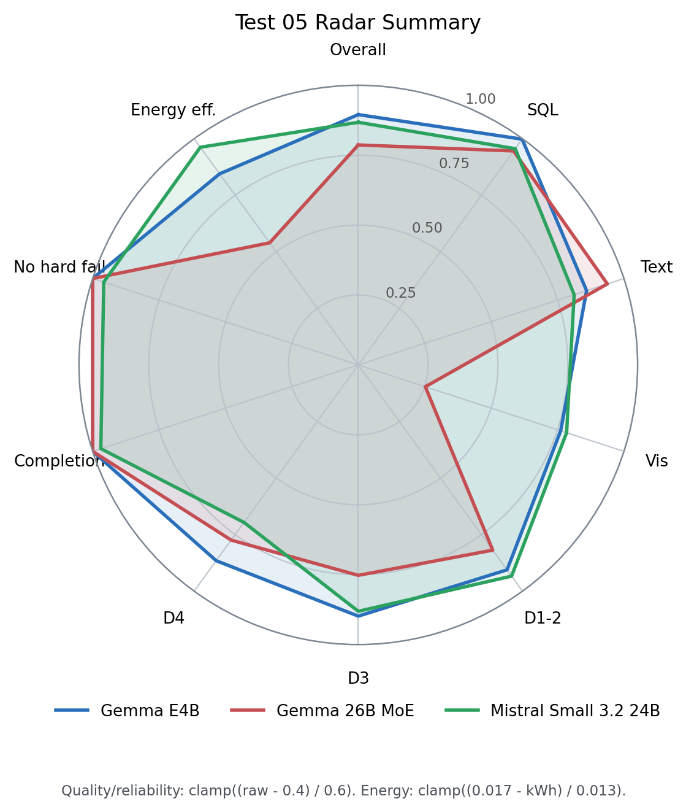
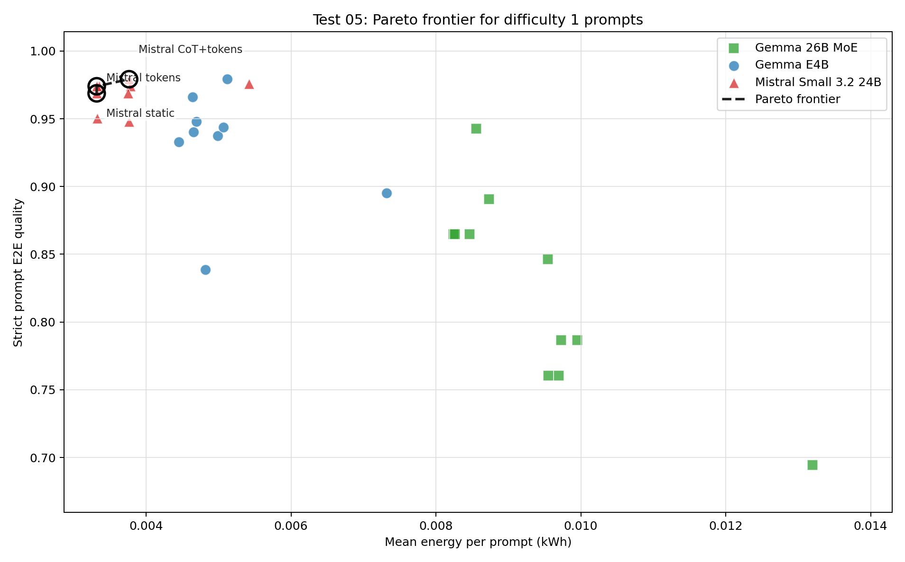
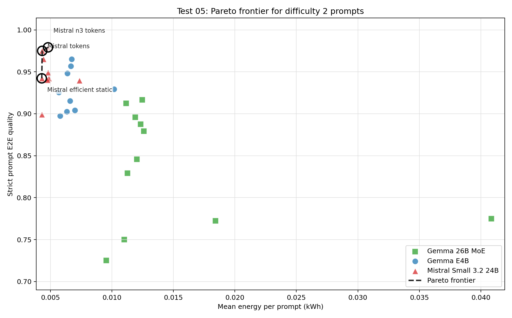
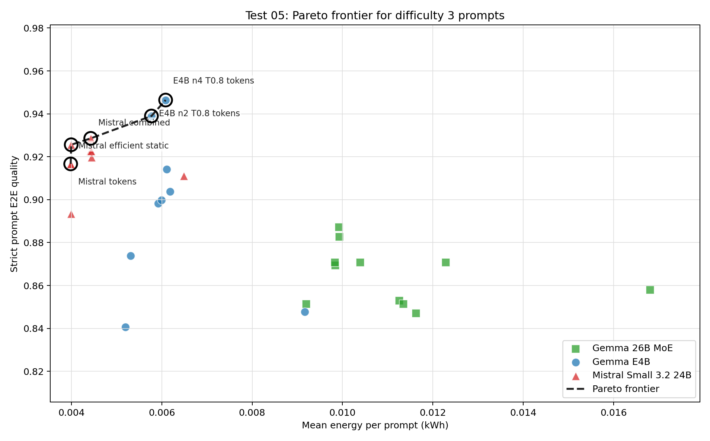
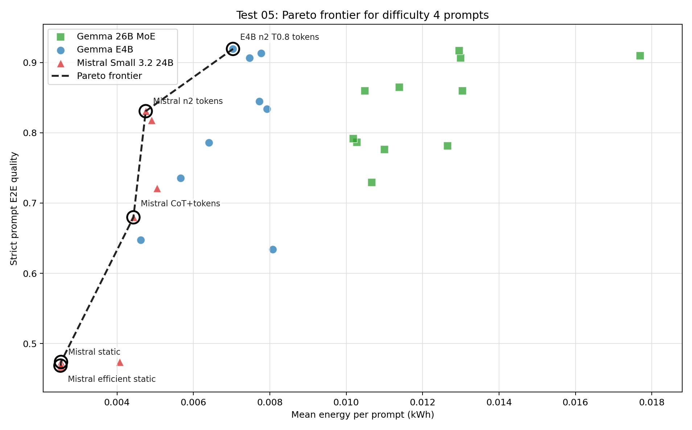
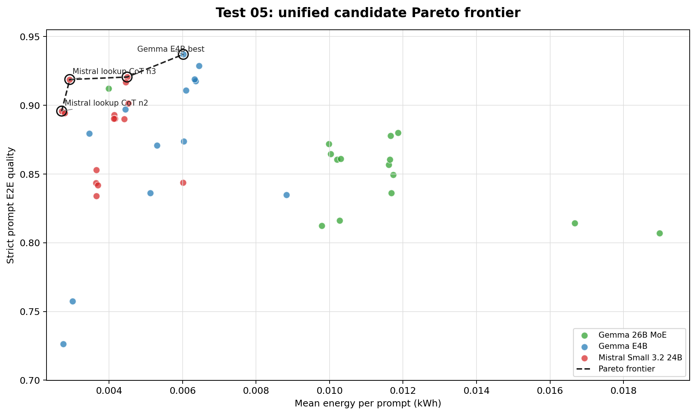
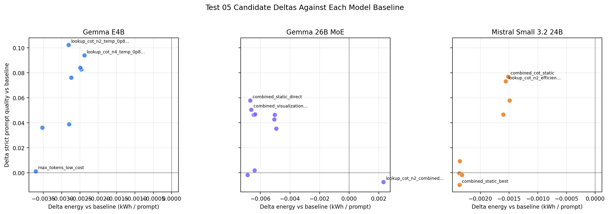

# Test 05 Final-Run Report: Pareto Confirmation

## Data Source

Results analyzed from:

```text
/home/oss/Downloads/05_final_pareto_confirmation/
/home/oss/Downloads/01_model_baseline_comparison/
/home/oss/Downloads/02v2_agent_step_parameter_sensitivity/
/home/oss/Downloads/thesis_tests_final_test34/03_max_tokens_agent_ladder/
/home/oss/Downloads/thesis_tests_final_test34/04_compute_expansion_n_and_cot/
```

Test 05 is treated as one unified candidate set. This is intentional: during
the test design we decided not to rerun every useful configuration if the same
configuration had already been measured with the GPT-5.4 GT judge in Tests
02-04. Those useful rows are therefore part of the final Pareto candidate set,
not a separate screening or provenance layer.

The report excludes the plain `rep` folders in the Test 01 and Test 05 download
directories because those rows were judged with the local Ollama model, not
GPT-5.4. Test 04b is also excluded from this GPT-5.4 report because the final
run folder has no usable rows and the older 04b run used the local Ollama
judge.

## Method Notes

Quality is computed strictly: if a prompt expects a data, text, or visualization
score and that score is missing, the missing slot is counted as `0`. This keeps
failed runs inside the accuracy estimate instead of dropping them from the
mean.

Metrics used in the report:

```text
quality_mean_strict   mean of strict csv_iou, text_score, and vis_score component means
prompt_quality_mean   mean per-prompt score over the expected GT slots for that prompt
completion_rate       completed score slots / expected score slots
full_completion_rate  fraction of prompts where every expected score slot exists
```

The main Pareto objective minimizes mean energy per prompt and maximizes strict
prompt quality. A configuration is non-dominated if no other configuration has
both lower-or-equal energy and higher-or-equal prompt quality, with at least one
strict improvement.

## Executive Findings

- The best strict prompt quality is `lookup_cot_n2_temp_0p8_low_cost_tokens` on
  `gemma4:e4b`: prompt quality `0.9371`, full completion, and `0.00602` kWh per
  prompt.
- The lowest-energy useful non-dominated point is Mistral
  `lookup_cot_n2`: prompt quality `0.8958` at `0.00271` kWh per prompt.
- The strongest low-energy Mistral point is `lookup_cot_n3`: prompt quality
  `0.9188`, full completion, and `0.00293` kWh per prompt.
- `combined_cot_static` confirms that Mistral remains a strong low-energy final
  family: prompt quality `0.9206` at `0.00449` kWh per prompt.
- Gemma E4B is the high-quality endpoint. Its best candidate improves prompt
  quality by `+0.1022` and reduces energy by `-0.00281` kWh per prompt relative
  to its Test 01 baseline.
- Gemma 26B improves with targeted tuning, especially with the
  `visualization_max_tokens_10000` candidate, but it is dominated once energy
  is included.
- The final conclusion is not a model-size ranking: the best low-energy region
  is Mistral, while the best high-quality endpoint is the small thinking Gemma
  E4B with lookup repair.

## Unified Candidate Ranking

Sorted by strict prompt quality over the useful Test 05 candidate set:

| Model | Config | Prompt quality | Completion | kWh / prompt |
| --- | --- | --- | --- | --- |
| Gemma E4B | `lookup_cot_n2_temp_0p8_low_cost_tokens` | 0.9371 | 100.0% | 0.00602 |
| Gemma E4B | `lookup_cot_n4_temp_0p8_low_cost_tokens` | 0.9287 | 100.0% | 0.00645 |
| Mistral Small 3.2 24B | `combined_cot_static` | 0.9206 | 98.1% | 0.00449 |
| Gemma E4B | `lookup_cot_n4_temp_0p8` | 0.9189 | 100.0% | 0.00633 |
| Mistral Small 3.2 24B | `lookup_cot_n3` | 0.9188 | 100.0% | 0.00293 |
| Mistral Small 3.2 24B | `lookup_cot_n2_efficient_tokens` | 0.9168 | 98.1% | 0.00445 |
| Gemma 26B MoE | `visualization_max_tokens_10000` | 0.9123 | 100.0% | 0.00399 |
| Gemma E4B | `lookup_cot_n4` | 0.8972 | 100.0% | 0.00444 |
| Mistral Small 3.2 24B | `lookup_cot_n2` | 0.8958 | 95.1% | 0.00271 |
| Mistral Small 3.2 24B | `lookup_cot_n4` | 0.8944 | 95.1% | 0.00279 |
| Mistral Small 3.2 24B | `analysis_top_k_56` | 0.8931 | 95.2% | 0.00414 |
| Mistral Small 3.2 24B | `lookup_repeat_penalty_1p3` | 0.8903 | 95.2% | 0.00416 |
| Mistral Small 3.2 24B | `visualization_repeat_last_n_56` | 0.8903 | 95.2% | 0.00413 |
| Mistral Small 3.2 24B | `combined_cot_static_tokens` | 0.8902 | 96.3% | 0.00441 |
| Gemma 26B MoE | `visualization_repeat_penalty_1` | 0.8800 | 100.0% | 0.01186 |
| Gemma E4B | `lookup_cot_n2` | 0.8795 | 100.0% | 0.00346 |
| Gemma 26B MoE | `visualization_top_k_20` | 0.8779 | 100.0% | 0.01166 |
| Gemma E4B | `lookup_cot_n2_low_cost_tokens` | 0.8737 | 98.1% | 0.00603 |
| Gemma 26B MoE | `combined_static_direct` | 0.8720 | 100.0% | 0.00998 |
| Gemma E4B | `lookup_temp_0p8_low_cost_tokens` | 0.8709 | 98.1% | 0.00530 |

## Unified Pareto Frontier

Non-dominated configurations for prompt E2E quality vs. energy:

| Model | Config | Prompt quality | Completion | kWh / prompt |
| --- | --- | --- | --- | --- |
| Mistral Small 3.2 24B | `lookup_cot_n2` | 0.8958 | 95.1% | 0.00271 |
| Mistral Small 3.2 24B | `lookup_cot_n3` | 0.9188 | 100.0% | 0.00293 |
| Mistral Small 3.2 24B | `combined_cot_static` | 0.9206 | 98.1% | 0.00449 |
| Gemma E4B | `lookup_cot_n2_temp_0p8_low_cost_tokens` | 0.9371 | 100.0% | 0.00602 |

Interpretation:

- Mistral defines the low-energy frontier. `lookup_cot_n2` is the cheapest
  useful Pareto point, while `lookup_cot_n3` is the best low-energy quality
  point with full completion.
- `combined_cot_static` is the strongest Mistral combined candidate. It is more
  expensive than the simple lookup-CoT points but reaches slightly higher prompt
  quality.
- Gemma E4B defines the high-quality endpoint. Its best candidate is more
  expensive than Mistral but gives the highest prompt quality and full
  completion.
- Gemma 26B has repaired candidates, but all are dominated by either cheaper
  Mistral points or the higher-quality Gemma E4B endpoint.

## Baseline Deltas

Top positive deltas against each model baseline:

| Model | Config | Prompt quality | Delta quality | Delta kWh | Completion | kWh / prompt |
| --- | --- | --- | --- | --- | --- | --- |
| Gemma E4B | `lookup_cot_n2_temp_0p8_low_cost_tokens` | 0.9371 | +0.1022 | -0.00281 | 100.0% | 0.00602 |
| Gemma E4B | `lookup_cot_n4_temp_0p8_low_cost_tokens` | 0.9287 | +0.0938 | -0.00238 | 100.0% | 0.00645 |
| Gemma E4B | `lookup_cot_n4_temp_0p8` | 0.9189 | +0.0841 | -0.00250 | 100.0% | 0.00633 |
| Mistral Small 3.2 24B | `combined_cot_static` | 0.9206 | +0.0769 | -0.00152 | 98.1% | 0.00449 |
| Mistral Small 3.2 24B | `lookup_cot_n2_efficient_tokens` | 0.9168 | +0.0731 | -0.00156 | 98.1% | 0.00445 |
| Gemma 26B MoE | `combined_static_direct` | 0.8720 | +0.0578 | -0.00668 | 100.0% | 0.00998 |
| Mistral Small 3.2 24B | `lookup_cot_n3_efficient_tokens` | 0.9015 | +0.0578 | -0.00149 | 98.1% | 0.00452 |
| Gemma 26B MoE | `combined_visualization_topk20_tokens` | 0.8647 | +0.0505 | -0.00663 | 100.0% | 0.01003 |

The most important point is that the best candidates improve quality while also
reducing energy relative to their own baselines. This is strongest for Gemma
E4B, where lookup repair both increases completion and reduces the cost of
failed or overlong downstream behavior.

## Radar Summary

The radar plot compares one runnable final representative per model. For each
model, the same configuration is used for every axis:

| Model | Radar representative |
| --- | --- |
| Gemma E4B | `lookup_cot_n2_temp_0p8_low_cost_tokens` |
| Gemma 26B MoE | `combined_static_direct` |
| Mistral Small 3.2 24B | `combined_cot_static` |

Quality and reliability axes use the fixed scale
`clamp((raw - 0.4) / 0.6, 0, 1)`, while energy efficiency uses
`clamp((0.017 - kWh_per_prompt) / 0.013, 0, 1)`.

Radar axes:

- `Overall`: strict prompt-level E2E quality, averaging expected SQL/text/visual slots per prompt; missing expected scores count as `0`.
- `SQL`: strict `csv_iou` over prompts with data GT; missing expected data scores count as `0`.
- `Text`: strict `text_score` over prompts with analysis GT; missing expected text scores count as `0`.
- `Vis`: strict `vis_score` over prompts with visualization GT; missing expected visualization scores count as `0`.
- `D1-2`: strict prompt-level E2E quality averaged over difficulty 1 and 2 prompts.
- `D3`: strict prompt-level E2E quality averaged over difficulty 3 prompts.
- `D4`: strict prompt-level E2E quality averaged over difficulty 4 prompts.
- `Completion`: completed expected GT score slots divided by all expected GT score slots.
- `No hard fail`: fraction of prompts with strict prompt-level quality greater than `0`.
- `Energy eff.`: anchored inverse energy score from kWh per prompt; higher is better.



Raw radar values:

| Model | Overall | SQL | Text | Vis | D1-2 | D3 | D4 | Completion | No hard fail | kWh / prompt | Energy eff. |
| --- | --- | --- | --- | --- | --- | --- | --- | --- | --- | --- | --- |
| Gemma E4B | 0.937 | 0.999 | 0.916 | 0.857 | 0.944 | 0.939 | 0.919 | 1.000 | 1.000 | 0.00602 | 0.845 |
| Gemma 26B MoE | 0.872 | 0.968 | 0.963 | 0.551 | 0.891 | 0.851 | 0.865 | 1.000 | 1.000 | 0.00998 | 0.540 |
| Mistral Small 3.2 24B | 0.921 | 0.974 | 0.888 | 0.871 | 0.960 | 0.929 | 0.818 | 0.981 | 0.975 | 0.00449 | 0.962 |

The radar view shows why the final recommendation is split by operating
priority. Gemma E4B is the most complete high-quality profile, especially on
difficulty-4 prompts and reliability. Mistral remains the best energy-efficient
profile and stays close on overall quality, but is weaker on hard prompts.
Gemma 26B keeps strong SQL/text and reliability axes, yet its visualization
axis and energy cost prevent it from becoming the final Pareto recommendation.

## Prompt Difficulty

Difficulty 4 is the most important split because it contains the hardest
multi-step analytical prompts. Mistral remains the cheapest useful option, but
its hard-prompt quality and completion stay below Gemma E4B. Gemma 26B is also
strong on hard prompts, yet its energy level makes it dominated by the tuned E4B
hard-prompt endpoint.

Representative best configurations by difficulty:

| Difficulty | Best model/config | Role | Prompt quality | Completion | kWh / prompt |
| --- | --- | --- | --- | --- | --- |
| 1 | Mistral / `combined_cot_static_tokens` | lowest-cost high-quality | 0.979 | 100.0% | 0.00376 |
| 2 | Mistral / `lookup_cot_n3_efficient_tokens` | lowest-cost high-quality | 0.979 | 100.0% | 0.00481 |
| 3 | Gemma E4B / `lookup_cot_n4_temp_0p8_low_cost_tokens` | highest quality | 0.946 | 100.0% | 0.00609 |
| 4 | Gemma E4B / `lookup_cot_n2_temp_0p8_low_cost_tokens` | hard-prompt endpoint | 0.919 | 100.0% | 0.00704 |

The following plots split the Pareto view by prompt difficulty. Each plot uses
the full-benchmark confirmation rows for that difficulty: Test 01 baselines and
the final Test 05 candidate runs. This keeps every difficulty-specific frontier
on the same benchmark support while preserving the unified candidate
interpretation above.



Difficulty 1 is a Mistral-only frontier. The useful choice is mainly an energy
trade-off inside the same model family: the cheapest frontier point is already
high quality, while `combined_cot_static_tokens` gives the best score at a
small energy increase.



Difficulty 2 is also controlled by Mistral. Efficient static/token settings are
the low-energy points, while `lookup_cot_n3_efficient_tokens` gives the highest
quality on this slice.



Difficulty 3 is the transition region. Mistral remains the low-energy side of
the frontier, but Gemma E4B becomes the high-quality endpoint once lookup CoT,
temperature 0.8, and low-cost token caps are combined.



Difficulty 4 is the decisive hard-prompt case. Mistral can remain cheaper, but
the tuned Gemma E4B endpoint is the only frontier point with both high quality
and full completion.

## Figures



This is the main final-decision plot. It shows every useful candidate in the
same quality-energy space and draws a single Pareto frontier. Points are colored
only by model; there is no visual distinction between candidates measured in
Test 05 and candidates reused from earlier tests.



This plot isolates whether each combined candidate improved over its own model
baseline, and whether the improvement required additional energy.

## Model-Level Findings

### Gemma E4B

Best recommendation: `lookup_cot_n2_temp_0p8_low_cost_tokens`.

- Prompt quality: `0.9371`
- Completion: `100.0%`
- Energy: `0.00602` kWh per prompt
- Delta vs. baseline: `+0.1022` prompt quality and `-0.00281` kWh per prompt

Gemma E4B is the best high-quality endpoint because lookup CoT repairs the
fragile SQL step, the lower lookup temperature stabilizes generation, and
low-cost downstream token caps avoid unnecessary output expansion. Depth 4 CoT
variants are close but slightly worse: they cost more and do not beat depth 2.

### Gemma 26B MoE

Best recommendation: `combined_static_direct`.

- Prompt quality: `0.8720`
- Completion: `100.0%`
- Energy: `0.00998` kWh per prompt
- Delta vs. baseline: `+0.0578` prompt quality and `-0.00668` kWh per prompt

Gemma 26B benefits from targeted visualization and token settings, confirming
that the MoE model can be repaired. However, its energy remains too high
relative to the quality achieved. It is useful as evidence that larger thinking
models can improve with agent-specific tuning, but it is not the deployment
recommendation in this benchmark.

### Mistral Small 3.2 24B

Best recommendation: `combined_cot_static` for maximum Mistral quality, or
`lookup_cot_n3` for the best low-energy quality point.

- `combined_cot_static`: prompt quality `0.9206`, energy `0.00449` kWh per prompt
- `lookup_cot_n3`: prompt quality `0.9188`, energy `0.00293` kWh per prompt

Mistral remains the best low-energy family. Lookup CoT gives a large quality
improvement at low absolute cost, but on hard prompts its quality and completion
remain below tuned Gemma E4B.

## Final Interpretation

1. Test 05 should be read as one unified final candidate comparison. Useful
   configurations from earlier tests are included directly because rerunning
   every already-measured configuration was intentionally avoided.
2. The final Pareto frontier has four non-dominated points: two low-energy
   Mistral lookup-CoT points, one stronger Mistral combined point, and one
   high-quality Gemma E4B endpoint.
3. The best high-quality point is Gemma E4B with lookup CoT depth 2, lookup
   temperature 0.8, and low-cost downstream token caps.
4. Mistral Small 3.2 24B is the best low-energy family. It is the natural choice
   for easy-to-medium workloads or energy-constrained deployment.
5. Gemma 26B MoE improves with tuning but remains dominated once energy is
   included.
6. Prompt difficulty changes the operational recommendation: Mistral is the
   natural choice for easy-to-medium workloads; Gemma E4B is preferable when
   hard SQL prompts and robust completion matter more than minimum energy.
