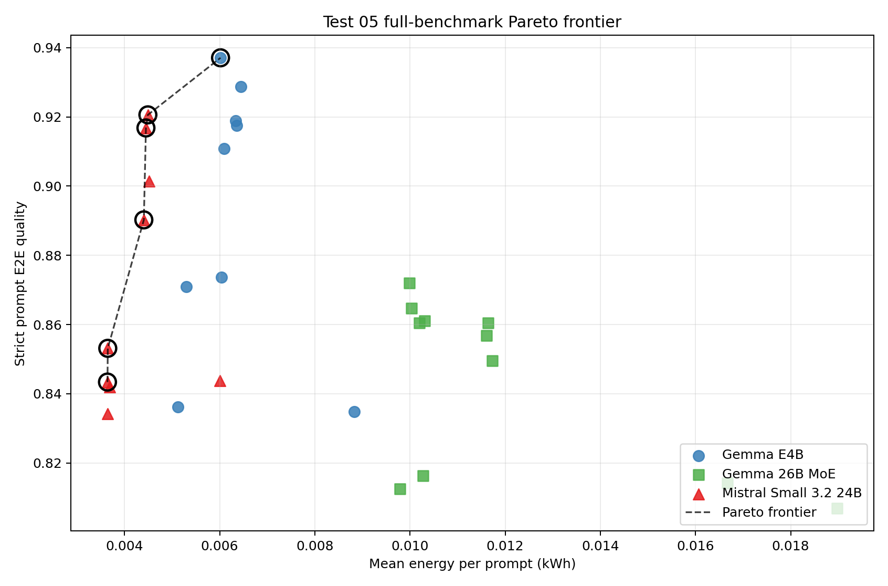
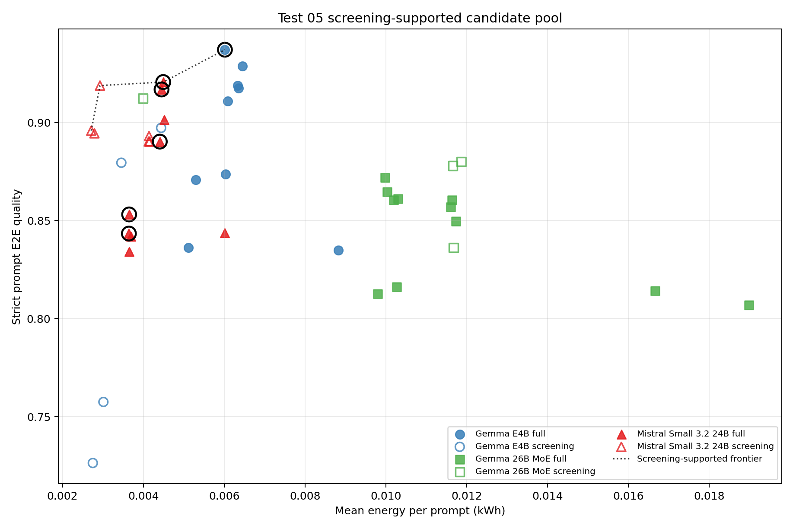
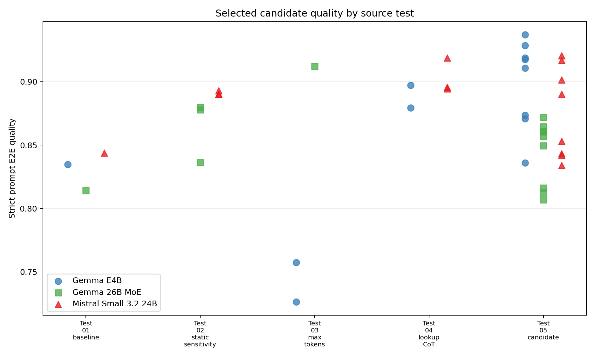
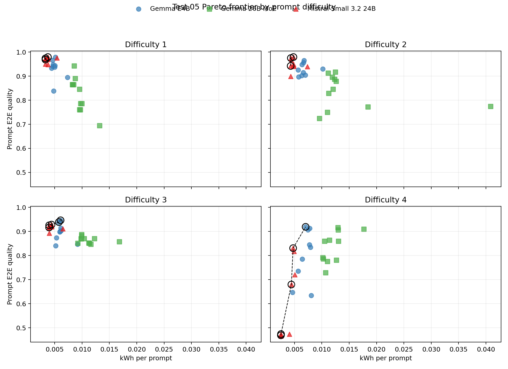
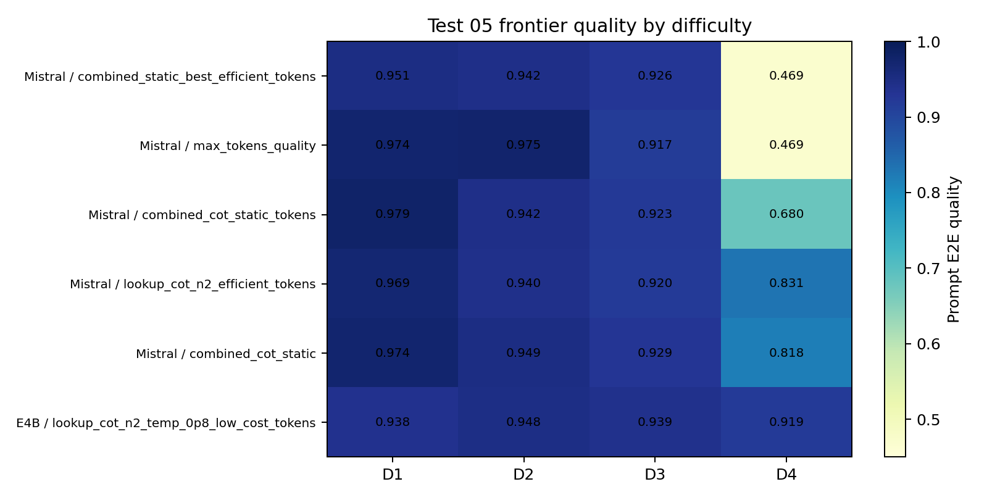

# Test 05 Final-Run Report: Pareto Confirmation

## Data Source

Results analyzed from:

```text
/home/oss/Downloads/05_final_pareto_confirmation/
/home/oss/Downloads/01_model_baseline_comparison/
/home/oss/Downloads/02v2_agent_step_parameter_sensitivity/
/home/oss/Downloads/thesis_tests_final_test34/03_max_tokens_agent_ladder/
/home/oss/Downloads/thesis_tests_final_test34/04_compute_expansion_n_and_cot/
```

Formal full-benchmark Pareto pool:

```text
Test 01: model baselines, rep01-rep03, full 20-prompt benchmark
Test 05: combined final candidates, rep01-rep02, full 20-prompt benchmark
GT judge: openai / gpt-5.4
No-GT judge during the agent run: local Ollama model under test
```

Screening-supported candidate pool:

```text
Selected Test 02 static-sensitivity candidates: 15-prompt screening dataset
Selected Test 03 max-token candidates: 10-prompt screening dataset
Selected Test 04 lookup-CoT candidates: 10-prompt screening dataset
```

The report intentionally excludes the plain `rep` folders in the Test 01 and Test 05 download directories because those rows were judged with the local Ollama model, not GPT-5.4. It also keeps the formal Pareto frontier on the full 20-prompt benchmark only. Selected rows from Tests 02-04 are added in a separate screening-supported view because they explain where the final candidates came from, but their 10- or 15-prompt measurements do not have the same evidential weight as the full benchmark.

Test 04b was requested by the design but is not mixed into the GPT-5.4 screening-supported analysis: the final-run folder `/home/oss/Downloads/thesis_tests_final_test34/04b_lookup_bon_ranges/` has no usable rows, while the older `/home/oss/Downloads/04b_lookup_bon_range/` run used the local Ollama judge. Keeping it out avoids comparing different judges inside the same Pareto plot.

Coverage after filtering:

| Source | Model | Repeat | Dataset | Configs | Rows | Prompts |
| --- | --- | --- | --- | --- | --- | --- |
| Test 01 baseline | Gemma 26B MoE | rep01 | full_20 | 1 | 20 | 20 |
| Test 01 baseline | Gemma 26B MoE | rep02 | full_20 | 1 | 20 | 20 |
| Test 01 baseline | Gemma 26B MoE | rep03 | full_20 | 1 | 20 | 20 |
| Test 01 baseline | Gemma E4B | rep01 | full_20 | 1 | 20 | 20 |
| Test 01 baseline | Gemma E4B | rep02 | full_20 | 1 | 20 | 20 |
| Test 01 baseline | Gemma E4B | rep03 | full_20 | 1 | 20 | 20 |
| Test 01 baseline | Mistral Small 3.2 24B | rep01 | full_20 | 1 | 20 | 20 |
| Test 01 baseline | Mistral Small 3.2 24B | rep02 | full_20 | 1 | 20 | 20 |
| Test 01 baseline | Mistral Small 3.2 24B | rep03 | full_20 | 1 | 20 | 20 |
| Test 02 static sensitivity | Gemma 26B MoE | rep01 | screening_15 | 3 | 45 | 15 |
| Test 02 static sensitivity | Gemma 26B MoE | rep02 | screening_15 | 3 | 45 | 15 |
| Test 02 static sensitivity | Mistral Small 3.2 24B | rep01 | screening_15 | 3 | 45 | 15 |
| Test 02 static sensitivity | Mistral Small 3.2 24B | rep02 | screening_15 | 3 | 45 | 15 |
| Test 03 max tokens | Gemma 26B MoE | rep01 | screening_10 | 1 | 10 | 10 |
| Test 03 max tokens | Gemma 26B MoE | rep02 | screening_10 | 1 | 10 | 10 |
| Test 03 max tokens | Gemma 26B MoE | rep03 | screening_10 | 1 | 10 | 10 |
| Test 03 max tokens | Gemma E4B | rep01 | screening_10 | 2 | 20 | 10 |
| Test 03 max tokens | Gemma E4B | rep02 | screening_10 | 2 | 20 | 10 |
| Test 03 max tokens | Gemma E4B | rep03 | screening_10 | 2 | 20 | 10 |
| Test 04 lookup CoT | Gemma E4B | rep01 | screening_10 | 2 | 20 | 10 |
| Test 04 lookup CoT | Gemma E4B | rep02 | screening_10 | 2 | 20 | 10 |
| Test 04 lookup CoT | Gemma E4B | rep03 | screening_10 | 2 | 20 | 10 |
| Test 04 lookup CoT | Mistral Small 3.2 24B | rep01 | screening_10 | 3 | 30 | 10 |
| Test 04 lookup CoT | Mistral Small 3.2 24B | rep02 | screening_10 | 3 | 30 | 10 |
| Test 04 lookup CoT | Mistral Small 3.2 24B | rep03 | screening_10 | 3 | 30 | 10 |
| Test 05 candidate | Gemma 26B MoE | rep01 | full_20 | 10 | 200 | 20 |
| Test 05 candidate | Gemma 26B MoE | rep02 | full_20 | 10 | 200 | 20 |
| Test 05 candidate | Gemma E4B | rep01 | full_20 | 8 | 160 | 20 |
| Test 05 candidate | Gemma E4B | rep02 | full_20 | 8 | 160 | 20 |
| Test 05 candidate | Mistral Small 3.2 24B | rep01 | full_20 | 8 | 160 | 20 |
| Test 05 candidate | Mistral Small 3.2 24B | rep02 | full_20 | 8 | 160 | 20 |

## Method Notes

Quality is computed strictly: if a prompt expects a data, text, or visualization score and that score is missing, the missing slot is counted as `0`. This keeps failed runs inside the accuracy estimate instead of dropping them from the mean.

Metrics used in the report:

```text
quality_mean_strict   mean of strict csv_iou, text_score, and vis_score component means
prompt_quality_mean   mean per-prompt score over the expected GT slots for that prompt
completion_rate       completed score slots / expected score slots
full_completion_rate  fraction of prompts where every expected score slot exists
```

The main Pareto objective minimizes mean energy per prompt and maximizes strict prompt quality. A configuration is non-dominated if no other configuration has both lower-or-equal energy and higher-or-equal prompt quality, with at least one strict improvement.

## Executive Findings

- The highest strict prompt quality in the full-benchmark pool is `lookup_cot_n2_temp_0p8_low_cost_tokens` on `gemma4:e4b` with prompt quality `0.9371` at `0.00602` kWh per prompt.
- The lowest-energy full-benchmark point is `combined_static_best_efficient_tokens` on `mistral-small3.2:24b` at `0.00364` kWh per prompt and prompt quality `0.8434`.
- The highest-quality full frontier point is `lookup_cot_n2_temp_0p8_low_cost_tokens` on `gemma4:e4b`. This is the best confirmed accuracy-oriented candidate because it is measured on the full benchmark and is non-dominated.
- `gemma4:e4b` is best with `lookup_cot_n2_temp_0p8_low_cost_tokens`: prompt quality delta `+0.1022` and energy delta `-0.00281` kWh per prompt versus its Test 01 baseline.
- `gemma4:26b` is best with `combined_static_direct`: prompt quality delta `+0.0578` and energy delta `-0.00668` kWh per prompt versus its Test 01 baseline.
- `mistral-small3.2:24b` is best with `combined_cot_static`: prompt quality delta `+0.0769` and energy delta `-0.00152` kWh per prompt versus its Test 01 baseline.
- The screening-supported view confirms that the final candidates were not arbitrary combinations: selected Test 02, 03, and 04 rows show the same useful building blocks, especially Gemma E4B lookup CoT, Gemma 26B visualization/token tuning, and Mistral lookup CoT.
- The best screening-only non-dominated selected point is `lookup_cot_n3` on `mistral-small3.2:24b` from `Test 04 lookup CoT`. It is useful provenance, but it should not replace the full-dataset frontier because it was measured on `screening_10`.

Compared with the earlier local-judge Test 05 report, this GPT-5.4 judged run is more conservative. Several candidates that looked very strong under the local judge lose quality once GPT-5.4 evaluates text and visualization outputs more strictly. The Pareto conclusion therefore shifts from simple model-size ranking to a more nuanced tradeoff between robust completion, prompt difficulty, and energy.

## Overall Ranking

Sorted by strict prompt quality on the full benchmark:

| Model | Config | Source | Quality | Prompt quality | Completion | Full completion | Sec / prompt | kWh / prompt |
| --- | --- | --- | --- | --- | --- | --- | --- | --- |
| Gemma E4B | lookup_cot_n2_temp_0p8_low_cost_tokens | Test 05 candidate | 0.9238 | 0.9371 | 100.0% | 100.0% | 102.2 | 0.00602 |
| Gemma E4B | lookup_cot_n4_temp_0p8_low_cost_tokens | Test 05 candidate | 0.9206 | 0.9287 | 100.0% | 100.0% | 108.9 | 0.00645 |
| Mistral Small 3.2 24B | combined_cot_static | Test 05 candidate | 0.9105 | 0.9206 | 98.1% | 97.5% | 71.3 | 0.00449 |
| Gemma E4B | lookup_cot_n4_temp_0p8 | Test 05 candidate | 0.9121 | 0.9189 | 100.0% | 100.0% | 107.0 | 0.00633 |
| Gemma E4B | lookup_cot_n4_low_cost_tokens | Test 05 candidate | 0.9095 | 0.9176 | 100.0% | 100.0% | 108.0 | 0.00636 |
| Mistral Small 3.2 24B | lookup_cot_n2_efficient_tokens | Test 05 candidate | 0.9063 | 0.9168 | 98.1% | 97.5% | 70.7 | 0.00445 |
| Gemma E4B | lookup_cot_n2_temp_0p8 | Test 05 candidate | 0.9047 | 0.9109 | 100.0% | 100.0% | 103.2 | 0.00609 |
| Mistral Small 3.2 24B | lookup_cot_n3_efficient_tokens | Test 05 candidate | 0.8963 | 0.9015 | 98.1% | 97.5% | 71.6 | 0.00452 |
| Mistral Small 3.2 24B | combined_cot_static_tokens | Test 05 candidate | 0.8794 | 0.8902 | 96.3% | 95.0% | 70.0 | 0.00441 |
| Gemma E4B | lookup_cot_n2_low_cost_tokens | Test 05 candidate | 0.8710 | 0.8737 | 98.1% | 97.5% | 102.1 | 0.00603 |
| Gemma 26B MoE | combined_static_direct | Test 05 candidate | 0.8271 | 0.8720 | 100.0% | 100.0% | 153.3 | 0.00998 |
| Gemma E4B | lookup_temp_0p8_low_cost_tokens | Test 05 candidate | 0.8650 | 0.8709 | 98.1% | 97.5% | 89.7 | 0.00530 |
| Gemma 26B MoE | combined_visualization_topk20_tokens | Test 05 candidate | 0.8448 | 0.8647 | 100.0% | 100.0% | 153.8 | 0.01003 |
| Gemma 26B MoE | max_tokens_direct_safe | Test 05 candidate | 0.8310 | 0.8610 | 100.0% | 100.0% | 157.9 | 0.01030 |
| Gemma 26B MoE | combined_all_best_static | Test 05 candidate | 0.8302 | 0.8605 | 100.0% | 100.0% | 156.0 | 0.01020 |
| Gemma 26B MoE | lookup_cot_n3 | Test 05 candidate | 0.8148 | 0.8605 | 98.1% | 97.5% | 176.9 | 0.01164 |
| Gemma 26B MoE | lookup_cot_n2 | Test 05 candidate | 0.8095 | 0.8569 | 98.1% | 97.5% | 176.5 | 0.01161 |
| Mistral Small 3.2 24B | max_tokens_quality | Test 05 candidate | 0.8318 | 0.8531 | 92.6% | 90.0% | 57.9 | 0.00365 |
| Gemma 26B MoE | lookup_cot_n2_visualization_rp1 | Test 05 candidate | 0.8060 | 0.8496 | 98.1% | 97.5% | 178.2 | 0.01173 |
| Mistral Small 3.2 24B | baseline | Test 01 baseline | 0.8271 | 0.8437 | 92.6% | 90.0% | 48.9 | 0.00601 |
| Mistral Small 3.2 24B | combined_static_best_efficient_tokens | Test 05 candidate | 0.8273 | 0.8434 | 92.6% | 90.0% | 57.9 | 0.00364 |
| Mistral Small 3.2 24B | max_tokens_efficient | Test 05 candidate | 0.8250 | 0.8420 | 92.6% | 90.0% | 58.8 | 0.00369 |

Top positive Test 05 deltas against each model baseline:

| Model | Config | Prompt quality | Delta quality | Delta kWh | Completion | kWh / prompt |
| --- | --- | --- | --- | --- | --- | --- |
| Gemma E4B | lookup_cot_n2_temp_0p8_low_cost_tokens | 0.9371 | +0.1022 | -0.00281 | 100.0% | 0.00602 |
| Gemma E4B | lookup_cot_n4_temp_0p8_low_cost_tokens | 0.9287 | +0.0938 | -0.00238 | 100.0% | 0.00645 |
| Gemma E4B | lookup_cot_n4_temp_0p8 | 0.9189 | +0.0841 | -0.00250 | 100.0% | 0.00633 |
| Gemma E4B | lookup_cot_n4_low_cost_tokens | 0.9176 | +0.0827 | -0.00247 | 100.0% | 0.00636 |
| Mistral Small 3.2 24B | combined_cot_static | 0.9206 | +0.0769 | -0.00152 | 98.1% | 0.00449 |
| Gemma E4B | lookup_cot_n2_temp_0p8 | 0.9109 | +0.0760 | -0.00274 | 100.0% | 0.00609 |
| Mistral Small 3.2 24B | lookup_cot_n2_efficient_tokens | 0.9168 | +0.0731 | -0.00156 | 98.1% | 0.00445 |
| Gemma 26B MoE | combined_static_direct | 0.8720 | +0.0578 | -0.00668 | 100.0% | 0.00998 |
| Mistral Small 3.2 24B | lookup_cot_n3_efficient_tokens | 0.9015 | +0.0578 | -0.00149 | 98.1% | 0.00452 |
| Gemma 26B MoE | combined_visualization_topk20_tokens | 0.8647 | +0.0505 | -0.00663 | 100.0% | 0.01003 |
| Gemma 26B MoE | max_tokens_direct_safe | 0.8610 | +0.0469 | -0.00636 | 100.0% | 0.01030 |
| Mistral Small 3.2 24B | combined_cot_static_tokens | 0.8902 | +0.0465 | -0.00160 | 96.3% | 0.00441 |

Largest negative Test 05 deltas against each model baseline:

| Model | Config | Prompt quality | Delta quality | Delta kWh | Completion | kWh / prompt |
| --- | --- | --- | --- | --- | --- | --- |
| Mistral Small 3.2 24B | combined_static_best | 0.8341 | -0.0096 | -0.00236 | 92.6% | 0.00365 |
| Gemma 26B MoE | lookup_cot_n2_combined_all_best | 0.8069 | -0.0073 | +0.00231 | 98.1% | 0.01898 |
| Mistral Small 3.2 24B | max_tokens_efficient | 0.8420 | -0.0017 | -0.00232 | 92.6% | 0.00369 |
| Gemma 26B MoE | combined_visualization_rp1_tokens | 0.8125 | -0.0016 | -0.00687 | 99.1% | 0.00979 |
| Mistral Small 3.2 24B | combined_static_best_efficient_tokens | 0.8434 | -0.0003 | -0.00237 | 92.6% | 0.00364 |
| Gemma E4B | max_tokens_low_cost | 0.8361 | +0.0013 | -0.00371 | 94.4% | 0.00512 |
| Gemma 26B MoE | max_tokens_quality | 0.8162 | +0.0021 | -0.00640 | 100.0% | 0.01027 |
| Mistral Small 3.2 24B | max_tokens_quality | 0.8531 | +0.0094 | -0.00236 | 92.6% | 0.00365 |

## Full-Dataset Pareto Frontier

Strict prompt-quality frontier:

| Model | Config | Source | Quality | Prompt quality | Completion | Full completion | Sec / prompt | kWh / prompt |
| --- | --- | --- | --- | --- | --- | --- | --- | --- |
| Mistral Small 3.2 24B | combined_static_best_efficient_tokens | Test 05 candidate | 0.8273 | 0.8434 | 92.6% | 90.0% | 57.9 | 0.00364 |
| Mistral Small 3.2 24B | max_tokens_quality | Test 05 candidate | 0.8318 | 0.8531 | 92.6% | 90.0% | 57.9 | 0.00365 |
| Mistral Small 3.2 24B | combined_cot_static_tokens | Test 05 candidate | 0.8794 | 0.8902 | 96.3% | 95.0% | 70.0 | 0.00441 |
| Mistral Small 3.2 24B | lookup_cot_n2_efficient_tokens | Test 05 candidate | 0.9063 | 0.9168 | 98.1% | 97.5% | 70.7 | 0.00445 |
| Mistral Small 3.2 24B | combined_cot_static | Test 05 candidate | 0.9105 | 0.9206 | 98.1% | 97.5% | 71.3 | 0.00449 |
| Gemma E4B | lookup_cot_n2_temp_0p8_low_cost_tokens | Test 05 candidate | 0.9238 | 0.9371 | 100.0% | 100.0% | 102.2 | 0.00602 |

Interpretation: Mistral defines the low-energy region, while Gemma E4B defines the high-quality endpoint. Gemma 26B improves substantially over its baseline, but its full-dataset candidates remain dominated because they cost more energy while reaching lower prompt quality than the best E4B and Mistral points.

## Screening-Supported Candidate Pool

The next view adds selected previous-test candidates from Tests 02-04. This is not the formal full-benchmark frontier; it is a provenance and robustness check. Full-benchmark points are shown as filled markers, while screening points are hollow. The plot makes visible whether the single-axis candidates that motivated Test 05 were competitive before they were combined.

Selected previous-test coverage:

| Model | Source | Config | Status | Dataset | Repeats |
| --- | --- | --- | --- | --- | --- |
| Gemma E4B | Test 01 baseline | baseline | included | full_20 | 3 |
| Gemma 26B MoE | Test 01 baseline | baseline | included | full_20 | 3 |
| Mistral Small 3.2 24B | Test 01 baseline | baseline | included | full_20 | 3 |
| Gemma 26B MoE | Test 02 static sensitivity | visualization_repeat_penalty_1 | included | screening_15 | 2 |
| Gemma 26B MoE | Test 02 static sensitivity | visualization_top_k_20 | included | screening_15 | 2 |
| Gemma 26B MoE | Test 02 static sensitivity | lookup_repeat_penalty_1p3 | included | screening_15 | 2 |
| Mistral Small 3.2 24B | Test 02 static sensitivity | analysis_top_k_56 | included | screening_15 | 2 |
| Mistral Small 3.2 24B | Test 02 static sensitivity | lookup_repeat_penalty_1p3 | included | screening_15 | 2 |
| Mistral Small 3.2 24B | Test 02 static sensitivity | visualization_repeat_last_n_56 | included | screening_15 | 2 |
| Gemma E4B | Test 03 max tokens | analysis_max_tokens_5000 | included | screening_10 | 3 |
| Gemma E4B | Test 03 max tokens | visualization_max_tokens_4000 | included | screening_10 | 3 |
| Gemma 26B MoE | Test 03 max tokens | visualization_max_tokens_10000 | included | screening_10 | 3 |
| Gemma E4B | Test 04 lookup CoT | lookup_cot_n2 | included | screening_10 | 3 |
| Gemma E4B | Test 04 lookup CoT | lookup_cot_n4 | included | screening_10 | 3 |
| Mistral Small 3.2 24B | Test 04 lookup CoT | lookup_cot_n2 | included | screening_10 | 3 |
| Mistral Small 3.2 24B | Test 04 lookup CoT | lookup_cot_n3 | included | screening_10 | 3 |
| Mistral Small 3.2 24B | Test 04 lookup CoT | lookup_cot_n4 | included | screening_10 | 3 |
| Gemma E4B | Test 04b lookup range | lookup_temp_0p3 | excluded: no GPT-5.4 final-run rows; old 04b rows use local Ollama judge | screening_10 | 0 |
| Gemma E4B | Test 04b lookup range | lookup_temp_0p8 | excluded: no GPT-5.4 final-run rows; old 04b rows use local Ollama judge | screening_10 | 0 |

Best selected screening rows by strict prompt quality:

| Model | Config | Source | Dataset | Prompt quality | Completion | kWh / prompt |
| --- | --- | --- | --- | --- | --- | --- |
| Mistral Small 3.2 24B | lookup_cot_n3 | Test 04 lookup CoT | screening_10 | 0.9188 | 100.0% | 0.00293 |
| Gemma 26B MoE | visualization_max_tokens_10000 | Test 03 max tokens | screening_10 | 0.9123 | 100.0% | 0.00399 |
| Gemma E4B | lookup_cot_n4 | Test 04 lookup CoT | screening_10 | 0.8972 | 100.0% | 0.00444 |
| Mistral Small 3.2 24B | lookup_cot_n2 | Test 04 lookup CoT | screening_10 | 0.8958 | 95.1% | 0.00271 |
| Mistral Small 3.2 24B | lookup_cot_n4 | Test 04 lookup CoT | screening_10 | 0.8944 | 95.1% | 0.00279 |
| Mistral Small 3.2 24B | analysis_top_k_56 | Test 02 static sensitivity | screening_15 | 0.8931 | 95.2% | 0.00414 |
| Mistral Small 3.2 24B | lookup_repeat_penalty_1p3 | Test 02 static sensitivity | screening_15 | 0.8903 | 95.2% | 0.00416 |
| Mistral Small 3.2 24B | visualization_repeat_last_n_56 | Test 02 static sensitivity | screening_15 | 0.8903 | 95.2% | 0.00413 |
| Gemma 26B MoE | visualization_repeat_penalty_1 | Test 02 static sensitivity | screening_15 | 0.8800 | 100.0% | 0.01186 |
| Gemma E4B | lookup_cot_n2 | Test 04 lookup CoT | screening_10 | 0.8795 | 100.0% | 0.00346 |
| Gemma 26B MoE | visualization_top_k_20 | Test 02 static sensitivity | screening_15 | 0.8779 | 100.0% | 0.01166 |
| Gemma 26B MoE | lookup_repeat_penalty_1p3 | Test 02 static sensitivity | screening_15 | 0.8362 | 100.0% | 0.01168 |
| Gemma E4B | visualization_max_tokens_4000 | Test 03 max tokens | screening_10 | 0.7576 | 90.1% | 0.00301 |
| Gemma E4B | analysis_max_tokens_5000 | Test 03 max tokens | screening_10 | 0.7264 | 88.9% | 0.00275 |

Screening-only non-dominated selected rows:

| Model | Config | Source | Dataset | Prompt quality | Completion | kWh / prompt |
| --- | --- | --- | --- | --- | --- | --- |
| Mistral Small 3.2 24B | lookup_cot_n3 | Test 04 lookup CoT | screening_10 | 0.9188 | 100.0% | 0.00293 |
| Mistral Small 3.2 24B | lookup_cot_n2 | Test 04 lookup CoT | screening_10 | 0.8958 | 95.1% | 0.00271 |

Key reading: the selected screening rows support the design, but they do not overturn the full-benchmark conclusion. E4B lookup CoT is already strong in Test 04, then becomes the best confirmed full-dataset endpoint when combined with temperature 0.8 and cost-aware token caps. Gemma 26B screening rows confirm that visualization and token settings can repair part of the MoE weakness, but full Test 05 still leaves it dominated. Mistral screening rows show that lookup CoT is useful, and the combined Test 05 candidates convert that into a strong low-energy frontier.

## Prompt Difficulty Pareto

The same non-dominance rule was applied separately inside each prompt difficulty for the full-benchmark pool. This asks whether a configuration is still efficient when the benchmark is split into easier and harder tasks.

Non-dominated configurations by difficulty:

| Difficulty | Model | Config | Prompt quality | Completion | kWh / prompt |
| --- | --- | --- | --- | --- | --- |
| 1 | Mistral Small 3.2 24B | combined_static_best | 0.9688 | 100.0% | 0.00332 |
| 1 | Mistral Small 3.2 24B | max_tokens_quality | 0.9740 | 100.0% | 0.00332 |
| 1 | Mistral Small 3.2 24B | combined_cot_static_tokens | 0.9792 | 100.0% | 0.00376 |
| 2 | Mistral Small 3.2 24B | combined_static_best_efficient_tokens | 0.9422 | 100.0% | 0.00430 |
| 2 | Mistral Small 3.2 24B | max_tokens_quality | 0.9750 | 100.0% | 0.00434 |
| 2 | Mistral Small 3.2 24B | lookup_cot_n3_efficient_tokens | 0.9792 | 100.0% | 0.00481 |
| 3 | Mistral Small 3.2 24B | max_tokens_quality | 0.9167 | 100.0% | 0.00398 |
| 3 | Mistral Small 3.2 24B | combined_static_best_efficient_tokens | 0.9256 | 100.0% | 0.00400 |
| 3 | Mistral Small 3.2 24B | combined_cot_static | 0.9286 | 100.0% | 0.00443 |
| 3 | Gemma E4B | lookup_cot_n2_temp_0p8_low_cost_tokens | 0.9390 | 100.0% | 0.00577 |
| 3 | Gemma E4B | lookup_cot_n4_temp_0p8_low_cost_tokens | 0.9464 | 100.0% | 0.00609 |
| 4 | Mistral Small 3.2 24B | combined_static_best_efficient_tokens | 0.4688 | 63.6% | 0.00252 |
| 4 | Mistral Small 3.2 24B | combined_static_best | 0.4740 | 63.6% | 0.00254 |
| 4 | Mistral Small 3.2 24B | combined_cot_static_tokens | 0.6797 | 81.8% | 0.00443 |
| 4 | Mistral Small 3.2 24B | lookup_cot_n2_efficient_tokens | 0.8307 | 90.9% | 0.00475 |
| 4 | Gemma E4B | lookup_cot_n2_temp_0p8_low_cost_tokens | 0.9193 | 100.0% | 0.00704 |

Best observed configuration per model and difficulty:

| Difficulty | Model | Config | Prompt quality | Completion | kWh / prompt |
| --- | --- | --- | --- | --- | --- |
| 1 | Gemma 26B MoE | combined_visualization_topk20_tokens | 0.9427 | 100.0% | 0.00856 |
| 1 | Gemma E4B | lookup_cot_n4_temp_0p8 | 0.9792 | 100.0% | 0.00512 |
| 1 | Mistral Small 3.2 24B | combined_cot_static_tokens | 0.9792 | 100.0% | 0.00376 |
| 2 | Gemma 26B MoE | lookup_cot_n2 | 0.9167 | 100.0% | 0.01246 |
| 2 | Gemma E4B | lookup_cot_n4_low_cost_tokens | 0.9650 | 100.0% | 0.00673 |
| 2 | Mistral Small 3.2 24B | lookup_cot_n3_efficient_tokens | 0.9792 | 100.0% | 0.00481 |
| 3 | Gemma 26B MoE | combined_visualization_topk20_tokens | 0.8871 | 100.0% | 0.00992 |
| 3 | Gemma E4B | lookup_cot_n4_temp_0p8_low_cost_tokens | 0.9464 | 100.0% | 0.00609 |
| 3 | Mistral Small 3.2 24B | combined_cot_static | 0.9286 | 100.0% | 0.00443 |
| 4 | Gemma 26B MoE | lookup_cot_n3 | 0.9167 | 100.0% | 0.01296 |
| 4 | Gemma E4B | lookup_cot_n2_temp_0p8_low_cost_tokens | 0.9193 | 100.0% | 0.00704 |
| 4 | Mistral Small 3.2 24B | lookup_cot_n2_efficient_tokens | 0.8307 | 90.9% | 0.00475 |

Difficulty 4 is the most important thesis split because it contains the hardest multi-step analytical prompts. Mistral remains the cheapest useful option, but its hard-prompt quality and completion stay below Gemma E4B. Gemma 26B is also strong on hard prompts, yet its energy level makes it dominated by the tuned E4B hard-prompt endpoint.

## Figures



This is the main final-decision plot. Points are full-benchmark model/config executions. The dashed line is the strict prompt-quality Pareto frontier, and outlined points are non-dominated.



This plot adds selected reused candidates from Tests 02-04. Filled markers are full-benchmark points; hollow markers are screening-subset points. It should be used to explain candidate provenance, not as a replacement for the formal full-benchmark frontier.



This plot shows how the selected candidate pool is distributed across Test 01, Tests 02-04, and Test 05. It makes the incremental design visible: the final combined candidates are built from earlier single-axis gains.


This plot isolates whether each new Test 05 combined candidate improved over its own model baseline, and whether the improvement required additional energy.



This is the main prompt-difficulty plot. It repeats the Pareto analysis separately for difficulty 1, 2, 3, and 4, making it visible whether a candidate is only efficient on easy prompts or remains useful on hard prompts.



The heatmap shows the overall Pareto-front configurations only, split by difficulty. This is useful for thesis slides because it compresses the frontier into an easy "where does each candidate fail?" view.

## Model-Level Findings

### Gemma E4B

| Model | Config | Source | Quality | Prompt quality | Completion | Full completion | Sec / prompt | kWh / prompt |
| --- | --- | --- | --- | --- | --- | --- | --- | --- |
| Gemma E4B | lookup_cot_n2_temp_0p8_low_cost_tokens | Test 05 candidate | 0.9238 | 0.9371 | 100.0% | 100.0% | 102.2 | 0.00602 |
| Gemma E4B | lookup_cot_n4_temp_0p8_low_cost_tokens | Test 05 candidate | 0.9206 | 0.9287 | 100.0% | 100.0% | 108.9 | 0.00645 |
| Gemma E4B | lookup_cot_n4_temp_0p8 | Test 05 candidate | 0.9121 | 0.9189 | 100.0% | 100.0% | 107.0 | 0.00633 |
| Gemma E4B | lookup_cot_n4_low_cost_tokens | Test 05 candidate | 0.9095 | 0.9176 | 100.0% | 100.0% | 108.0 | 0.00636 |
| Gemma E4B | lookup_cot_n2_temp_0p8 | Test 05 candidate | 0.9047 | 0.9109 | 100.0% | 100.0% | 103.2 | 0.00609 |
| Gemma E4B | lookup_cot_n2_low_cost_tokens | Test 05 candidate | 0.8710 | 0.8737 | 98.1% | 97.5% | 102.1 | 0.00603 |
| Gemma E4B | lookup_temp_0p8_low_cost_tokens | Test 05 candidate | 0.8650 | 0.8709 | 98.1% | 97.5% | 89.7 | 0.00530 |
| Gemma E4B | max_tokens_low_cost | Test 05 candidate | 0.8187 | 0.8361 | 94.4% | 92.5% | 86.8 | 0.00512 |
| Gemma E4B | baseline | Test 01 baseline | 0.8213 | 0.8348 | 95.1% | 93.3% | 75.4 | 0.00883 |

Best full-benchmark recommendation for `gemma4:e4b` is `lookup_cot_n2_temp_0p8_low_cost_tokens`. It changes prompt quality by `+0.1022`, completion by `+0.049`, and energy by `-0.00281` kWh per prompt relative to the Test 01 baseline.
Best selected screening evidence for this model is `lookup_cot_n4` from `Test 04 lookup CoT` with prompt quality `0.8972` on `screening_10`. This supports the candidate design but is not a full-benchmark replacement.

### Gemma 26B MoE

| Model | Config | Source | Quality | Prompt quality | Completion | Full completion | Sec / prompt | kWh / prompt |
| --- | --- | --- | --- | --- | --- | --- | --- | --- |
| Gemma 26B MoE | combined_static_direct | Test 05 candidate | 0.8271 | 0.8720 | 100.0% | 100.0% | 153.3 | 0.00998 |
| Gemma 26B MoE | combined_visualization_topk20_tokens | Test 05 candidate | 0.8448 | 0.8647 | 100.0% | 100.0% | 153.8 | 0.01003 |
| Gemma 26B MoE | max_tokens_direct_safe | Test 05 candidate | 0.8310 | 0.8610 | 100.0% | 100.0% | 157.9 | 0.01030 |
| Gemma 26B MoE | combined_all_best_static | Test 05 candidate | 0.8302 | 0.8605 | 100.0% | 100.0% | 156.0 | 0.01020 |
| Gemma 26B MoE | lookup_cot_n3 | Test 05 candidate | 0.8148 | 0.8605 | 98.1% | 97.5% | 176.9 | 0.01164 |
| Gemma 26B MoE | lookup_cot_n2 | Test 05 candidate | 0.8095 | 0.8569 | 98.1% | 97.5% | 176.5 | 0.01161 |
| Gemma 26B MoE | lookup_cot_n2_visualization_rp1 | Test 05 candidate | 0.8060 | 0.8496 | 98.1% | 97.5% | 178.2 | 0.01173 |
| Gemma 26B MoE | max_tokens_quality | Test 05 candidate | 0.7996 | 0.8162 | 100.0% | 100.0% | 157.7 | 0.01027 |
| Gemma 26B MoE | baseline | Test 01 baseline | 0.7725 | 0.8142 | 97.5% | 96.7% | 136.0 | 0.01667 |
| Gemma 26B MoE | combined_visualization_rp1_tokens | Test 05 candidate | 0.7797 | 0.8125 | 99.1% | 97.5% | 150.8 | 0.00979 |
| Gemma 26B MoE | lookup_cot_n2_combined_all_best | Test 05 candidate | 0.7844 | 0.8069 | 98.1% | 97.5% | 282.6 | 0.01898 |

Best full-benchmark recommendation for `gemma4:26b` is `combined_static_direct`. It changes prompt quality by `+0.0578`, completion by `+0.025`, and energy by `-0.00668` kWh per prompt relative to the Test 01 baseline.
Best selected screening evidence for this model is `visualization_max_tokens_10000` from `Test 03 max tokens` with prompt quality `0.9123` on `screening_10`. This supports the candidate design but is not a full-benchmark replacement.

### Mistral Small 3.2 24B

| Model | Config | Source | Quality | Prompt quality | Completion | Full completion | Sec / prompt | kWh / prompt |
| --- | --- | --- | --- | --- | --- | --- | --- | --- |
| Mistral Small 3.2 24B | combined_cot_static | Test 05 candidate | 0.9105 | 0.9206 | 98.1% | 97.5% | 71.3 | 0.00449 |
| Mistral Small 3.2 24B | lookup_cot_n2_efficient_tokens | Test 05 candidate | 0.9063 | 0.9168 | 98.1% | 97.5% | 70.7 | 0.00445 |
| Mistral Small 3.2 24B | lookup_cot_n3_efficient_tokens | Test 05 candidate | 0.8963 | 0.9015 | 98.1% | 97.5% | 71.6 | 0.00452 |
| Mistral Small 3.2 24B | combined_cot_static_tokens | Test 05 candidate | 0.8794 | 0.8902 | 96.3% | 95.0% | 70.0 | 0.00441 |
| Mistral Small 3.2 24B | max_tokens_quality | Test 05 candidate | 0.8318 | 0.8531 | 92.6% | 90.0% | 57.9 | 0.00365 |
| Mistral Small 3.2 24B | baseline | Test 01 baseline | 0.8271 | 0.8437 | 92.6% | 90.0% | 48.9 | 0.00601 |
| Mistral Small 3.2 24B | combined_static_best_efficient_tokens | Test 05 candidate | 0.8273 | 0.8434 | 92.6% | 90.0% | 57.9 | 0.00364 |
| Mistral Small 3.2 24B | max_tokens_efficient | Test 05 candidate | 0.8250 | 0.8420 | 92.6% | 90.0% | 58.8 | 0.00369 |
| Mistral Small 3.2 24B | combined_static_best | Test 05 candidate | 0.8175 | 0.8341 | 92.6% | 90.0% | 57.8 | 0.00365 |

Best full-benchmark recommendation for `mistral-small3.2:24b` is `combined_cot_static`. It changes prompt quality by `+0.0769`, completion by `+0.056`, and energy by `-0.00152` kWh per prompt relative to the Test 01 baseline.
Best selected screening evidence for this model is `lookup_cot_n3` from `Test 04 lookup CoT` with prompt quality `0.9188` on `screening_10`. This supports the candidate design but is not a full-benchmark replacement.

## Final Interpretation

1. The formal full-benchmark Pareto front is the thesis recommendation layer. It is based only on Test 01 baselines and Test 05 combined candidates, all judged by GPT-5.4 on the same 20 prompts.

2. The screening-supported pool is the provenance layer. It shows that the final configurations were assembled from real single-axis gains rather than chosen post hoc, but it keeps smaller datasets visually and textually separate.

3. The best final high-quality point is Gemma E4B with lookup CoT depth 2, lookup temperature 0.8, and low-cost downstream token caps. CoT depth 4 is more expensive and does not beat depth 2 on the full benchmark.

4. Mistral Small 3.2 24B is the best low-energy family. Lookup CoT makes it substantially stronger, but its hardest-prompt completion remains below Gemma E4B.

5. Gemma 26B MoE benefits from targeted visualization/static/token settings and is strong on difficult prompts, but it is not Pareto-efficient once energy is included. It is best interpreted as evidence that larger thinking MoE models can be repaired, not as the deployment recommendation in this benchmark.

6. Prompt difficulty changes the operational recommendation: Mistral is the natural choice for easy-to-medium workloads; Gemma E4B is preferable when hard SQL prompts and robust completion matter more than minimum energy.
