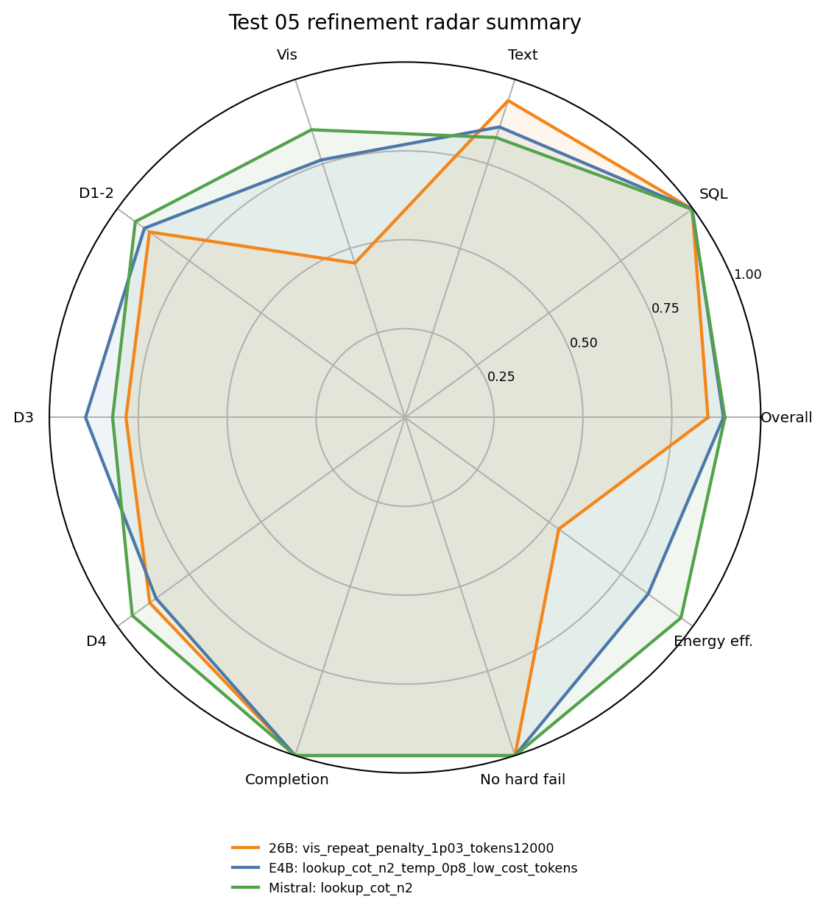
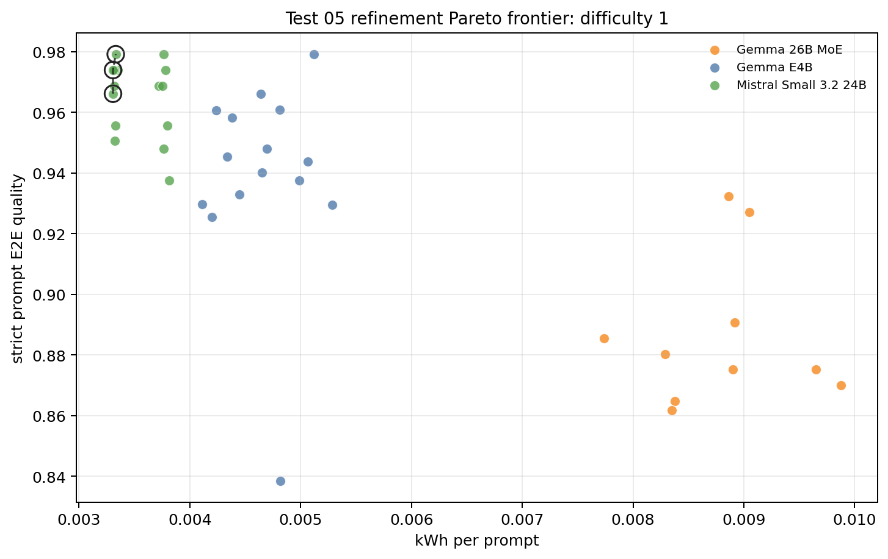
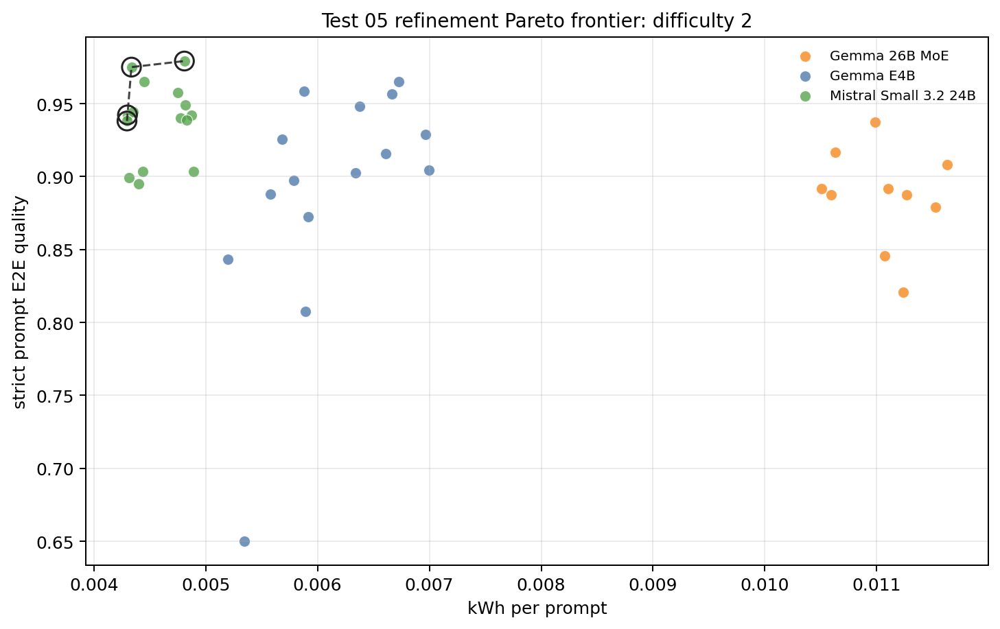
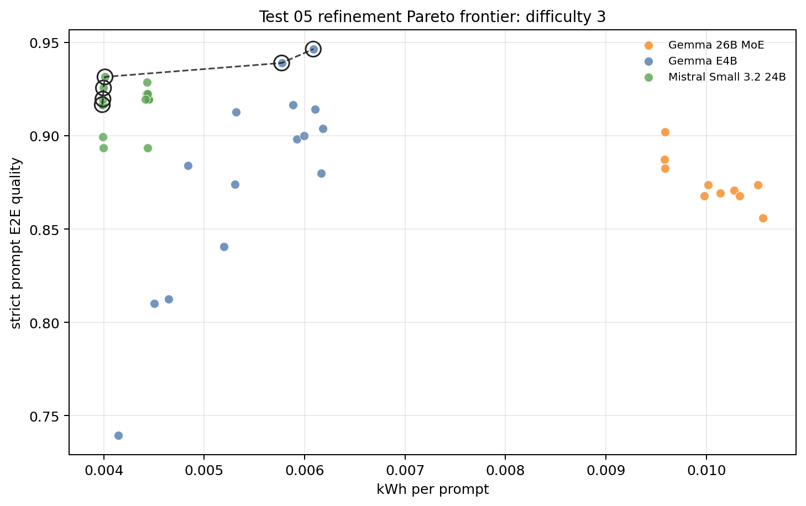
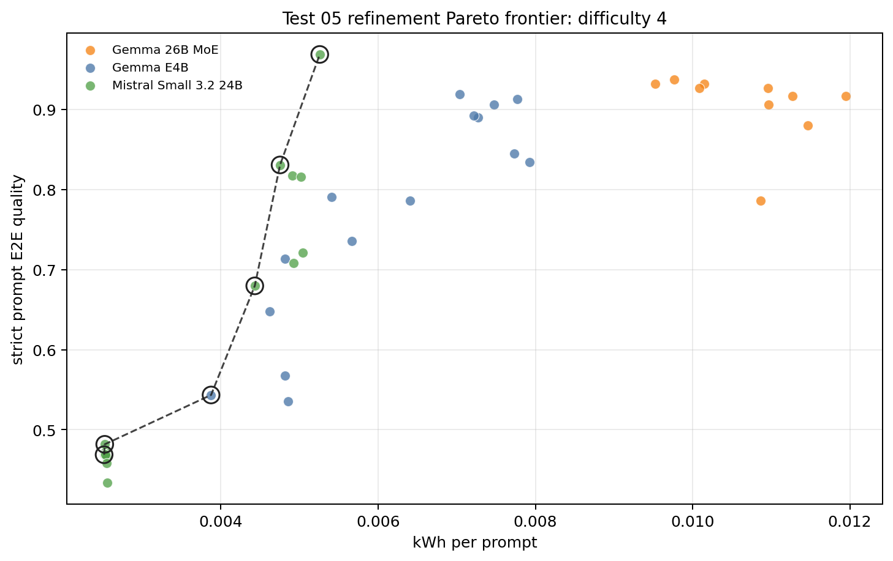
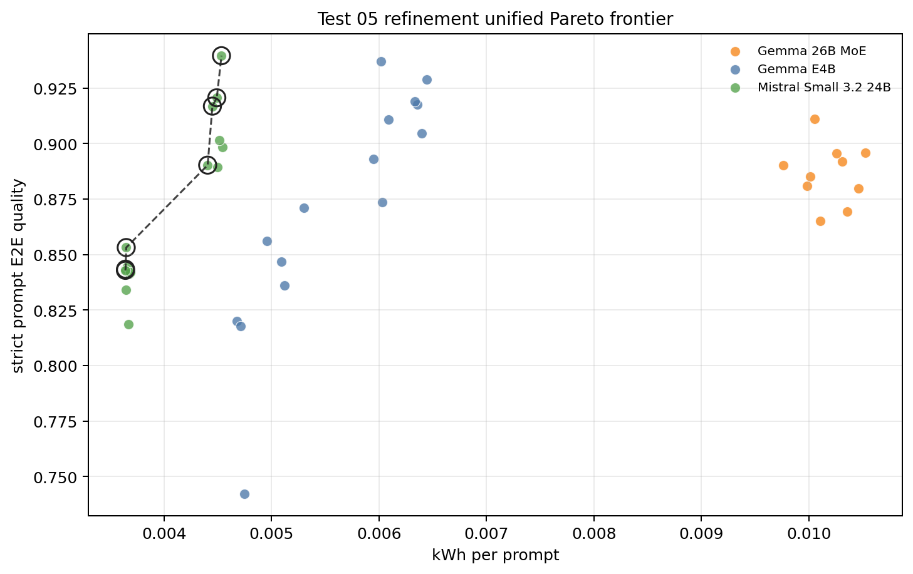
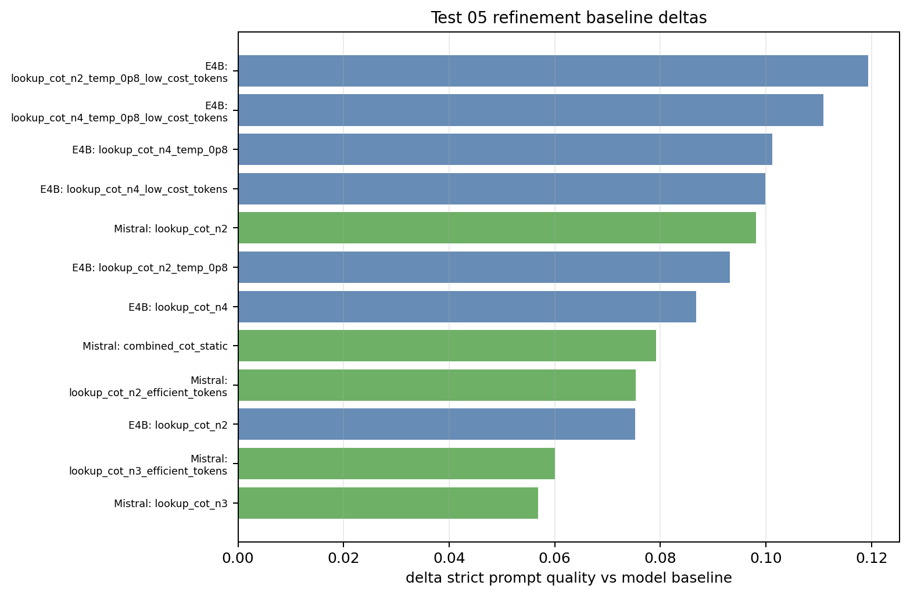
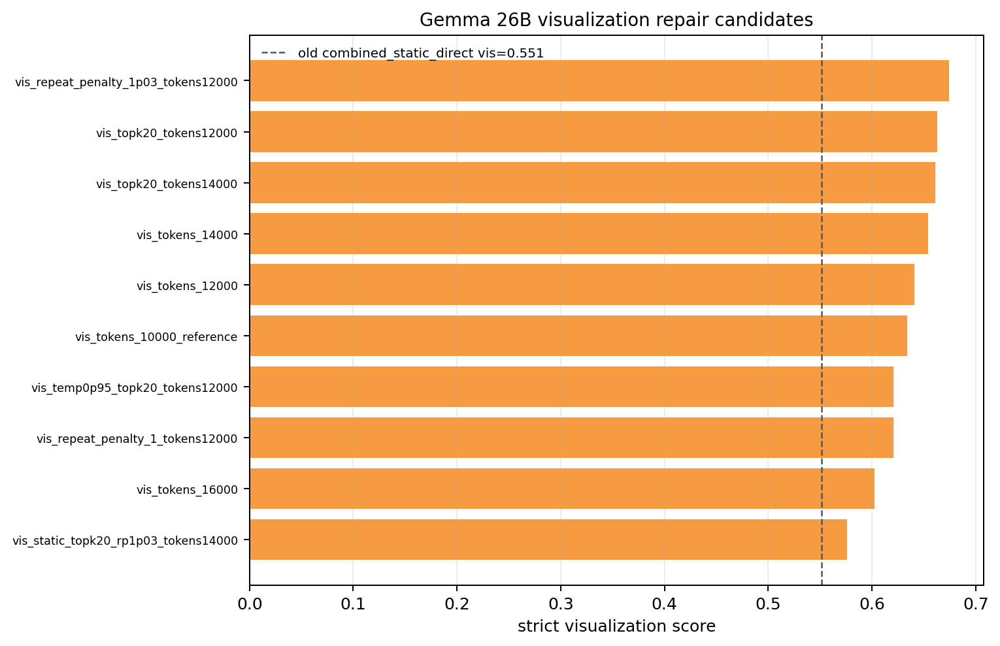

# Test 05 Post-Submission Refinement Report: Pareto Confirmation

## Data Source

Results analyzed from the joined refinement folder:

```text
/home/oss/Downloads/test05_refinement_complete/merged/
```

The raw source folders are preserved under:

```text
/home/oss/Downloads/test05_refinement_complete/raw_sources/post_submission_refinement/
/home/oss/Downloads/test05_refinement_complete/raw_sources/final_test05_existing/
```

This report keeps the same Test 05 rationale as the submitted final-run report: all useful candidate configurations are treated as one unified final candidate set. Provenance is retained in the data, but it is not used as a separate analytical group.

Coverage validation passed:

- `gemma4_26b`: 10 configs, 2 repetitions, 400 prompt rows.
- `gemma4_e4b`: 15 configs, 2 repetitions, 600 prompt rows.
- `mistral_small32_24b`: 15 configs, 2 repetitions, 600 prompt rows.

The old final-run Test 05 report is intentionally left unchanged.

## Method Notes

Quality is recomputed strictly from `all_detail.csv`. If a prompt expects a data, text, or visualization score and the score is missing, the missing slot is counted as `0`. This keeps failed runs inside the accuracy estimate instead of dropping them from the mean.

Metrics used in the report:

```text
prompt_quality_mean       mean per-prompt score over expected GT slots
csv_iou_mean              strict data/table score over prompts with data GT
text_score_mean           strict analysis score over prompts with text GT
vis_score_mean            strict visualization score over prompts with vis GT
completion_rate           completed score slots / expected score slots
hard_failure_resistance   fraction of prompts with strict prompt quality > 0
energy_consumed_kwh_mean  mean kWh per prompt
```

The main Pareto objective minimizes mean energy per prompt and maximizes strict prompt quality. A configuration is non-dominated if no other configuration has both lower-or-equal energy and higher-or-equal quality, with at least one strict improvement.

## Executive Findings

- The best strict prompt quality is now Mistral Small 3.2 24B `lookup_cot_n2`: prompt quality `0.9395`, completion `100.0%`, and `0.00453` kWh per prompt.
- This changes the main post-submission conclusion: Mistral becomes both the low-energy family and the highest-quality point in this refinement pool. The best Mistral row improves over the old report's Mistral frontier because the reused `lookup_cot_n2` candidate was rerun on the full final machine/dataset support.
- Gemma E4B remains extremely competitive, but its best candidate `lookup_cot_n2_temp_0p8_low_cost_tokens` is now slightly dominated by Mistral: `0.9371` quality at `0.00602` kWh per prompt.
- The Gemma 26B visualization repair works partially. The old representative `combined_static_direct` had visualization score `0.5513`; the best new 26B visualization score is `0.6741` from `vis_repeat_penalty_1p03_tokens12000`.
- The best overall Gemma 26B repair candidate is `vis_repeat_penalty_1p03_tokens12000` with prompt quality `0.9110`, full completion, visualization score `0.6741`, and `0.01006` kWh per prompt.
- Larger visualization caps alone do not monotonically improve Gemma 26B. The 16000-token cap is worse than the 12000/14000 region, while `repeat_penalty=1.03` with 12000 visualization tokens gives the strongest 26B balance.
- Difficulty-specific frontiers still matter: Mistral dominates difficulty 1, 2, and 4 in this refinement, while Gemma E4B remains the high-quality endpoint for difficulty 3.

## Unified Candidate Ranking

Sorted by strict prompt quality over the complete refinement candidate set:

| Model | Config | Origin | Prompt quality | Completion | Vis | kWh / prompt |
| --- | --- | --- | --- | --- | --- | --- |
| Mistral Small 3.2 24B | `lookup_cot_n2` | post submission refinement | 0.9395 | 100.0% | 0.9107 | 0.00453 |
| Gemma E4B | `lookup_cot_n2_temp_0p8_low_cost_tokens` | final test05 existing combined | 0.9371 | 100.0% | 0.8571 | 0.00602 |
| Gemma E4B | `lookup_cot_n4_temp_0p8_low_cost_tokens` | final test05 existing combined | 0.9287 | 100.0% | 0.8929 | 0.00645 |
| Mistral Small 3.2 24B | `combined_cot_static` | final test05 existing combined | 0.9206 | 98.1% | 0.8705 | 0.00449 |
| Gemma E4B | `lookup_cot_n4_temp_0p8` | final test05 existing combined | 0.9189 | 100.0% | 0.8638 | 0.00633 |
| Gemma E4B | `lookup_cot_n4_low_cost_tokens` | final test05 existing combined | 0.9176 | 100.0% | 0.8661 | 0.00636 |
| Mistral Small 3.2 24B | `lookup_cot_n2_efficient_tokens` | final test05 existing combined | 0.9168 | 98.1% | 0.8571 | 0.00445 |
| Gemma 26B MoE | `vis_repeat_penalty_1p03_tokens12000` | post submission refinement | 0.9110 | 100.0% | 0.6741 | 0.01006 |
| Gemma E4B | `lookup_cot_n2_temp_0p8` | final test05 existing combined | 0.9109 | 100.0% | 0.8750 | 0.00609 |
| Gemma E4B | `lookup_cot_n4` | post submission refinement | 0.9046 | 100.0% | 0.8527 | 0.00640 |
| Mistral Small 3.2 24B | `lookup_cot_n3_efficient_tokens` | final test05 existing combined | 0.9015 | 98.1% | 0.8661 | 0.00452 |
| Mistral Small 3.2 24B | `lookup_cot_n3` | post submission refinement | 0.8983 | 98.1% | 0.8705 | 0.00455 |
| Gemma 26B MoE | `vis_tokens_14000` | post submission refinement | 0.8959 | 100.0% | 0.6540 | 0.01053 |
| Gemma 26B MoE | `vis_topk20_tokens14000` | post submission refinement | 0.8954 | 100.0% | 0.6607 | 0.01026 |
| Gemma E4B | `lookup_cot_n2` | post submission refinement | 0.8929 | 98.1% | 0.8214 | 0.00595 |
| Gemma 26B MoE | `vis_tokens_12000` | post submission refinement | 0.8918 | 100.0% | 0.6406 | 0.01031 |
| Mistral Small 3.2 24B | `combined_cot_static_tokens` | final test05 existing combined | 0.8902 | 96.3% | 0.8482 | 0.00441 |
| Gemma 26B MoE | `vis_temp0p95_topk20_tokens12000` | post submission refinement | 0.8902 | 100.0% | 0.6205 | 0.00976 |
| Mistral Small 3.2 24B | `lookup_cot_n4` | post submission refinement | 0.8893 | 96.3% | 0.8527 | 0.00450 |
| Gemma 26B MoE | `vis_tokens_10000_reference` | post submission refinement | 0.8850 | 100.0% | 0.6339 | 0.01001 |
| Gemma 26B MoE | `vis_topk20_tokens12000` | post submission refinement | 0.8808 | 100.0% | 0.6629 | 0.00999 |
| Gemma 26B MoE | `vis_static_topk20_rp1p03_tokens14000` | post submission refinement | 0.8798 | 100.0% | 0.5759 | 0.01046 |
| Gemma E4B | `lookup_cot_n2_low_cost_tokens` | final test05 existing combined | 0.8737 | 98.1% | 0.8438 | 0.00603 |
| Gemma E4B | `lookup_temp_0p8_low_cost_tokens` | final test05 existing combined | 0.8709 | 98.1% | 0.8348 | 0.00530 |

## Unified Pareto Frontier

Non-dominated configurations for prompt E2E quality vs. energy:

| Model | Config | Prompt quality | Completion | kWh / prompt |
| --- | --- | --- | --- | --- |
| Mistral Small 3.2 24B | `visualization_repeat_last_n_56` | 0.8429 | 92.6% | 0.00364 |
| Mistral Small 3.2 24B | `combined_static_best_efficient_tokens` | 0.8434 | 92.6% | 0.00364 |
| Mistral Small 3.2 24B | `max_tokens_quality` | 0.8531 | 92.6% | 0.00365 |
| Mistral Small 3.2 24B | `combined_cot_static_tokens` | 0.8902 | 96.3% | 0.00441 |
| Mistral Small 3.2 24B | `lookup_cot_n2_efficient_tokens` | 0.9168 | 98.1% | 0.00445 |
| Mistral Small 3.2 24B | `combined_cot_static` | 0.9206 | 98.1% | 0.00449 |
| Mistral Small 3.2 24B | `lookup_cot_n2` | 0.9395 | 100.0% | 0.00453 |

Interpretation:

- The unified frontier is now entirely Mistral. This is the biggest difference from the submitted Test 05 report.
- Several Mistral configurations sit in a narrow energy band around `0.0036-0.0045` kWh per prompt, but `lookup_cot_n2` is the decisive endpoint because it reaches the highest strict quality and full completion.
- Gemma E4B remains close in absolute quality, but the best E4B point is more expensive and slightly lower-quality than the best Mistral rerun.
- Gemma 26B improves its visualization weakness but does not enter the Pareto frontier because its energy remains around `0.010` kWh per prompt.

## Baseline Deltas

Top positive deltas against each model baseline, for models with a baseline row in the merged refinement dataset:

| Model | Config | Prompt quality | Delta quality | Delta kWh | Completion | kWh / prompt |
| --- | --- | --- | --- | --- | --- | --- |
| Gemma E4B | `lookup_cot_n2_temp_0p8_low_cost_tokens` | 0.9371 | +0.1193 | +0.00131 | 100.0% | 0.00602 |
| Gemma E4B | `lookup_cot_n4_temp_0p8_low_cost_tokens` | 0.9287 | +0.1109 | +0.00174 | 100.0% | 0.00645 |
| Gemma E4B | `lookup_cot_n4_temp_0p8` | 0.9189 | +0.1011 | +0.00162 | 100.0% | 0.00633 |
| Gemma E4B | `lookup_cot_n4_low_cost_tokens` | 0.9176 | +0.0998 | +0.00165 | 100.0% | 0.00636 |
| Mistral Small 3.2 24B | `lookup_cot_n2` | 0.9395 | +0.0981 | +0.00085 | 100.0% | 0.00453 |
| Gemma E4B | `lookup_cot_n2_temp_0p8` | 0.9109 | +0.0931 | +0.00138 | 100.0% | 0.00609 |
| Gemma E4B | `lookup_cot_n4` | 0.9046 | +0.0868 | +0.00169 | 100.0% | 0.00640 |
| Mistral Small 3.2 24B | `combined_cot_static` | 0.9206 | +0.0792 | +0.00081 | 98.1% | 0.00449 |
| Mistral Small 3.2 24B | `lookup_cot_n2_efficient_tokens` | 0.9168 | +0.0754 | +0.00077 | 98.1% | 0.00445 |
| Gemma E4B | `lookup_cot_n2` | 0.8929 | +0.0752 | +0.00124 | 98.1% | 0.00595 |
| Mistral Small 3.2 24B | `lookup_cot_n3_efficient_tokens` | 0.9015 | +0.0601 | +0.00083 | 98.1% | 0.00452 |
| Mistral Small 3.2 24B | `lookup_cot_n3` | 0.8983 | +0.0569 | +0.00086 | 98.1% | 0.00455 |

Gemma 26B is not included in this baseline-delta table because the refinement dataset contains only the 10 new 26B visualization-repair configurations, not a rerun baseline. For Gemma 26B, the relevant comparison is therefore against the old weak visualization representative and the new token/sampling repair candidates.

## Gemma 26B Visualization Repair

The 26B rerun was designed specifically to test whether the old visualization weakness was caused by under-budgeted or poorly sampled visualization generation. The answer is mixed: the weakness improves, but it is not fully repaired.

| Config | Prompt quality | SQL | Text | Vis | Completion | kWh / prompt |
| --- | --- | --- | --- | --- | --- | --- |
| `vis_repeat_penalty_1p03_tokens12000` | 0.9110 | 0.9987 | 0.9625 | 0.6741 | 100.0% | 0.01006 |
| `vis_tokens_14000` | 0.8959 | 0.9987 | 0.9313 | 0.6540 | 100.0% | 0.01053 |
| `vis_topk20_tokens14000` | 0.8954 | 0.9675 | 0.9563 | 0.6607 | 100.0% | 0.01026 |
| `vis_tokens_12000` | 0.8918 | 0.9675 | 0.9594 | 0.6406 | 100.0% | 0.01031 |
| `vis_temp0p95_topk20_tokens12000` | 0.8902 | 0.9831 | 0.9531 | 0.6205 | 100.0% | 0.00976 |
| `vis_tokens_10000_reference` | 0.8850 | 0.9675 | 0.9437 | 0.6339 | 100.0% | 0.01001 |
| `vis_topk20_tokens12000` | 0.8808 | 0.9601 | 0.9344 | 0.6629 | 100.0% | 0.00999 |
| `vis_static_topk20_rp1p03_tokens14000` | 0.8798 | 0.9831 | 0.9531 | 0.5759 | 100.0% | 0.01046 |
| `vis_tokens_16000` | 0.8694 | 0.9675 | 0.9313 | 0.6027 | 100.0% | 0.01035 |
| `vis_repeat_penalty_1_tokens12000` | 0.8652 | 0.9425 | 0.9437 | 0.6205 | 100.0% | 0.01010 |

The old `combined_static_direct` representative had visualization score `0.5513`, prompt quality `0.8720`, and energy `0.00998` kWh per prompt. The best new repair candidate, `vis_repeat_penalty_1p03_tokens12000`, raises prompt quality to `0.9110` and visualization score to `0.6741`. The best direct visualization score is `0.6741`. However, these repairs still trail the best E4B and Mistral visualization scores, and the 26B energy remains roughly twice the Mistral frontier.

The max-token result is also informative: `vis_tokens_16000` does not improve over 12000 or 14000 tokens. This suggests the failure mode is not simply that the visualization step always needs more room. Moderate extra budget plus the right repetition penalty is more useful than increasing the cap indefinitely.

## Radar Summary

The radar plot compares one best overall representative per model from the refinement candidate pool:

| Model | Radar representative |
| --- | --- |
| Gemma 26B MoE | `vis_repeat_penalty_1p03_tokens12000` |
| Gemma E4B | `lookup_cot_n2_temp_0p8_low_cost_tokens` |
| Mistral Small 3.2 24B | `lookup_cot_n2` |

Quality and reliability axes use the fixed scale `clamp((raw - 0.4) / 0.6, 0, 1)`, while energy efficiency uses `clamp((0.017 - kWh_per_prompt) / 0.013, 0, 1)`.

Radar axes:

- `Overall`: strict prompt-level E2E quality, averaging expected SQL/text/visual slots per prompt; missing expected scores count as `0`.
- `SQL`: strict `csv_iou` over prompts with data GT; missing expected data scores count as `0`.
- `Text`: strict `text_score` over prompts with analysis GT; missing expected text scores count as `0`.
- `Vis`: strict `vis_score` over prompts with visualization GT; missing expected visualization scores count as `0`.
- `D1-2`: strict prompt-level E2E quality averaged over difficulty 1 and 2 prompts.
- `D3`: strict prompt-level E2E quality averaged over difficulty 3 prompts.
- `D4`: strict prompt-level E2E quality averaged over difficulty 4 prompts.
- `Completion`: completed expected GT score slots divided by all expected GT score slots.
- `No hard fail`: fraction of prompts with strict prompt-level quality greater than `0`.
- `Energy eff.`: anchored inverse energy score from kWh per prompt; higher is better.



Raw radar values:

| Model | Config | Overall | SQL | Text | Vis | D1-2 | D3 | D4 | Completion | No hard fail | kWh / prompt | Energy eff. |
| --- | --- | --- | --- | --- | --- | --- | --- | --- | --- | --- | --- | --- |
| Gemma 26B MoE | `vis_repeat_penalty_1p03_tokens12000` | 0.911 | 0.999 | 0.963 | 0.674 | 0.933 | 0.871 | 0.932 | 1.000 | 1.000 | 0.01006 | 0.534 |
| Gemma E4B | `lookup_cot_n2_temp_0p8_low_cost_tokens` | 0.937 | 0.999 | 0.916 | 0.857 | 0.944 | 0.939 | 0.919 | 1.000 | 1.000 | 0.00602 | 0.845 |
| Mistral Small 3.2 24B | `lookup_cot_n2` | 0.940 | 0.998 | 0.897 | 0.911 | 0.962 | 0.893 | 0.969 | 1.000 | 1.000 | 0.00453 | 0.959 |

The radar view confirms the changed recommendation. Mistral now has the strongest overall profile because it combines high visualization score, hard-prompt robustness, full completion, and much better energy efficiency. Gemma E4B remains balanced and very close on quality, but it no longer owns the high-quality endpoint in this refinement. Gemma 26B keeps excellent SQL/text reliability but still has a visibly weaker visualization axis and lower energy efficiency.

## Prompt Difficulty

Representative best configurations by difficulty:

| Difficulty | Best model/config | Role | Prompt quality | Completion | kWh / prompt |
| --- | --- | --- | --- | --- | --- |
| 1 | Mistral / `baseline` | high-quality endpoint | 0.9792 | 100.0% | 0.00333 |
| 2 | Mistral / `lookup_cot_n3_efficient_tokens` | high-quality endpoint | 0.9792 | 100.0% | 0.00481 |
| 3 | E4B / `lookup_cot_n4_temp_0p8_low_cost_tokens` | high-quality endpoint | 0.9464 | 100.0% | 0.00609 |
| 4 | Mistral / `lookup_cot_n2` | high-quality endpoint | 0.9688 | 100.0% | 0.00526 |

The difficulty split changes the story in a useful way. Mistral controls difficulty 1, 2, and 4 in this refinement. Difficulty 3 remains the one slice where Gemma E4B gives the highest-quality endpoint, although at higher energy than the Mistral low-energy points.



Difficulty 1 is effectively solved by Mistral in the refinement data. The cheapest frontier points are already near-perfect, and the baseline remains a very strong easy-prompt choice.



Difficulty 2 is also Mistral-led. Efficient token/static variants define the low-energy side, while `lookup_cot_n3_efficient_tokens` is the high-quality endpoint on this slice.



Difficulty 3 is the only slice where Gemma E4B still becomes the high-quality endpoint. The frontier moves from Mistral low-energy points to E4B lookup-CoT candidates as quality becomes the priority.



Difficulty 4 is the largest change from the submitted report: the rerun Mistral `lookup_cot_n2` candidate reaches the hard-prompt endpoint with full completion, so E4B no longer uniquely owns the hard-prompt frontier.

## Figures



This is the main post-submission decision plot. It shows every candidate in the same quality-energy space and draws a single Pareto frontier. Points are colored by model; provenance is not encoded visually because the analysis treats the candidate set as unified.



This plot isolates whether each candidate improved over its own rerun baseline where a baseline exists in the merged refinement data. Gemma 26B is handled separately because the refinement set contains only visualization-repair rows for that model.



This plot focuses on the reason for the post-submission rerun: whether 26B visualization improves when token budget and visualization sampling are adjusted.

## Model-Level Findings

### Gemma E4B

Best refinement candidate: `lookup_cot_n2_temp_0p8_low_cost_tokens`.

- Prompt quality: `0.9371`
- Completion: `100.0%`
- Visualization score: `0.8571`
- Energy: `0.00602` kWh per prompt
- Delta vs. rerun baseline: `+0.1193` prompt quality and `+0.00131` kWh per prompt

Gemma E4B remains a strong high-quality family. The same lookup-CoT plus temperature 0.8 pattern remains valuable, but the post-submission rerun no longer supports E4B as the unique quality endpoint because Mistral `lookup_cot_n2` now slightly exceeds it at lower energy.

### Gemma 26B MoE

Best refinement candidate: `vis_repeat_penalty_1p03_tokens12000`.

- Prompt quality: `0.9110`
- Completion: `100.0%`
- Visualization score: `0.6741`
- Energy: `0.01006` kWh per prompt

Gemma 26B is partially repaired by targeted visualization settings. The best repair combines a moderate visualization-token increase with `repeat_penalty=1.03`, not the largest token cap. This supports the concern raised by the radar plot, but also shows that simply giving the model more output budget is insufficient. The model remains dominated in the quality-energy plane.

### Mistral Small 3.2 24B

Best refinement candidate: `lookup_cot_n2`.

- Prompt quality: `0.9395`
- Completion: `100.0%`
- Visualization score: `0.9107`
- Energy: `0.00453` kWh per prompt
- Delta vs. rerun baseline: `+0.0981` prompt quality and `+0.00085` kWh per prompt

Mistral is the biggest winner of the refinement pass. The post-submission rerun makes lookup CoT depth 2 the best candidate overall, not only the low-energy option. It also controls the difficulty-4 frontier, which was previously the main argument for preferring tuned E4B when hard prompts dominate.

## Final Interpretation

1. The post-submission refinement changes the main Pareto conclusion: Mistral Small 3.2 24B now owns the unified frontier, including the highest-quality point.
2. Gemma E4B remains very close and still gives a strong, reliable thinking-model endpoint, but it is no longer non-dominated once the rerun Mistral lookup-CoT rows are included.
3. Gemma 26B visualization improves meaningfully compared with the weak old representative, but the repair is incomplete and the energy cost keeps it off the frontier.
4. The best 26B visualization repair is not the largest token cap. Moderate extra budget plus `repeat_penalty=1.03` works better than blindly increasing visualization `max_tokens` to 16000.
5. Prompt difficulty still matters, but the hard-prompt conclusion changes: Mistral `lookup_cot_n2` becomes the difficulty-4 endpoint in this refinement, while E4B remains strongest only on difficulty 3.
6. The new report should be treated as a post-submission refinement of the submitted thesis, not a replacement for the original submitted experiment history.
